# 1.1 Hugging Face 와 LLM

**학습 목표**

- Hugging Face 플랫폼의 구성 요소(모델 허브 · 데이터셋 · Space · 문서)를 설명하고, 계정과 Access Token 을 만들어 Colab 환경에 안전하게 등록할 수 있다.
- Transformers 라이브러리의 세 축인 Pipeline · Trainer · Generate 의 역할을 구분할 수 있다.
- Pipeline 으로 사전학습 모델을 내려받아 task 에 맞게 실행하고, GPU 메모리 사용량을 확인할 수 있다.
- 동적 양자화(load_in_8bit / load_in_4bit)를 적용해 큰 모델을 제한된 메모리에서 실행하고, 양자화 전후를 비교할 수 있다.
- 대화 템플릿(chat template)을 적용해 Gradio 기반 ChatBot 을 만들 수 있다.
- Pipeline 없이 tokenizer 와 `model.generate()` 로 직접 추론하는 코드를 작성할 수 있다.
- 이미지 입력이 가능한 Multi-modal LLM 을 processor 와 함께 사용할 수 있다.

**이 절의 구성**

- 1.1.1 Hugging Face 플랫폼
- 1.1.2 계정 만들기와 Access Token
- 1.1.3 Playground 에서 모델 성능 검토하기
- 1.1.4 Organization 활용
- 1.1.5 Transformers 라이브러리
- 1.1.6 Pipeline 으로 사전학습 모델 사용하기 — 실습 1.1.1
- 1.1.7 ChatBot 만들기와 동적 양자화 — 실습 1.1.2
- 1.1.8 Pipeline 을 사용하지 않는 추론
- 1.1.9 Multi-modal LLM 사용하기
- 1.1.10 실습과제
- 1.1.11 정리

---

**⟨ Hugging Face 사용해 보기 ⟩**

> 사전학습 모델을 구해 오는 두 가지 경로 — 유료 API 플랫폼과 오픈 모델 허브 — 를 비교하고,
> 이 강의의 실습 기반이 되는 Hugging Face 를 계정 생성부터 차례로 익힌다.

## 1.1.1 Hugging Face 플랫폼
<!-- 슬라이드 7 -->

사전학습 모델(pre-trained model)을 사용하는 경로는 크게 둘로 나뉜다. 하나는 OpenAI 처럼
모델을 API 로 제공하는 상용 플랫폼이고, 다른 하나는 모델 자체를 내려받아 쓰는 오픈 모델
허브다.

OpenAI Platform(https://openai.com)은 API key 를 발급받아 사용한다. 사용 가능한 모델을
확인한 뒤에는 반드시 비용을 검토해야 한다. API 요금은 https://openai.com/api/pricing/,
ChatGPT 구독 요금은 https://openai.com/chatgpt/pricing/ 에 정리되어 있다.

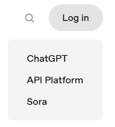

이 강의에서 주로 사용할 플랫폼은 Hugging Face(https://huggingface.co/)다. 90만 개 이상의
모델, 20만 개의 데이터셋, 30만 개 이상의 데모 앱(Space)을 갖춘 플랫폼으로, 사전학습 모델
생태계의 사실상의 중심이다. 처음 둘러볼 때는 다음 자원들을 차례로 확인해 보면 좋다.

- **GitHub** : https://github.com/huggingface — 라이브러리 소스가 공개되어 있다.
- **Learning Course** : https://huggingface.co/learn — 공식 학습 과정이다.
- **Leaderboard** : https://huggingface.co/spaces/open-llm-leaderboard/open_llm_leaderboard#/ —
  공개 LLM 의 성능 순위를 보여준다. Official model 필터를 체크해 보고, parameter 크기
  조건을 조절해 보면 모델 규모별 성능 차이를 가늠할 수 있다.
- **Space** : https://huggingface.co/spaces — 데모 앱을 올리고 실행하는 공간이다. 유료
  하드웨어를 골라 실험할 수 있고, 잘 만들어진 데모들을 구경할 수 있다. 예를 들어
  "DeepSite" 를 실행해 보자.
- **Docs > Hub** : https://huggingface.co/docs/hub/index — 플랫폼 전체 구성을 설명한다.
- **Docs > Core ML Libraries > Transformers** — 사전학습 모델의 추론과 학습에 필요한
  모든 라이브러리를 제공한다.

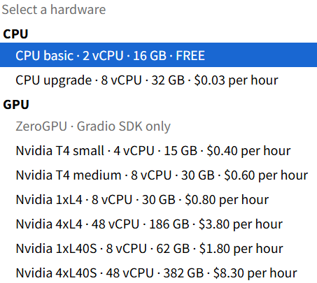

---

## 1.1.2 계정 만들기와 Access Token
<!-- 슬라이드 8~11 -->
<!-- 원문의 수업용 공용 계정 ID/PW(슬라이드 8·11)는 공개 교재에 싣지 않는다. 계정 정보는 강의 중 별도 안내. -->

Hugging Face 의 모델을 코드에서 내려받으려면 계정과 Access Token 이 필요하다. 가입
절차는 다음과 같다. (수업용 공용 계정을 쓰는 경우 계정 정보는 강의 중에 안내한다.)

1. https://huggingface.co/ 에서 Sign up 한다. ID(이메일) · 비밀번호 · User name ·
   User full name 을 입력한다.
2. 가입했으면 로그인하기 전에 **이메일 확인(email confirm)** 을 먼저 한다. Gmail 에서
   Hugging Face 가 보낸 메일을 검색해 confirm 링크를 클릭한다.
3. **Join an organization** 에서 수업용 조직(aicamp.kr)을 검색해 가입한다.
4. **Access Tokens** 메뉴에서 토큰을 만든다. Token name 은 `llmclass` 로 하고, 권한
   (permission)을 설정한 뒤 토큰을 복사한다.

프로필 아이콘을 누르면 나오는 메뉴의 맨 아래에 Access Tokens 항목이 있다.

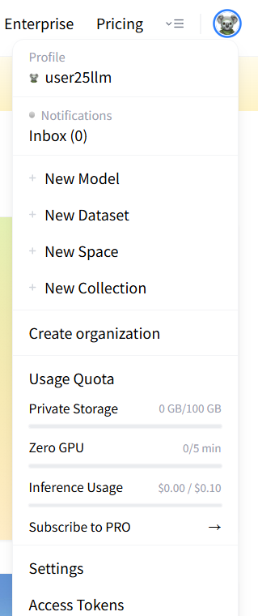

토큰을 만들 때는 기본 권한을 설정한다. Fine-grained 타입을 선택하면 저장소(Repositories)
읽기·쓰기, Inference 호출, Collections, Webhooks 등 항목별로 권한을 세밀하게 지정할 수
있다. 한 번 만든 토큰의 타입은 바꿀 수 없다.

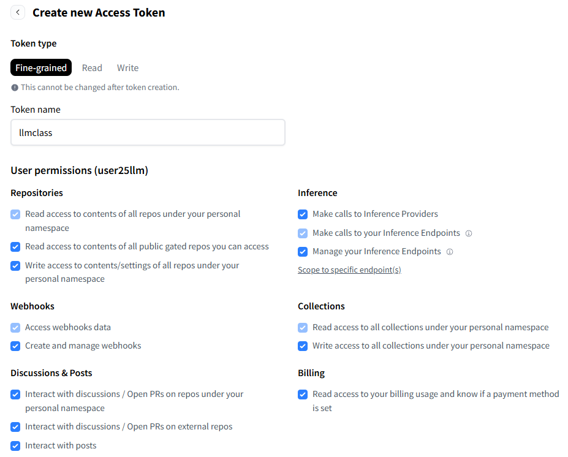

생성된 토큰은 그 자리에서 복사해 코드에 붙여 넣거나 개인 메모장에 저장한다. 화면을 벗어나면
전체 값을 다시 볼 수 없다. 이미 만든 토큰은 목록의 메뉴에서 권한 수정(Edit permissions),
재발급(Invalidate and refresh), 삭제(Delete)를 할 수 있다.

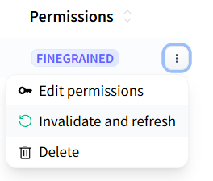

계정이 이미 생성되어 있는 경우에는 로그인한 뒤 같은 메뉴에서 토큰을 **새로 발급**받으면
된다. 토큰 목록에서 Invalidate and refresh 를 클릭하면 새 토큰이 만들어지고, 이를 복사해
쓴다.

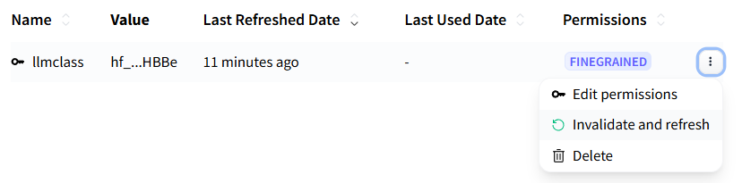

가장 중요한 원칙은 **토큰을 파일에 노출하지 않는 것**이다. 노트북 파일에 토큰 문자열을
직접 적어 두면 파일을 공유하는 순간 토큰이 유출된다. 대신 Colab 의 보안 비밀(secrets)
기능에 `HF_TOKEN` 이라는 이름으로 저장해 두고, 코드에서는 이름으로 읽어 온다. 구체적인
방법은 실습에서 해본다.


Hugging Face 사용법을 한글로 정리한 wikidocs 자료(https://wikidocs.net/book/8056)도
참고할 수 있다.

---

## 1.1.3 Playground 에서 모델 성능 검토하기
<!-- 슬라이드 12 -->

코드를 작성하기 전에, 브라우저에서 바로 모델을 실행해 보며 성능을 가늠할 수 있는 곳이
Playground(https://huggingface.co/playground)다. 모델을 선택하고 system prompt 와
user prompt 를 입력한 뒤 run 하면 응답을 볼 수 있다. 응답 생성은 Fireworks, Hyperbolic,
Together AI 같은 모델 실행 서비스(inference provider)들이 담당한다.

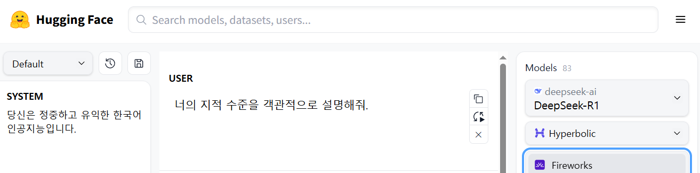

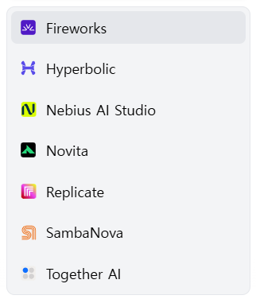

Playground 에서 시험해 볼 만한 주요 모델은 다음과 같다. `#p` 는 파라미터 수,
MoE(Mixture of Experts)는 전문가 모듈 중 일부만 활성화하는 구조(활성/전체 전문가 수),
마지막은 컨텍스트 길이다.

- DeepSeek-R1 : #p 37B/671B, MoE(8/257), 128k
- Qwen3-235B-A22B : #p 22B/235B, MoE(8/128), 32k
- Qwen3-30B-A3B : #p 30B, MoE(8/128)
- Qwen3-8B : #p 8.2B, Dense expert (실행 x), 32k
- Llama-3.1-8B-Instruct : #p 8B, 128k
- Aya-expanse-8b : #p 8B, 다국어, 8k
- Aya-vision-8b : #p 8B, text + image, 16k
- C4ai-command-a-2025 : #p 111B, RAG 지원, 256k
- c4ai-command-r7b-2024 : #p 7B, RAG 지원, 128k

무료 계정에서는 실행 횟수가 제한된다.

---

## 1.1.4 Organization 활용
<!-- 슬라이드 13 -->

Hugging Face 의 조직(Organization)은 여러 사용자가 자산을 공유하는 작업 공간이다.
화면 상단의 배너나 검색에서 조직 이름으로 찾아 가입(Join)할 수 있다.
(수업용 조직 LLM2506 이 있으나 이번 수업에서는 사용하지 않는다.)

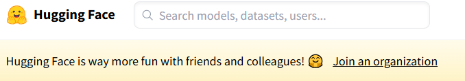

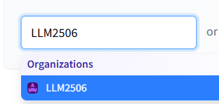

조직을 활용하면 다음과 같은 장점이 있다.

- **협업 및 접근성 관리**
  - 공유된 작업 공간 : 모델 · 데이터셋 · Space(데모 앱)를 공유하고, 팀원들이 최신 버전의
    자산에 쉽게 접근해 협업한다.
  - 역할 기반 접근 제어 : 사용자별로 관리자 · 쓰기 권한 · 읽기 권한 등의 역할을 부여한다.
    민감한 데이터나 모델을 다룰 때 보안이 강화된다.
  - 버전 관리 : 저장소가 Git 기반으로 작동하므로 GitHub 와 유사하게 버전 관리 · 커밋
    기록 · 변경 사항 시각화가 된다.
- **프로젝트 관리 및 효율성 증대**
  - 프로젝트 그룹화 : 모델 · 데이터셋 · Space 를 조직 아래에 그룹화해 프로젝트별로
    체계적으로 관리한다.
  - 쉬운 배포 및 공유 : Hugging Face 라이브러리를 활용해 모델 학습부터 배포까지의
    워크플로우를 관리한다.
  - 리소스 공유 : 학습된 모델, 전처리된 데이터셋 등을 공유해 중복을 줄이고 개발 시간을
    단축한다.
- **공개 및 비공개 자산 관리**
  - 공개 저장소와 비공개 저장소를 모두 지원한다. 공개 저장소로는 커뮤니티와 자산을
    공유하고 피드백을 받으며, 비공개 저장소로는 내부 프로젝트나 기밀 자산을 안전하게
    관리한다.
  - 접근 요청 : 특정 데이터셋이나 모델에 대한 접근을 제한하고, 조직 관리자가 사용자
    접근을 관리할 수 있다.

---

**⟨ Hugging Face Model coding 하기 ⟩**

> 이제 브라우저를 벗어나 코드로 모델을 다룬다. Transformers 라이브러리의 구조를 먼저
> 이해하고, Pipeline → ChatBot → 직접 추론 → Multi-modal 순으로 실습을 진행한다.

## 1.1.5 Transformers 라이브러리
<!-- 슬라이드 14 -->

Transformers 는 Hugging Face 의 사전학습 모델을 다루는 핵심 라이브러리다
(Docs > Core ML Libraries > transformers, https://huggingface.co/docs/transformers/index).
추론과 훈련을 위해 사전학습된 자연어 처리 · 컴퓨터 비전 · 오디오 · 멀티모달 모델을
제공하며, 최첨단 모델로 추론 또는 훈련하는 데 필요한 것을 세 축으로 제공한다.

**Pipeline** — 텍스트 생성, 이미지 분할, 자동 음성 인식, 문서 질문 답변 등 많은 작업(task)을
위한 간단하고 최적화된 추론 클래스다.

**Trainer** — PyTorch 모델에 대한 학습 및 분산 학습을 지원한다. Mixed precision,
`torch.compile`, FlashAttention 등을 지원한다.

> **FlashAttention 이 해결하는 병목**
> attention 행렬($Q * K^T$)은 시퀀스 길이의 제곱($O(N^2)$)에 비례해 커지고, 이것이
> GPU 의 주메모리인 HBM 에 저장되므로 병목이 생긴다. FlashAttention 은 HBM 저장을
> $O(N)$ 으로 줄여 이 병목을 개선한다.

- Tiling(Tile-based Computation) : 행렬($Q * K^T$)을 tile 단위로 나눠 scaled-dot
  product 를 계산한다. 연산이 HBM 이 아니라 훨씬 빠른 SRAM 에서 동작한다.
- Kernel Fusion : scaled-dot product attention 의 세 단계($QK^T$, softmax, $V$ 곱셈)를
  하나의 kernel 에서 연산해 HBM 접근을 최소화한다.
- 여기서 kernel 이란 GPU 에 전달되는 함수를 말한다. kernel 을 분해한 thread 는 GPU
  core 에서 병렬 실행되고, thread 의 결과는 HBM 에 저장된다.

**Generate** — Streaming 및 Multiple decoding 전략을 지원하며, LLM 과 Vision LM 을 통한
텍스트 생성을 담당한다.

- Streaming : 생성된 token 을 즉시 반환한다. 실시간으로 생성 과정을 보여주기 위한
  기능이다.
- Multiple decoding : 다양한 Beam Search 로 여러 텍스트 시퀀스를 생성하고 제어한다.

---

## 1.1.6 Pipeline 으로 사전학습 모델 사용하기
<!-- 슬라이드 15 -->

Pipeline 으로 사전학습 모델을 사용하는 준비는 두 가지다 — 토큰을 안전하게 불러오는 것,
그리고 쓸 모델을 고르는 것.

**토큰 불러오기.** 1.1.2 에서 강조했듯 토큰을 파일에 노출하지 않는다. Hugging Face 에서
토큰을 가져와 Colab 의 보안 비밀에 `HF_TOKEN` 이라는 이름으로 저장해 두고, 코드에서
읽어 `os.environ["HF_TOKEN"]` 에 저장한다. 환경 변수에 토큰이 있으면 라이브러리가
자동으로 사용하므로 별도의 Hugging Face login 과정을 생략할 수 있다.

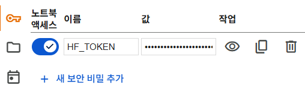

**모델에 접근하기.** 일부 모델은 사용 전 동의(agree)가 필요하다. 예를 들어
`mistralai/Mistral-7B-Instruct-v0.2` 는 모델 페이지에서 연락처 공유에 동의해야 접근할 수
있다.

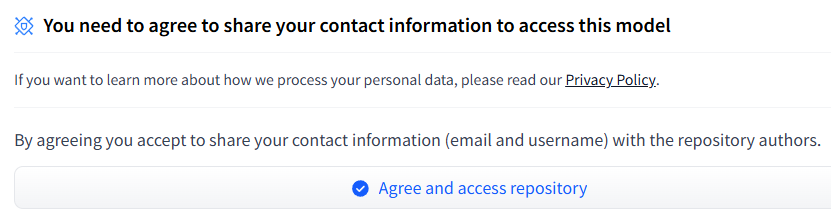

**모델 고르기.** 모델 페이지에서 task 종류를 확인하고, 필터로 후보를 좁힌다. 예를 들어
languages(Korean), tasks(Fill-Mask), name(bert) 으로 걸러 보자. 모델을 선택하면 model
card 에서 상세 정보를 확인한다.

### 실습 1.1.1 — Pipeline 으로 모델 실행하기
<!-- 슬라이드 16~17 -->

> 노트북: `code/1.1.1.Pipeline.ipynb`
> [](https://colab.research.google.com/github/AI-BoostCamp/AgenticAI/blob/main/code/1.1.1.Pipeline.ipynb)

세 가지 모델을 선택해 각각에 적합한 task 를 실행해 본다. 먼저 Colab 보안 비밀에서 토큰을
읽어 환경 변수에 넣고, 로그인 상태를 확인한다.

```python
## Colab secrets에서 토큰 불러와서
## os environment에 저장
from google.colab import userdata
import os
os.environ["HF_TOKEN"] = userdata.get('HF_TOKEN')
```

```python
# !huggingface-cli login 필요 없음
!hf auth whoami
```

`hf auth whoami` 는 현재 로그인된 계정과 소속 조직을 보여준다. 환경 변수의 토큰이
인식되므로 별도의 로그인 명령은 필요 없다.

첫 번째 모델은 BERT 계열의 다국어 모델로, 빈칸을 채우는 fill-mask task 를 실행한다.
`pipeline(task, model=…, tokenizer=…)` 로 추론 객체를 만들고 입력 문장을 넘기면 된다.

```python
from transformers import pipeline

model = "bert-base-multilingual-cased"
task = "fill-mask"
input_text = "The capital of France is [MASK]."
input_text = "안녕! 나는 [MASK] 모델이야."

task_oper = pipeline(task, model=model, tokenizer=model)
task_oper(input_text)
```

출력은 `[MASK]` 자리에 올 후보 token 들을 확률(score) 순으로 보여준다.

```
[{'score': 0.2145..., 'token_str': '여자', 'sequence': '안녕! 나는 여자 모델이야.'},
 {'score': 0.1213..., 'token_str': '가수', 'sequence': '안녕! 나는 가수 모델이야.'},
 {'score': 0.0440..., 'token_str': '모',   'sequence': '안녕! 나는 모 모델이야.'},
 ...]
```

두 번째는 한국어 GPT 계열 모델로 텍스트 생성(text-generation)을 실행한다.
`num_return_sequences` 로 생성할 시퀀스 개수를 지정한다.

```python
model = "kykim/gpt3-kor-small_based_on_gpt2" # 526MB
task = "text-generation"

input_text = "수학은"

task_oper = pipeline(task, model=model, tokenizer=model)

task_oper(input_text,
          max_new_tokens=256,
          num_return_sequences=2,
          truncation=True)
```

세 번째로 더 큰 모델을 실행해 본다. 노트북에는 8bit 로 압축된 8B 모델
`PrunaAI/NCSOFT-Llama-3-OffsetBias-8B-bnb-8bit-smashed` 가 예시로 등장한다. 모델
이름을 풀어 읽으면 그 자체가 명세다 — OffsetBias 는 모델의 성능이나 특성을 미세 조정하는
기법, 8B 는 파라미터 80억 개, bnb-8bit 는 bitsandbytes 라이브러리로 8bit 양자화했다는
뜻, smashed 는 PrunaAI 가 제공하는 모델 경량화 · 최적화 기법을 적용했다는 뜻이다.
PrunaAI 는 이처럼 남의 모델을 싸고 빠르게 실행되도록 압축해 배포하는,
경량화 · 최적화 전문 조직이다.

```python
%%time

task = "text-generation"
#model_name = "PrunaAI/NCSOFT-Llama-3-OffsetBias-8B-bnb-8bit-smashed"
model_name = "google/gemma-3-4b-it"

task_oper = pipeline(task=task, model=model_name, device_map="auto")
```

`device_map="auto"` 는 모델을 GPU 에 자동 배치한다. 이런 규모의 모델을 로드했으면
사용된 메모리를 확인해 보자. Colab 의 리소스 표시에서 GPU RAM 사용량을 볼 수 있다.

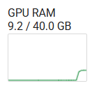

생성 옵션을 지정해 두 가지 질문에 각각 두 가지 답변을 만들어 본다. 각 인자의 의미는
주석에 있다.

```python
%%time
## 두가지 질문에 각각 두가지 답변 생성하기 ##

input_text = ["머신러닝에서 지도 학습과 비지도 학습의 주요 차이점을 설명해줘.3줄 이내로.",
              "너의 지적 수준을 객관적으로 설명해봐. 7줄 이내로 설명해줘.", ]

output = task_oper(input_text,
                   max_new_tokens=512,   # 생성할 최대 토큰 수
                  do_sample=True,        # token 확률에서 sampling
                  temperature=0.7,       # 큰 값일 수록 낮은 확률의 token을 선택
                  top_p=0.9,             # 누적확률 90%까지 sampling에 포함
                  num_return_sequences=2,# 두가지 답변을 준비
                  batch_size=2           # 두가지 질문을 처리
                  )
```

출력은 질문별 · 답변별로 중첩된 리스트로 반환되므로 `output[0][0]['generated_text']`
처럼 꺼내 본다. 같은 질문에도 sampling 때문에 서로 다른 두 답변이 생성된 것을 확인할 수
있다.

한편 이 실습에 쓰인 bitsandbytes 계열 압축 모델에는 주의할 점이 있다.

> **주의 — bitsandbytes 와 GGUF**
> bitsandbytes 라이브러리는 문제가 많이 발생한다. 최근에는 GGUF 로 압축하는 경향이
> 강해지고 있다.

Colab 에서 bitsandbytes(특히 8bit/4bit) 모델을 로드할 때 오류가 잦은 이유는 구조적이다.
bitsandbytes 는 특정 CUDA 버전에 대해 컴파일된 wheel 을 제공하는데 Colab 의 CUDA
버전은 수시로 바뀌고, 일부 GPU 만 공식 지원하며, 모델이 요구하는 버전과 기본 설치 버전이
충돌하기도 한다. 반면 GGUF 는 llama.cpp 포맷으로 GPU 없이 CPU 에서도 빠르게 동작하고,
전용 런타임(llama.cpp, ollama, LM Studio 등)이 안정적이며, 모델 파일 하나만 배포하면
되므로 로컬 LLM 생태계의 사실상 표준 포맷이 되어 가고 있다.

---

## 1.1.7 ChatBot 만들기와 동적 양자화
<!-- 슬라이드 19~23 -->

Pipeline 실습의 두 번째 주제는 ChatBot 이다. 모델에 대화 형식의 입력을 만들어 넣는
대화 템플릿(chat template)과, 웹 UI 라이브러리 Gradio(https://www.gradio.app/)를
사용한다.

**대화 템플릿.** 대화형 모델은 발신자 역할(role)이 표시된 메시지 목록을 입력으로 받는다.

- `system` : 메시지 발신자가 system 임을 나타낸다. 모델의 태도나 규칙을 지정한다.
- `user` : 사용자 메시지임을 나타낸다.
- `assistant` : 모델이 답변할 차례임을 나타낸다.

이 역할 표시를 모델이 학습한 형식의 문자열로 바꾸는 것이 대화 템플릿이다. Llama-3 계열의
템플릿은 다음과 같은 특수 token 으로 역할을 구분한다.

```
<|begin_of_text|><|start_header_id|>system<|end_header_id|>
당신은 정중하고 유익한 한국어 인공지능입니다.<|eot_id|>
<|start_header_id|>user<|end_header_id|>
{input_text}<|eot_id|>
<|start_header_id|>assistant<|end_header_id|>
```

모델에 따라 커스텀 템플릿이 사용될 수 있으므로, 템플릿 문자열을 직접 조립하기보다
tokenizer 가 제공하는 템플릿을 `tokenizer.apply_chat_template()` 로 적용하는 것이 좋다.
또 하나 중요한 것이 `eos_token_id` 다. 생성 중 eos token 이 나오면 생성을 중단하는데,
Llama-3 의 eos token 은 `<|eot_id|>` 다.

### 실습 1.1.2 — Pipeline ChatBot 만들기
<!-- 슬라이드 19~21 -->

> 노트북: `code/1.1.2.Pipeline_Chatbot.ipynb`
> [](https://colab.research.google.com/github/AI-BoostCamp/AgenticAI/blob/main/code/1.1.2.Pipeline_Chatbot.ipynb)

`PrunaAI/NCSOFT-Llama-3-OffsetBias-8B-bnb-8bit-smashed` 모델로 한국어 ChatBot 을
만든다. 이 모델은 이미 8bit 로 양자화되어 저장되어 있으므로 로드할 때
`BitsAndBytesConfig` 를 따로 설정할 필요가 없다. 모델과 토크나이저를 로드하고,
텍스트 생성 파이프라인을 구성한 뒤, 대화 템플릿을 적용하는 함수를 정의한다.

```python
%%time
model_name = "PrunaAI/NCSOFT-Llama-3-OffsetBias-8B-bnb-8bit-smashed"  # 8.5GB

# 8비트 양자화를 위한 BitsAndBytesConfig 설정 필요없음
# quantization_config = BitsAndBytesConfig( load_in_8bit=True,)

# 모델과 토크나이저 로드 (custom code 사용 가능성 있음)
tokenizer = AutoTokenizer.from_pretrained(model_name, trust_remote_code=True)
model = AutoModelForCausalLM.from_pretrained(
    model_name,
    # quantization_config=quantization_config,
    device_map="auto", # GPU 자동 설정
    trust_remote_code=True, )

# 텍스트 생성 파이프라인 설정
chatbot = pipeline(
    "text-generation",
    model=model,
    tokenizer=tokenizer,
    device_map="auto") # 파이프라인도 동일하게 device_map 사용

# Llama-3 계열 모델을 위한 대화 템플릿 구성
def chat_with_llama3_quantized(input_text):
    messages = [
        {"role": "system", "content": "당신은 정중하고 유익한 한국어 인공지능입니다."},
        {"role": "user", "content": input_text}, ]

    # apply_chat_template을 사용하여 프롬프트 문자열 생성
    prompt = tokenizer.apply_chat_template(
        messages,
        tokenize=False, # 토크나이저가 직접 텍스트를 반환
        add_generation_prompt=True )#<|start_header_id|>assistant<|end_header_id|> 추가

    response = chatbot(
        prompt,
        max_new_tokens=256,
        temperature=0.7,
        do_sample=True,
        eos_token_id=tokenizer.eos_token_id, # Llama-3의 EOS 토큰 ID 사용
        pad_token_id=tokenizer.eos_token_id,
        return_full_text=False,
    )[0]["generated_text"] ## 생성되는 text중 첫번째 선택

    return response
```

함수의 흐름은 입력 텍스트 → 템플릿 적용 → chatbot 파이프라인 → 답변 추출이다.
`add_generation_prompt=True` 는 프롬프트 끝에
`<|start_header_id|>assistant<|end_header_id|>` 를 붙여 모델이 답변할 차례임을 알린다.
`print(tokenizer.chat_template)` 로 이 모델에 실제 적용된 커스텀 템플릿 구조를 확인해
볼 수 있다.

이 함수를 Gradio 로 감싸면(wrapping) 웹 기반 상호작용 UI 가 된다.

```python
# Gradio 인터페이스 설정
iface = gr.Interface(
    fn=chat_with_llama3_quantized, # input_text -> templet -> chatbot -> 답변추출
    inputs=gr.Textbox(lines=4, placeholder="대화를 입력하세요...", label="질문"),
    outputs=gr.Textbox(lines=16,label="답변"),
    title="NCSOFT Llama 3 OffsetBias 8B (Korean, 8-bit Quantized)",
    description="NCSOFT Llama 3 OffsetBias 8B 기반 한국어 챗봇 인터페이스입니다.",
    flagging_mode="never",
)

iface.launch(share=True, debug=True)
```

`share=True` 는 외부에서 접속 가능한 임시 공유 링크를 만든다. 링크는 보통 7일 후
만료되고, Colab 런타임이 종료되면 바로 접속이 불가능해진다.

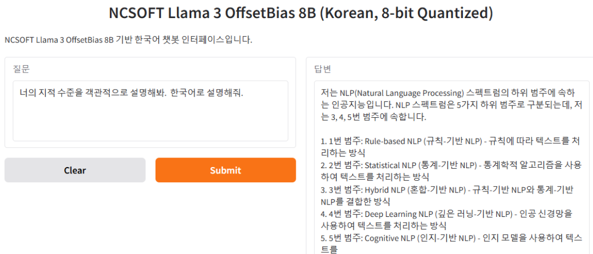

하나의 Colab 세션에서 여러 모델을 이어서 실험하려면, 다음 모델을 로드하기 전에 이전
모델을 메모리에서 제거해야 한다.

```python
iface.close()
del model
del tokenizer
del chatbot
del iface
torch.cuda.empty_cache()
import gc
gc.collect()
```

### 동적 양자화 — Quantization at Load Time
<!-- 슬라이드 22 -->

앞의 PrunaAI 모델은 저장 단계에서 이미 양자화된 모델이었다. 반대로 **동적 양자화
(Quantization at Load Time)** 는 원본 모델을 로드하는 과정에서 메모리 상의 모델 표현만
낮은 정밀도로 수정하는 방식이다. Transformers 에 내장된 기능으로, 메모리와 추론 시간이
줄어드는 대신 성능이 약간 하락한다(허용 가능한 수준). 로드할 때 `load_in_8bit` 또는
`load_in_4bit` 를 지정하면 된다.

`deepseek-ai/deepseek-llm-7b-chat` 모델로 확인해 보자. 양자화 없이 그대로 로드하면
GPU 메모리를 27.8 GB 사용한다.

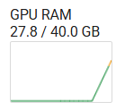

같은 모델을 4bit 로 양자화해 로드하는 코드는 다음과 같다. 캐시에 받아 둔 모델을
양자화해 메모리에 올리는 것이므로 로드도 빨라진다.

```python
%%time
# DeepSeek 모델 이름
model_name = "deepseek-ai/deepseek-llm-7b-chat"

# 모델과 토크나이저 로드 (custom code 사용 가능성 있음)
tokenizer = AutoTokenizer.from_pretrained(
    model_name,
    trust_remote_code=True)

model = AutoModelForCausalLM.from_pretrained(
    model_name,
    trust_remote_code=True,
    device_map="auto",
#    load_in_8bit=True,)  # bitsandbytes 설치되어 있어야 함
    load_in_4bit=True,)  # bitsandbytes 설치되어 있어야 함

# 텍스트 생성 파이프라인 설정
chatbot = pipeline(
    "text-generation",
    model=model,
    tokenizer=tokenizer,
    device_map="auto"
)
```

양자화 수준에 따른 메모리 차이를 비교하면 효과가 분명하다. 8bit 로드는 9.1 GB, 4bit
로드는 7.1 GB 로, 양자화 없이 로드했을 때의 27.8 GB 에서 크게 줄어든다.

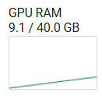

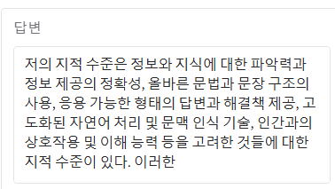

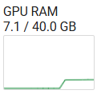

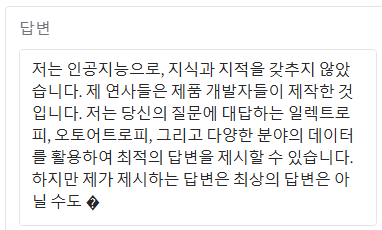

ChatBot UI 는 앞 실습과 같은 구조로 구성한다. DeepSeek 모델의 템플릿에도
`apply_chat_template` 을 그대로 쓸 수 있다.

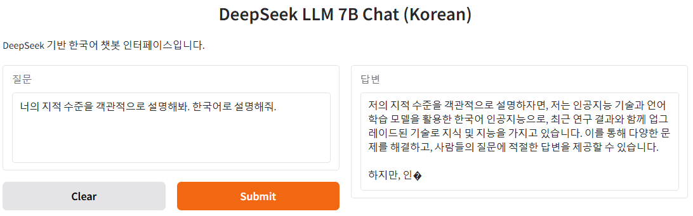

### 한국어 특화 파생 모델 — DeepSeek-llama3.1-Bllossom-8B
<!-- 슬라이드 23 -->

`UNIVA-Bllossom/DeepSeek-llama3.1-Bllossom-8B` 는 DeepSeek-R1-distill-Llama-8B 를
베이스로 한국어 환경에서의 추론 성능 향상을 목표로 추가 학습된 모델이다. 기존
DeepSeek-R1-Distill 계열의 언어 섞임(language mixing) · 다국어 성능 저하 문제를
해결하려는 시리즈에 속한다. 모델 카드에서 인터페이스 관련 설명을 확인하고 적용해 보자.

이 모델을 양자화 없이 로드하면 GPU 메모리를 32.4 GB 사용하고, 8bit 동적 양자화
(`load_in_8bit=True`)로 로드하면 9.4 GB 로 줄어든다.

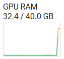

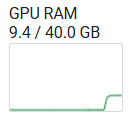

이 모델은 추론(reasoning) 특화 모델이라 답변 앞에 사고 과정(thinking)이 붙는다. 응답
함수에서 `response.split("</think>")[-1]` 로 나누면 사고 과정 이후의 답변만 추출할 수
있고, 그대로 반환하면 사고 과정까지 확인할 수 있다.

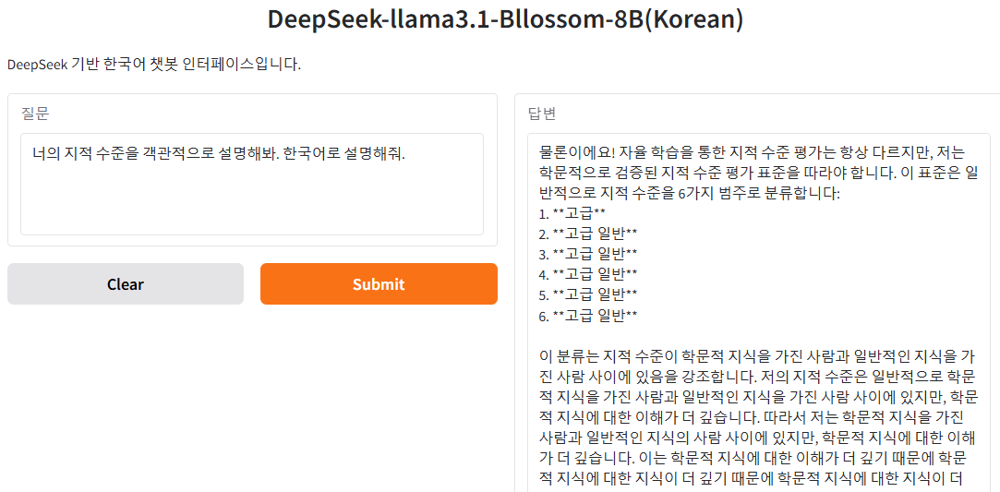

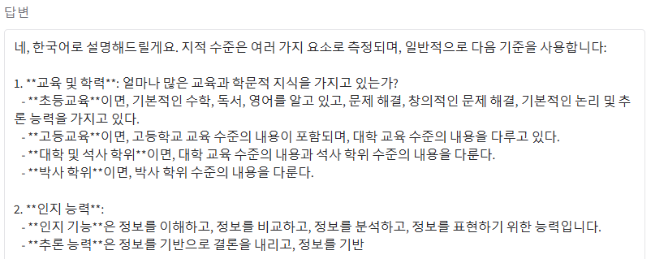

> **주의 — 동적 양자화가 항상 빠른 것은 아니다**
> bitsandbytes 의 동적 양자화(`load_in_8bit` 등)에서 가중치는 8bit 로 저장되지만 실제
> 행렬 곱은 FP16/BF16 실수로 수행된다. 매 스텝마다 int8 → fp16 변환(dequantize)
> 오버헤드가 생기므로, 메모리 사용량은 줄어도 추론은 오히려 느려질 수 있다.

---

## 1.1.8 Pipeline 을 사용하지 않는 추론
<!-- 슬라이드 24 -->

Pipeline 은 편리하지만 내부 동작을 감춘다. 같은 일을 pipeline 없이 — tokenizer 와
`model.generate()` 를 직접 호출해 — 해보면 추론의 각 단계가 드러난다.
`HuggingFaceH4/zephyr-7b-beta`(Hugging Face H4 연구팀이 배포하는 경량화 모델)로
ChatBot 을 만들어 본다.

```python
%%time
# 모델 및 토크나이저 로드
model_name = "HuggingFaceH4/zephyr-7b-beta"
tokenizer = AutoTokenizer.from_pretrained(model_name)
model = AutoModelForCausalLM.from_pretrained(
    model_name,
    trust_remote_code=True,
    device_map="auto",
    load_in_8bit=True,)
```

응답 함수는 pipeline 이 대신해 주던 단계들을 직접 수행한다 — 대화 기록으로 메시지 목록
구성 → 템플릿 적용 → 토크나이즈와 텐서 변환 → `model.generate()` → 출력 디코딩 →
답변 부분 추출.

```python
# 시스템 프롬프트 설정
system_prompt = "당신은 정중하고 유익한 한국어 인공지능입니다."

# 챗봇 응답 함수 정의
def respond(message, chat_history):
    global tokenizer, model

    # 대화 기록 구성
    messages = [{"role": "system", "content": system_prompt}]
    for user_msg, bot_msg in chat_history:
        messages.append({"role": "user", "content": user_msg})
        messages.append({"role": "assistant", "content": bot_msg})
    messages.append({"role": "user", "content": message})

    # 입력 텍스트 생성
    input_text = tokenizer.apply_chat_template(
        messages,
        tokenize=False,
        add_generation_prompt=True)

    # 토크나이즈 및 텐서 변환
    inputs = tokenizer(
        input_text,
        return_tensors="pt").to(model.device)

    # 모델을 사용하여 응답 생성
    with torch.no_grad():
        outputs = model.generate(
            **inputs,
            max_new_tokens=256,
            temperature=0.7,
            do_sample=True )

    # 출력 디코딩
    response = tokenizer.decode(outputs[0], skip_special_tokens=True)

    # 응답 부분 추출
    return response.split("<|assistant|>\n")[-1].strip()

# Gradio 인터페이스 생성
iface = gr.ChatInterface(
    fn=respond,
    title="Zephyr-7B Chatbot",
    description="로컬에서 실행되는 정중하고 유익한 한국어 인공지능 챗봇입니다.",
    textbox=gr.Textbox(placeholder="여기에 질문을 입력하세요...", max_lines=2),
    theme="default"
)

# 인터페이스 실행
iface.launch()
```

두 가지 세부를 짚어 둔다.

- `chat_history` 는 이전 대화를 기억하기 위해 사용한다. pipeline 을 쓰더라도 대화 맥락이
  필요하면 이렇게 history 를 직접 만들어 넣어야 한다.
- `**inputs` 는 딕셔너리를 함수에 전달하기 위해 키워드 인수로 변환(unpacking)하여
  전달하는 파이썬 문법이다. tokenizer 가 반환한 `input_ids`, `attention_mask` 등이
  각각의 인수로 `generate()` 에 넘어간다.

---

## 1.1.9 Multi-modal LLM 사용하기
<!-- 슬라이드 25~29 -->

이미지 입력이 가능한 Multi-modal LLM 으로
`naver-hyperclovax/HyperCLOVAX-SEED-Vision-Instruct-3B` 를 사용해 본다. 텍스트만 다루는
모델과의 차이는 **이미지 처리를 위한 processor 가 필요하다**는 점이다.

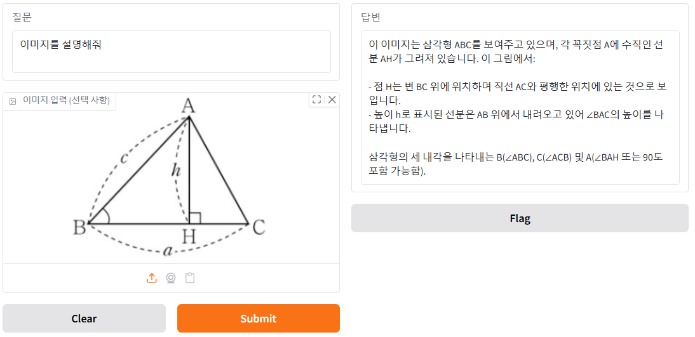

processor 는 모델 페이지의 "Files and versions" 에서 제공된다.

- `preprocessor_config.json` — Transformers 의 `AutoProcessor` 에 필요한 정보를 담고
  있다. processor class 로 `preprocessor.HCXVisionProcessor` 가 지정되어 있다.
- `preprocessor.py` — `HCXVisionProcessor` class 가 이미지와 비디오의 전처리를 담당한다.

모델은 BF16 을 사용해 로드한다.

```python
## Processor가 chat 템플릿과 멀티모달 입력을 한 번에 묶어 줘야
## 올바른 개수의 이미지 placeholder가 생성됨
from transformers import AutoTokenizer, AutoModelForCausalLM, AutoProcessor
import torch

model_name = "naver-hyperclovax/HyperCLOVAX-SEED-Vision-Instruct-3B"
processor = AutoProcessor.from_pretrained(model_name, trust_remote_code=True)
tokenizer  = AutoTokenizer.from_pretrained(model_name, trust_remote_code=True)
model = AutoModelForCausalLM.from_pretrained( model_name, trust_remote_code=True, device_map="auto",
                                              torch_dtype=torch.bfloat16) # BF16으로 지정
```

> **`torch_dtype=torch.bfloat16` 은 양자화가 아니다**
> 이 옵션은 data type 을 BF16 으로 캐스팅(type casting)하는 것이다. FP32 로 생성된 모델
> 파일(14 GB)은 그대로 유지되고, 연산(추론)만 BF16 으로 수행하며, 내부 버퍼 일부는
> FP32 를 유지할 수 있다. `load_in_?bit` 의 quantization 과는 다른 동작이다.

멀티모달 채팅 메시지는 **"콘텐츠 리스트" 형태**로 구성한다. 한 메시지의 content 가
문자열이 아니라 `{"type": "image", ...}`, `{"type": "text", ...}` 항목들의 리스트가 되고,
이미지를 한 번에 전달한다.

```python
SYSTEM_PROMPT = "당신은 정중하고 유익하며, 간결하게 답변하는 한국어 인공지능입니다."

def respond(message, image, chat_history):
    if not message: return "", chat_history

    # 멀티모달 채팅 메시지를 "콘텐츠 리스트" 형태로 구성
    chat = [{"role": "system", "content": [{"type":"text","text": SYSTEM_PROMPT}]}]
    for human, ai in chat_history:
        chat.append({"role":"user","content":[{"type":"text","text":human}]})
        chat.append({"role":"assistant","content":[{"type":"text","text":ai}]})

    user_contents = []
    if image is not None:              # vision 정보를 message에 추가
        user_contents.append({
            "type": "image",
            "filename": "uploaded_image.png",
            "image": image,   # PIL.Image 그대로
        })
    user_contents.append({"type":"text","text": message})
    chat.append({"role":"user","content": user_contents})

    # Processor가 템플릿+이미지 처리를 "한 번에" 수행
    model_inputs = processor.apply_chat_template(
        chat,
        tokenize=True,
        return_tensors="pt",
        return_dict=True,
        add_generation_prompt=True,
    ).to(model.device, dtype=torch.bfloat16)  ## model과 동일한 dtype 지정

    with torch.no_grad():
        output_ids = model.generate(
            **model_inputs,
            max_new_tokens=256,
            do_sample=True,
            top_p=0.7,                # 누적 확률이 상위 70% 토큰만 sampling
            temperature=0.4,
            repetition_penalty=1.3,   # 같은 토큰 반복 억제, >1.0이면 억제 강화
            eos_token_id=tokenizer.eos_token_id,
            pad_token_id=tokenizer.eos_token_id, # batch 길이 맞추기 padding token
        )

    text = processor.batch_decode(output_ids)[0].strip()
    chat_history.append((message, text))
    return text, chat_history
```

`processor.apply_chat_template()` 이 대화 템플릿 적용과 이미지 처리를 한 번에 수행하므로,
별도의 이미지 전처리가 필요 없고 생성 데이터의 후처리도 필요 없다.

이 코드에서 대화 기록을 매번 통째로 넣는 이유를 이해해 두자.

> **Chatting History 관리 — LLM 은 stateless 다**
> 매번 대화 히스토리 전체 또는 필요한 부분을 프롬프트에 넣어야 한다.
> 1) LLM 은 stateless 다. Transformer 기반 모델은 이전 요청의 내부 상태를 저장하지 않는다.
> 2) 맥락 유지의 유일한 근거는 "입력 토큰"이다. 문맥을 유지하려면 이전에 오간 메시지를
> 다시 입력으로 제공해야만 모델이 이해할 수 있다.

마지막으로 이미지 입력이 있는 UI 를 구성한다. Gradio 입력에 `gr.Image` 와 대화 상태를
유지하는 `gr.State` 가 추가된다.

```python
gr.Interface(
    fn=respond,
    inputs=[
        gr.Textbox(placeholder="여기에 질문을 입력하세요...", lines=2, label="질문"),
        gr.Image(type="pil", label="이미지 입력 (선택 사항)"),
        gr.State([])
    ],
    outputs=[
        gr.Textbox(lines=16,label="답변"),
        gr.State()
    ],
    title="HyperCLOVAX Vision Chatbot",
    description="텍스트와 이미지를 입력하면 HyperCLOVAX가 응답합니다."
).launch()
```

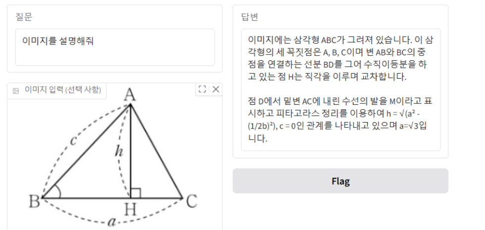

---

## 1.1.10 실습과제
<!-- 슬라이드 18, 30 -->
<!-- 슬라이드 31 : 숨김 MEMO 슬라이드, 내용 없음 -->

**실습과제 1 — Hugging Face 에서 성능이 좋은 모델을 찾아서 기본 동작을 확인하자.**

- Hugging Face > Models(https://huggingface.co/models)에서 검색해 보자.
  - Task, Language 등으로 검색해 보자.
  - Sort 에서 Trending, Most download 등으로 검색해 보자.
  - ChatGPT, Gemini 를 통해서 적당한 크기에 많이 사용하는 모델을 검색해 보자.
- Model page 에서 확인하자.
  - Model card 에서 모델의 task, 파라미터 수(#P) 등을 확인하자.
  - 모델 사용에 대한 동의(agree) 페이지가 있는지 확인하자.
  - Space 를 사용할 수 있는지 확인하고, 가능하면 Space 에서 성능을 검증해 보자.
- 모델을 pipeline 을 통해 사용해 보자.
  - 기본적인 질문에 답변 가능한가?
  - 메모리 사용량은 얼마인가?
- 파생 모델(fine-tuned models)의 종류도 구분해 보자. 모델 페이지의 model tree 에서
  베이스 모델로부터 파생된 모델들을 볼 수 있다
  (예: https://huggingface.co/mistralai/Mistral-7B-Instruct-v0.3).
  - Adapters : LoRA 등의 모듈을 추가하고 학습한 모델
  - Finetunes : 다른 dataset 으로 모델 전체를 완전 재학습한 모델
  - Merges : LoRA merge 등의 기법으로 모델을 결합해 task 를 확장한 모델
  - Quantization : 원본/파생 모델을 낮은 정밀도로 양자화한 모델

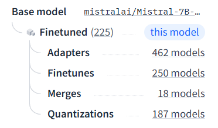

참고로, 실습 노트북에는 30B 이하 규모에서 많이 쓰이는 모델들의 요약이 정리되어 있다
(`code/1.1.1.Pipeline.ipynb` 마지막 부분). Llama-3.1-8B-Instruct, Qwen2.5-7B/14B-Instruct,
DeepSeek-R1-Distill-Qwen-7B/14B, gemma-2-9b 등의 모델 페이지 링크가 있으니 과제의
출발점으로 삼을 수 있다.

**실습과제 2 — 동적 양자화를 적용한 ChatBot 만들기.**

- 동적 양자화로 실습 환경에서 실행 가능한 더 좋은 모델을 찾아 보자.
- 모델을 실행해 보자.
  - 얼마나 큰 모델까지 실행 가능한가?
  - 모델의 성능이 좋은지 어떻게 검증할지 생각해 보자.

---

## 1.1.11 정리

- 사전학습 모델은 OpenAI 같은 유료 API 플랫폼 또는 Hugging Face 같은 오픈 모델 허브에서
  구한다. Hugging Face 는 모델 · 데이터셋 · Space · 문서 · Leaderboard 를 갖춘 플랫폼이다.
- 모델을 코드에서 쓰려면 Access Token 이 필요하다. 토큰은 파일에 노출하지 않고 Colab
  보안 비밀에 `HF_TOKEN` 으로 저장해 환경 변수로 읽는다.
- Transformers 라이브러리는 Pipeline(간단한 추론) · Trainer(학습, FlashAttention 등
  지원) · Generate(생성 전략) 를 제공한다.
- Pipeline 은 task 와 모델 이름만으로 추론을 실행한다. 대화형 모델은 역할(system ·
  user · assistant)이 있는 메시지 목록을 `apply_chat_template()` 로 변환해 입력한다.
- 동적 양자화(`load_in_8bit` / `load_in_4bit`)는 로드 시점에 정밀도를 낮춰 메모리를
  크게 줄인다(예: 27.8 GB → 9.1/7.1 GB). 다만 dequantize 오버헤드로 추론이 느려질 수
  있고, bitsandbytes 의 환경 호환성 문제로 최근에는 GGUF 포맷이 확산되고 있다.
- Pipeline 없이 tokenizer → `model.generate()` → decode 를 직접 호출하면 추론 단계를
  세밀하게 제어할 수 있다. LLM 은 stateless 이므로 대화 맥락은 매번 입력 토큰으로
  제공해야 한다.
- Multi-modal 모델은 이미지 전처리를 담당하는 processor 를 함께 로드하고, 메시지를
  콘텐츠 리스트 형태로 구성한다.
