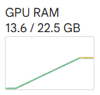
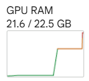
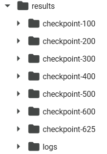
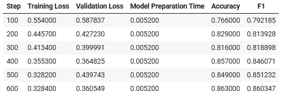
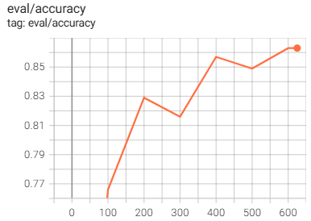
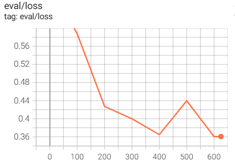
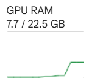
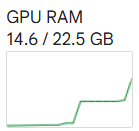
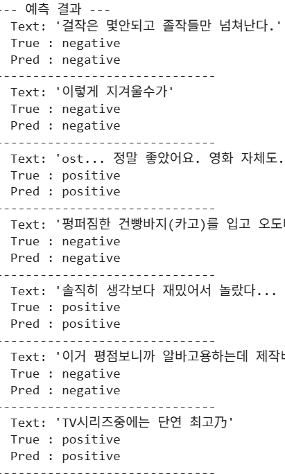

# 1.2 LLM Fine-tuning

**학습 목표**

- Hugging Face 모델 Fine-tuning 의 표준 절차(데이터 준비 → 모델 로드 → TrainingArguments →
  Trainer → 학습 → 평가 → 예측)를 설명할 수 있다.
- `TrainingArguments` 와 `Trainer` 로 자동화된 학습 루프를 구성할 수 있다.
- 평가 지표 함수(`compute_metrics`)를 정의해 학습 중 성능을 관찰할 수 있다.
- `find_executable_batch_size` 로 실행 가능한 최대 batch size 를 탐색할 수 있다.
- TensorBoard 로 학습 곡선을 확인하고, 학습된 모델을 저장 · 로드 · 재평가할 수 있다.

**이 절의 구성**

- 1.2.1 Fine-tuning 절차 한눈에 보기
- 1.2.2 전체 절차 실습 — IMDB 감성 분류 (실습 1.2.1)
- 1.2.3 한국어 모델을 한국어 데이터로 Fine-tuning (실습 1.2.2)
- 1.2.4 정리

---

## 1.2.1 Fine-tuning 절차 한눈에 보기
<!-- 슬라이드 33 -->

사전학습 모델(pretrained model)의 Fine-tuning 은 모델을 처음부터 만드는 일이 아니라,
이미 언어를 배운 모델에 내 데이터로 **마지막 학습을 한 번 더** 시키는 일이다. Hugging Face
에서 이 과정은 정형화되어 있다.

1. **Data 준비** — `datasets` 라이브러리를 사용한다.
2. **Model 및 해당 모델의 Tokenizer, Processor 로드**
3. **Training Arguments 설정** — `TrainingArguments` class 에 학습 시 필요한
   hyperparameter 를 설정한다.
4. **Trainer 정의** — PyTorch Lightning 의 trainer 와 유사하다. `Trainer` class 는
   Model, TrainingArguments, dataset, metric 함수를 받아 **자동화된 train loop** 를
   구성한다. batch size, learning rate, epochs, gradient 제어, mixed precision,
   분산 학습(DP, DDP), checkpoint, logging, callback 등 학습 option 을 지원하고,
   학습 중 또는 학습 완료 후 평가 데이터셋에 대한 성능 지표를 보고한다.
5. **Train** — `Trainer.train()` 을 호출한다.
6. **Evaluate and Predict** — `Trainer.evaluate()` 또는 `.predict()` 를 호출한다.

이 절의 나머지는 이 절차를 두 번 실행한다. 먼저 영어 데이터(IMDB)로 전체 절차를
따라가고, 그다음 한국어 데이터(네이버 영화 리뷰)로 좀 더 정교하게 반복한다.

---

## 1.2.2 전체 절차 실습 — IMDB 감성 분류
<!-- 슬라이드 34~39 -->

### 실습 1.2.1 — Trainer 로 Fine-tuning 하기

> 노트북: `code/1.2.1.FineTuning.ipynb`
> [](https://colab.research.google.com/github/AI-BoostCamp/AgenticAI/blob/main/code/1.2.1.FineTuning.ipynb)

영화 리뷰의 긍정/부정을 분류하는 감성 분류 task 로 Fine-tuning 절차 전체를 실행해 본다.

**1) 데이터 준비, 2) 모델 준비.** IMDB 데이터셋은 'train' 과 'test' 로 나뉘어 제공된다.
모델은 소문자만 사용하는 작은 BERT 모델 `bert-base-uncased` 를 쓴다. 분류 task 이므로
`AutoModelForSequenceClassification` 으로 로드하는데, 이 클래스는 사전학습 모델 위에
**분류를 위한 새로운 head layer 를 자동으로 추가**해 준다.

```python
%%time
# 모델 및 토크나이저 로드 : 'uncased', 소문자만 사용하는 작은 모델
model_name = "bert-base-uncased"
tokenizer = AutoTokenizer.from_pretrained(model_name)

# 시퀀스 분류를 위한 모델 로드 (2개의 클래스: 긍정/부정)
## 분류를 위한 새로운 head layer 자동으로 추가해 줌
model = AutoModelForSequenceClassification.from_pretrained(
    model_name,
    num_labels=2,
    torch_dtype=torch.bfloat16,
    device_map="auto",
    )
```

```python
from datasets import load_dataset

# 데이터 준비: 'train'과 'test'로 나뉘어 있음
dataset = load_dataset("imdb", cache_dir="/content/hf_cache")
```

데이터 전처리는 토크나이징이다. `datasets` 의 `map()` 으로 전체 데이터셋에 전처리
함수를 적용하고, 학습에 쓰지 않는 컬럼을 정리한다. 모델은 라벨 컬럼 이름으로
`labels` 를 기대하므로 `label` 을 `labels` 로 바꾼다.

```python
# 데이터 전처리 : 토크나이징
def tokenize_function(examples): # input_ids, attention_mask, token_type_ids 반환
    # 'text' 컬럼을 토크나이징하고, 최대 길이로 패딩, 트렁케이션 적용
    return tokenizer(examples["text"], padding="max_length",
                     max_length=256,   # 길이를 줄여서 VRAM 절감
                     truncation=True)

# 데이터셋에 전처리 적용
tokenized_dataset = dataset.map(tokenize_function, batched=True)

## 필요 없는 컬럼 제거 및 'label' 컬럼 이름 변경 (모델이 'labels'를 기대함)
tokenized_dataset = tokenized_dataset.remove_columns(["text"])
tokenized_dataset = tokenized_dataset.rename_column("label", "labels")

# 데이터 형식을 PyTorch 텐서로 설정
tokenized_dataset.set_format("torch")

# 학습 및 평가 데이터셋 분리
train_dataset = tokenized_dataset["train"]
eval_dataset = tokenized_dataset["test"]
```

실습 시간을 줄이기 위해 데이터셋 일부만 사용한다. `shuffle(seed=42)` 로 seed 를
고정하면 매번 같은 무작위 샘플을 얻는다.

```python
##  학습 시간 단축을 위해 데이터셋 일부만 사용
train_subset_size = 10000
test_subset_size = 1000

train_dataset_subset = tokenized_dataset['train'].shuffle(seed=42).select(range(train_subset_size))
test_dataset_subset = tokenized_dataset['test'].shuffle(seed=42).select(range(test_subset_size))
```

**3) Training Arguments 설정.** 학습에 필요한 hyperparameter 를 `TrainingArguments`
하나에 모은다. 각 인자가 학습의 어느 부분을 통제하는지 주석으로 확인해 두자 —
batch size 와 epoch 수는 학습 속도에, `eval_strategy` 와 `save_strategy` 는 평가 ·
저장 주기에, `load_best_model_at_end` 와 `metric_for_best_model` 은 학습이 끝났을 때
어떤 모델을 남길지에 관여한다.

```python
from transformers import DataCollatorWithPadding, Trainer

# 학습 인자 설정
training_args = TrainingArguments(
    output_dir="./results",           # 학습 결과 및 체크포인트 저장 경로
    num_train_epochs=1,               # epochs 3->1
    bf16=True,                        # BF16 사용
    per_device_train_batch_size=128,  # GPU/CPU당 batch size <-- tuning
    per_device_eval_batch_size=128,   # GPU/CPU당 batch size <-- tuning
    warmup_steps=10,                  # 웜업 스텝 수 500->100->10
    weight_decay=0.01,                # L2 정규화
    logging_dir="./logs",             # log 저장 경로
    logging_strategy="steps",         # 스텝 단위로 logging
    logging_steps=10,                 # logging 주기
    eval_strategy="epoch",            # epoch 단위로 평가
    save_strategy="epoch",            # epoch 단위로 모델 저장
    load_best_model_at_end=True,      # 최상의 모델 로드
    metric_for_best_model="accuracy", # 최상 모델을 결정 지표
    report_to="tensorboard",          # TensorBoard로 로깅 보고 (설치 필요)
)
```

**4) Trainer 정의.** 평가 지표 함수를 먼저 정의한다. Trainer 는 평가 때마다
`(predictions, labels)` 를 이 함수에 넘기고, 함수가 돌려준 지표를 기록한다.
`evaluate` 는 accuracy 같은 metric 함수를 모아 둔 Hugging Face 라이브러리다.

```python
# metric 함수 정의 : accuracy
metric = evaluate.load("accuracy")    # HF lib.
def compute_metrics(eval_pred):       # Trainer에서 사용하기 위해
    logits, labels = eval_pred        # (pred, label)
    predictions = np.argmax(logits, axis=-1)
    return metric.compute(predictions=predictions, references=labels)

# Trainer 정의
trainer = Trainer(
    model=model,                      #
    args=training_args,               # 준비한 학습 조건
    train_dataset=train_dataset_subset,### 속도를 높이기 위해 일부만 사용
    eval_dataset=test_dataset_subset,  ### subset 사용
    compute_metrics=compute_metrics,  # 지표 계산 함수
) # DataCollatorWithPadding: batch단위로 padding하기, trainer에서 자동으로 작동됨
```

**5) 학습, 6) 평가, 7) 예측.** 학습은 한 줄이다. 평가도 한 줄이고, 예측은 토크나이징한
입력을 `model(**inputs)` 로 직접 넣으면 된다.

```python
%%time
# 학습 실행
trainer.train()
# Wall time: 1min 6s
```

```python
# 평가 (학습 종료 후 최상 모델 로드됨)
eval_results = trainer.evaluate()
print(f"평가 결과: {eval_results}")

# 새로운 텍스트로 예측
text_to_predict = ["This movie was absolutely fantastic and I loved every minute of it!",
                   "This was a terrible waste of time, I regret watching it."]

# 토크나이징
inputs = tokenizer(
    text_to_predict,
    padding="max_length",
    truncation=True,
    return_tensors="pt" ).to(model.device)

# 예측 : trainer.predict(Dataset object) 또는 model(**inputs) 사용
with torch.no_grad():
    outputs = model(**inputs) # outputs는 logits를 포함
    logits = outputs.logits
    predictions = torch.argmax(logits, dim=-1) # 예측된 레이블 ID

# 예측 결과 디코딩
sentiment_labels = ["negative", "positive"]
predicted_sentiments = [sentiment_labels[p.item()] for p in predictions]
```

한 epoch 학습만으로 평가 정확도 0.913 이 나오고, 긍정 · 부정 문장이 올바르게
분류된다.

```
평가 결과: {'eval_loss': 0.2811..., 'eval_accuracy': 0.913, ...}

예측 텍스트: This movie was absolutely fantastic and I loved every minute of it!
예측 감성: positive
예측 텍스트: This was a terrible waste of time, I regret watching it.
예측 감성: negative
```

학습 중 GPU 메모리 사용량도 확인해 두자.



**7) 예측(2) — `trainer.predict(Dataset object)` 사용하기.** 앞에서는
`model(**inputs)` 로 토크나이즈된 데이터를 직접 전달했다. `trainer.predict()` 를
쓰려면 입력을 **Dataset 객체로 만들어 전달**해야 한다 — 토크나이즈된 inputs 는
dataset class 가 아니므로 `Dataset.from_dict()` API 로 변환하는 전처리가 추가된다.

```python
from datasets import Dataset

inputs = tokenizer(text_to_predict, padding="max_length", truncation=True, return_tensors="pt")

# Dataset 객체로 변환 : 토크나이징된 데이터 딕셔너리를 데이터셋으로 변환
predict_dataset = Dataset.from_dict({ # 예측이므로 'labels' 불필요
    'input_ids': inputs['input_ids'],
    'attention_mask': inputs['attention_mask'],
    'token_type_ids': inputs.get('token_type_ids') # BERT 모델의 경우 필요
})
predict_dataset.set_format("torch")

# with torch.no_grad(): # 필요 없음
outputs = trainer.predict(test_dataset=predict_dataset)
# Trainer.predict()의 출력은 PredictionOutput 객체이며, 예측 결과는 .predictions에 있음
logits = outputs.predictions
predictions = np.argmax(logits, axis=-1) # NumPy 배열로 변환 후 argmax
```

**Batch size 결정하기 — 학습 속도와 관련된 중요한 parameter.** LLM 은 모델이 커서
쉽게 메모리 부족이 발생하고, batch size 가 아주 민감하다. Accelerate 의
`find_executable_batch_size()` API 를 쓰면 자동으로 탐색할 수 있다 — training
max step 을 1 로 두고 **1 step 훈련을 시도해 보면서, overflow 를 check 하며 batch
size 를 줄여 본다.**

```python
from accelerate import find_executable_batch_size

# 함수 호출 시 자동으로 배치 크기 탐색 함
@find_executable_batch_size(starting_batch_size=256)
def find_batch_size_and_build_trainer(batch_size):
    # 모델은 함수 내부에서 로드 (각 배치 크기 시도마다 새로 로드)
    model = AutoModelForSequenceClassification.from_pretrained(model_name, num_labels=2,)
            # device_map='auto') ## Accelerate가 memory handling에 제약 발생하므로 제거 함
    training_args = TrainingArguments(
        output_dir="./results_batch_size_search",
        num_train_epochs=1, # 배치 사이즈 탐색을 위해 1 에포크로 제한
        per_device_train_batch_size=batch_size, # 탐색된 배치 사이즈 적용
        per_device_eval_batch_size=batch_size,
        learning_rate=2e-5,
        weight_decay=0.01,
        save_strategy="no",                   # 저장할 필요 없음
        load_best_model_at_end=False,         # 저장할 필요 없음
        max_steps=1,                          ####  1step 훈련 시도
        report_to="none",  )                  # report도 필요없음

    trainer = Trainer(
        model=model,
        args=training_args,
        train_dataset=train_dataset,
        eval_dataset=eval_dataset,
        tokenizer=tokenizer,
        compute_metrics=compute_metrics, )

    trainer.train() # 1 스텝만 훈련 시도
    return batch_size  # 이 줄을 꼭 추가!

executable_batch_size = find_batch_size_and_build_trainer()
print(f"최대 실행 가능한 배치 크기: {executable_batch_size}")
```

탐색 과정에서 batch size 를 시도할 때마다 메모리 사용량이 계단처럼 올라가는 것을
볼 수 있다.



---

## 1.2.3 한국어 모델을 한국어 데이터로 Fine-tuning
<!-- 슬라이드 40~45 -->

### 실습 1.2.2 — 한국어 영화 리뷰 감성 분석

> 노트북: `code/1.2.2.FineTuning한국어.ipynb`
> [](https://colab.research.google.com/github/AI-BoostCamp/AgenticAI/blob/main/code/1.2.2.FineTuning%ED%95%9C%EA%B5%AD%EC%96%B4.ipynb)

같은 절차를 한국어로, 좀 더 정교하게 반복한다.

- **Dataset** : Naver sentiment movie corpus v1.0 (nsmc) — https://github.com/e9t/nsmc
  train 15만 건, test 5만 건의 영화 리뷰에 긍정(1)/부정(0) 라벨이 붙어 있다.
- **Model** : 슬라이드 기준 `klue/roberta-base` (Fill-Mask 로 학습된 모델, 파라미터
  111M). **Fill-Mask task 로 학습된 모델을 한국어 영화 리뷰 데이터로 Fine-tuning**
  해 보는 것이 목표다.

**1) 데이터 준비.** 데이터셋을 로드하고 Dict 구조를 확인한다.

```python
## NSMC ('train'과 'test' 스플릿이 있습니다): train:15만, test:5만
dataset = load_dataset("Blpeng/nsmc")

p(dataset,'dataset')             # features: ['id', 'document', 'label']
p(dataset['train'][0],"dataset['train'][0]")
# {'id': '9976970', 'document': '아 더빙.. 진짜 짜증나네요 목소리', 'label': 0}
p(dataset['test'][0],"dataset['test'][0]")
# {'id': '6270596', 'document': '굳 ㅋ', 'label': 1}
```

> **datasets 4.x 변경 사항**
> datasets 4.x 에서 dataset 스크립트와 `trust_remote_code` 가 폐지되어, Parquet/CSV
> 같은 정적 파일로 배포된 데이터만 `load_dataset()` 으로 바로 읽을 수 있다. 그래서
> 노트북 최신본은 원본 `nsmc` 대신 정적 파일 사본인 `Blpeng/nsmc` 를 로드한다.

**2) 모델 준비.** 텍스트 분류이므로 `AutoModelForSequenceClassification` 을 쓰고,
이진 분류이므로 `num_labels=2` 다. 한국어에서는 **tokenizer 방식이 성능 차이를
만든다** — 문장의 성격(구어체/문어체)에 맞는 tokenizer 를 가진 모델을 골라야 한다.

다음은 대표적인 한국어 모델과 tokenizer 특성의 비교다.

| 모델명 | 학습 데이터 성격 | 토크나이저 방식 | 특성 |
|---|---|---|---|
| beomi/KcELECTRA | 댓글, SNS (구어체) | WordPiece | 욕설 · 신조어 · 오타가 많은 데이터에 강함 |
| monologg/KoELECTRA | 뉴스 + 일부 구어체 | WordPiece (Mecab 기반) | 밸런스가 좋아 가장 추천 |
| klue/bert-base | 뉴스, 위키 (문어체) | WordPiece (형태소 기반) | 공적인 문서 · 리포트 분석 |
| klue/roberta-base | 뉴스, 위키 (문어체) | Byte-Level BPE | 성능이 최우선일 때 (디코딩은 번거로움) |

```python
#model_name = "beomi/KcELECTRA-base"  # 109M # 형태소 분리 tokenizer, 구형
model_name = "klue/roberta-base"      # 111M # Byte-Level 분리 tokenizer
model_name = "monologg/koelectra-small-v3-discriminator" # 14M # 형태소분리 잘함
num_labels = 2 # (0: 부정, 1: 긍정)

tokenizer = AutoTokenizer.from_pretrained(model_name)

# pretrained 시, 체크포인트에 저장된 분류 헤드가 있다면 로드되고, 없으면 새로 추가
model = AutoModelForSequenceClassification.from_pretrained(
    model_name,
    num_labels=num_labels,
    device_map="auto")
```

<!-- 원문 불일치 확인 필요: 슬라이드 40 은 klue/roberta-base 를 모델로 명시하지만,
노트북 최신본은 monologg/koelectra-small-v3-discriminator(14M)를 최종 선택한다.
본문은 노트북 최신본을 따랐다. -->

**3) 데이터 전처리.** tokenizer 에 사용할 컬럼(`document`)을 선택하고, 학습에 쓰지
않는 나머지 컬럼은 삭제하며, 라벨 컬럼 이름을 바꾼다. 결측이나 빈 문자열도 걸러 낸다.

```python
def preprocess_function(examples):
    return tokenizer(
        examples['document'], # 'document' 컬럼 사용
        truncation=True,      # max_length 까지 제한
        padding='max_length', # max_length 까지 padding
        max_length=128 )      # max_length=tokenizer.model_max_length(512)

# batched=True : batch단위 처리로 속도 향상, 불필요한 컬럼 제거
tokenized_dataset = dataset.map(
    preprocess_function, batched=True,
    remove_columns=["Unnamed: 0", "id", "document"],) # 컬럼 제거
tokenized_dataset = tokenized_dataset.rename_column("label", "labels")
tokenized_dataset.set_format("torch")
```

실습 시간 때문에 subset 을 준비한다 (전체는 train 15만 · test 5만 건).

```python
##  학습 시간 단축을 위해 데이터셋 일부만 사용
train_subset_size = 10000
test_subset_size = 1000

# seed : 매번 같은 무작위 샘플을 얻음
train_dataset_subset = tokenized_dataset['train'].shuffle(seed=42).\
                        select(range(train_subset_size))
test_dataset_subset = tokenized_dataset['test'].shuffle(seed=42).\
                        select(range(test_subset_size))
```

**4) metric 함수 정의.** 이번에는 Hugging Face `evaluate` 대신 sklearn 의 일반적인
metric 함수를 쓴다. **return 을 dictionary 로 하면** Trainer 가 그대로 지표로 기록한다.
accuracy 에 더해 F1 도 함께 본다.

```python
from sklearn.metrics import accuracy_score, f1_score
## 일반적인 metric함수 사용시, return을 dictionary로 하면 됨
def compute_metrics(eval_pred):
    logits, labels = eval_pred
    predictions = np.argmax(logits, axis=-1)
    accuracy = accuracy_score(labels, predictions)
    f1 = f1_score(labels, predictions, average='binary')
    return {"accuracy": accuracy, "f1": f1}
```

**5) TrainingArguments 설정, Trainer 정의.** 이번에는 step 단위로 평가 · 저장한다.

```python
output_dir="./results"
training_args = TrainingArguments(
    output_dir=output_dir,          # checkpoint 저장 경로
    num_train_epochs=3,             # 3
    per_device_train_batch_size=batch_size, # GPU당 batch size
    per_device_eval_batch_size=batch_size,  # GPU당 batch size
    warmup_steps=30,                # 500 -> 30, 전체 step에 맞춰 조정
    weight_decay=0.01,              # L2 정규화
    logging_dir=f"{output_dir}/logs",# 로그 저장 디렉토리
    logging_steps=20,               # 너무 작으면 과부하
    eval_strategy="steps",          # 'no', 'steps', 'epoch', 'best'
    save_strategy="steps",
    save_steps=20,                  # 너무 작으면 과부하
    load_best_model_at_end=True,    # 가장 좋은 모델 로드
    metric_for_best_model="accuracy",# 최고 모델 선정 기준
    report_to="tensorboard",)

# Trainer 인스턴스 생성
trainer = Trainer(
    model=model,
    args=training_args,
    train_dataset=train_dataset_subset,
    eval_dataset=test_dataset_subset,
    tokenizer=tokenizer,
    compute_metrics=compute_metrics )
```

step 단위 저장이므로 `output_dir` 에 checkpoint 폴더가 step 마다 쌓인다.



**6) 학습 및 TensorBoard 로 확인.** 학습 전에 사전 성능을 재 보면 정확도 0.49 —
동전 던지기 수준이다. Fine-tuning 전의 모델은 이 task 를 전혀 모른다.

```python
# 평가 데이터셋 서브셋으로 사전 성능 확인
results = trainer.evaluate(eval_dataset=test_dataset_subset)
print(f"eval_loss:{results['eval_loss']:.3f}, eval_accuracy:{results['eval_accuracy']:.3f}, eval_f1:{results['eval_f1']:.3f}")
# eval_loss:0.695, eval_accuracy:0.493, eval_f1:0.224
```

TensorBoard 를 노트북 안에서 실행해 두고 학습을 시작하면 학습 곡선을 실시간으로
볼 수 있다.

```python
# TensorBoard 확장 기능 로드
%load_ext tensorboard
# TensorBoard 실행 및 로그 디렉토리 지정
%tensorboard --logdir {output_dir}/logs
```

```python
%%time
trainer.train()
```

logging step 을 100 으로 했을 때 step 별 지표는 다음과 같이 기록된다.







batch size 에 따라 메모리 사용량이 달라지는 것도 함께 확인해 두자.





**7) Evaluation & Prediction.** 평가 결과는 dictionary 로 반환된다. 학습 전
0.49 였던 정확도가 학습 후 0.88 로 오른다.

```python
results = trainer.evaluate(eval_dataset=test_dataset_subset)
print(f"Evaluation: acc:{results['eval_accuracy']:.2f},  f1:{results['eval_f1']:.2f}")
# Evaluation: acc:0.88,  f1:0.87
```

예측은 test 데이터에서 몇 건을 뽑아 실제 라벨과 비교해 본다.

```python
# Sample data 준비
sample_data = dataset['test'][100:110]
## text와 label 추출
texts = sample_data['document']
true_labels = sample_data['label']

# 토크나이징
inputs = tokenizer(texts, padding="max_length",
                   truncation=True, return_tensors="pt").to(model.device)
# 모델 예측
model.eval() # eval mode로 설정

with torch.no_grad(): # 메모리 절약, 속도 향상
    outputs = model(**inputs)
    logits = outputs.logits
    pred = torch.argmax(logits, dim=-1)
```



**8) Model Save, Load & Evaluation.** Trainer 는 `TrainingArguments` 의
`output_dir` 경로에 모델과 토크나이저를 저장한다. `load_best_model_at_end=True`
였다면 학습된 최고의 모델이 저장된다.

```python
# 학습 완료 후 모델 저장
trainer.save_model()                                 # 모델 저장
tokenizer.save_pretrained(training_args.output_dir)  # 토크나이저 저장

# 새로운 위치에 저장
model_save_path = './model'
trainer.save_model(model_save_path)
tokenizer.save_pretrained(model_save_path)
```

저장된 모델을 다시 로드해 평가하면 저장 전과 같은 성능이 재현되는지 확인할 수 있다.
평가만 할 때는 TrainingArguments 를 간소화할 수 있지만, `eval_dataset` · `tokenizer` ·
`compute_metrics` 는 반드시 필요하다.

```python
model_save_path = "./model"

# 저장된 모델 과 토크나이저 로드
loaded_model = AutoModelForSequenceClassification.from_pretrained(
    model_save_path,
    device_map='auto')
loaded_tokenizer = AutoTokenizer.from_pretrained(model_save_path)

## 학습을 위한 것이 아니므로 TrainingArguments는 간소화 가능하지만,
## eval_dataset, tokenizer, compute_metrics는 반드시 필요
eval_training_args = TrainingArguments(
    output_dir="./eval_results",    # 평가 결과를 저장할 임시 디렉토리
    per_device_eval_batch_size=16,  # 평가 배치 크기
    report_to="none",               # 로깅 비활성화
    do_train=False,                 # 학습은 하지 않음
    do_eval=True,)                  # 평가는 수행함

evaluator_trainer = Trainer(
    model=loaded_model,
    args=eval_training_args,
    eval_dataset=test_dataset_subset,# 평가 데이터셋
    tokenizer=loaded_tokenizer,      # tokenizer
    compute_metrics=compute_metrics,)# 평가 함수

results = evaluator_trainer.evaluate()
print("평가 결과:", results) # eval_accuracy': 0.863
```

---

## 1.2.4 정리

- Hugging Face Fine-tuning 은 **데이터 준비 → 모델 · 토크나이저 로드 →
  TrainingArguments → Trainer → train → evaluate/predict** 의 정형화된 절차를 따른다.
- `AutoModelForSequenceClassification` 은 사전학습 모델 위에 분류 head 를 자동으로
  추가한다. 라벨 컬럼 이름은 `labels` 여야 한다.
- `compute_metrics` 함수는 지표를 dictionary 로 반환하면 되고, Hugging Face
  `evaluate` 라이브러리든 sklearn 이든 쓸 수 있다.
- batch size 는 학습 속도와 메모리를 좌우하는 민감한 값이다.
  `find_executable_batch_size` 로 1 step 훈련을 반복하며 실행 가능한 최대값을 찾는다.
- 학습 곡선은 TensorBoard 로 관찰한다. 학습 전 0.49 였던 한국어 감성 분류 정확도가
  Fine-tuning 후 0.88 로 오르는 것에서 Fine-tuning 의 효과를 직접 확인했다.
- 학습된 모델은 `save_model()` 로 저장하고, 로드 후 재평가로 성능 재현을 확인한다.
