# 1.3 LoRA 를 이용한 Fine-tuning

**학습 목표**

- PEFT(Parameter-Efficient Fine-Tuning)의 개념과 대표 방법론(LoRA, QLoRA, Adapter,
  Prefix-Tuning, BitFit)을 구분할 수 있다.
- LoRA 의 원리 — 가중치 행렬을 freeze 하고 low-rank 행렬 $A$, $B$ 만 학습 — 를 수식
  수준에서 설명할 수 있다.
- PEFT 라이브러리로 LoRA 를 적용해 학습 파라미터를 1~2% 수준으로 줄인 Fine-tuning 을
  실행할 수 있다.
- Unsloth 프레임워크로 Qwen3-14B 급 모델을 4bit + LoRA 로 Fine-tuning 할 수 있다.
- LoRA adapter 저장 · 병합(merge) · GGUF 변환의 차이를 이해하고, llama.cpp 로 GGUF
  모델을 실행할 수 있다.

**이 절의 구성**

- 1.3.1 PEFT 와 대표 방법론
- 1.3.2 LoRA 의 원리
- 1.3.3 PEFT 라이브러리와 적용 절차
- 1.3.4 한국어 감성 분석에 LoRA 적용하기 (실습 1.3.1)
- 1.3.5 Hugging Face 주요 라이브러리
- 1.3.6 Unsloth — LoRA 를 위한 Fine-tuning 프레임워크
- 1.3.7 Qwen3-14B Reasoning 모델 Fine-tuning (실습 1.3.2)
- 1.3.8 모델 저장과 GGUF (실습 1.3.3)
- 1.3.9 Fine-tuning 해볼 만한 최신 모델들
- 1.3.10 실습과제
- 1.3.11 정리

---

## 1.3.1 PEFT 와 대표 방법론
<!-- 슬라이드 47 -->

PEFT(Parameter-Efficient Fine-Tuning)는 LLM 같은 사전학습 모델 **전체를 fine-tuning
하지 않고 일부 모듈만 tuning** 하는 접근이다. 메모리 절약, 학습 효율성, 일반화 성능을
높이는 것을 목표로 한다. 대표적인 방법론은 다음과 같다.

- **LoRA(Low-Rank Adaptation)** : rank 를 분해한(rank-decomposed) 행렬을 추가로
  삽입해 학습한다. 가장 많이 사용되는 방법으로, LLaMA · GPT · BERT 계열의
  instruction-tuning 등에 널리 쓰인다. 단점은 모델 구조를 파악해서 적용할 module 을
  특정해야 한다는 것이다.
- **QLoRA** : LoRA 에 4bit 양자화를 더해 GPU 메모리 절약을 극대화한다 (불안정한
  경우가 많다). LLaMA 7B/13B 등 대형 모델을 consumer GPU 에서 학습 가능하게 했다.
- **Adapter** : Transformer 레이어 사이에 작은 bottleneck 네트워크를 추가하여
  학습한다. 다양한 다운스트림 태스크에 쉽게 적응하며, HuggingFace
  adapter-transformers 로 유명하다. 다중 태스크 적용이 가능하다.
- **Prefix-Tuning** : T5 등에서 QA 와 텍스트 생성 태스크의 성능이 입증되었다. 특정
  태스크에만 강하다.
- **BitFit** : bias 만 학습한다. capacity 한계가 있다.

---

## 1.3.2 LoRA 의 원리
<!-- 슬라이드 48~49 -->

LoRA 는 "LoRA: Low-Rank Adaptation of Large Language Models"(2021)에서 제안된
방법으로, rank 를 분해한 행렬을 모델에 추가로 삽입(injection)해 학습한다. 작동 방식은
다음과 같다.

- 사전학습된 가중치 행렬 $W$($d \times k$)가 있을 때, 이 $W$ 를 직접 업데이트하는
  대신 작은 두 개의 행렬 $A$($d \times r$)와 $B$($r \times k$)를 도입한다.
  $r \ll d, k$ 인 low-rank 값이다.
- Fine-tuning 에서 $W$ 는 freeze 하고, 추가된 $A$ 와 $B$ 만 학습한다.
- 학습 후 추론 시에는 모두 사용한다: $W + AB$.

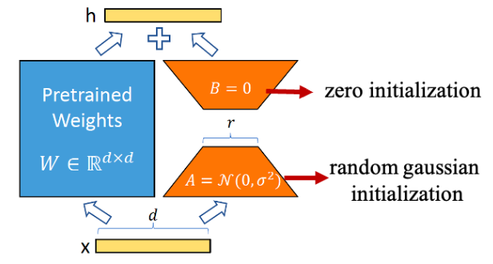

바탕이 되는 아이디어가 **Low-Rank Decomposition** — 행렬을 낮은 rank 의 행렬 곱으로
표현하는 것이다. $m \times n$ 행렬을 $m \times k$ 와 $k \times n$ 의 곱으로 근사한다
($k < n$).

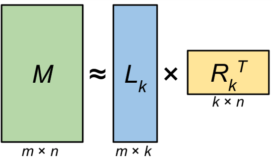

**학습 파라미터 감소.** 효과는 수치로 분명하다.

- $W$ : $1000 \times 1000 = 1{,}000{,}000$ 개
- $r=10$ : $1000 \times 10 + 10 \times 1000 = 20{,}000$ 개 — **98% 의 파라미터 감소**

파라미터가 줄면 학습 중 GPU 메모리가 절약된다. Adam 계열 optimizer 는 파라미터마다
gradient 와 momentum · variance 를 함께 저장하므로 필요 메모리는 대략 파라미터 수의
4배($\#P \times 4$: p, g, m, v)가 되는데, 학습 파라미터가 줄면 이 전체가 준다. 학습
속도가 빨라지고, **LoRA 가중치($A$ 와 $B$)만 저장 · 배포**할 수 있어 배포와 교체도
쉬워진다.

**LoRA 적용 layer.** 보통 다음 위치의 linear projection 에 적용한다.

- Attention : linear projection layer $W_q, W_k, W_v$ ($3 \times d_{model} \times d_{model}$)
- FFN : $W_1$, $W_2$ ($2 \times d_{model} \times d_{ff}$, 예: $2 \times 768 \times 3072$)

LoRA 논문의 GPT-2 실험에서 방법별 checkpoint 크기를 비교하면, 전체 fine-tuning(FT)이
774M 파라미터를 저장하는 데 비해 LoRA 는 0.77M 만 저장한다. Adapter(layer 추가
방식)와 비교해도 성능은 LoRA 가 가장 좋았다.

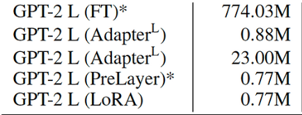

---

## 1.3.3 PEFT 라이브러리와 적용 절차
<!-- 슬라이드 50 -->

PEFT 라이브러리(https://github.com/huggingface/peft)는 Hugging Face transformers 와
원활하게 통합되며 LoRA, Prefix Tuning, Prompt Tuning, $IA^3$(Inverse Attention
Adaptation)를 지원한다. LoRA 적용의 기본 절차는 네 단계다.

> **LoRA 적용 기본 절차**
> LoraConfig 설정 → peft_model wrapping → Trainer 생성 → Training

절차 전체를 최소 코드로 요약하면 다음과 같다 (뒤의 실습에서 단계별로 자세히 다룬다).

```python
from transformers import AutoModelForSequenceClassification, AutoTokenizer
from peft import LoraConfig, get_peft_model

model_name = "klue/roberta-base"
tokenizer = AutoTokenizer.from_pretrained(model_name)

model = AutoModelForSequenceClassification.from_pretrained(
    model_name,
    num_labels=2
)

lora_config = LoraConfig(
    r=8,
    lora_alpha=16,
    lora_dropout=0.05,
    bias="none",
    task_type="SEQ_CLS",
    target_modules=["query", "key", "value", "dense"]  # 대부분 안전
)

peft_model = get_peft_model(model, lora_config)
peft_model.print_trainable_parameters()
```

---

## 1.3.4 한국어 감성 분석에 LoRA 적용하기
<!-- 슬라이드 51~56 -->

### 실습 1.3.1 — klue/roberta-base 에 LoRA 적용하기

> 노트북: `code/1.3.1.1.FineTuningLoRA.ipynb`
> [](https://colab.research.google.com/github/AI-BoostCamp/AgenticAI/blob/main/code/1.3.1.1.FineTuningLoRA.ipynb)

1.2 절의 한국어 감성 분석(nsmc)을 LoRA 로 다시 실행한다. 달라지는 것은 모델 준비
단계에 LoRA 적용이 끼어드는 것뿐이고, 나머지 절차는 같다. (QLoRA 는 VRAM 절약에는
좋지만 CUDA/bitsandbytes 호환성 문제로 불안정한 경우가 많아 실습에서 제외한다.)

**Model & Tokenizer load.** `klue/roberta-base`(111M 파라미터)를 로드한다.

```python
#model_name = "beomi/KcELECTRA-base"   # 109M
#model_name = "klue/roberta-small"     # 68M
model_name = "klue/roberta-base"       # 111M

num_labels = 2 # (0: 부정, 1: 긍정)
tokenizer = AutoTokenizer.from_pretrained(model_name)

model = AutoModelForSequenceClassification.from_pretrained(
    model_name,
    num_labels=num_labels,
    device_map="auto",
    torch_dtype=torch.bfloat16   ##
)
```

**LoRA 적용할 module 검토.** LoRA 의 단점이 여기서 나온다 — 적용할 module 이름을
정확히 특정해야 한다. `model` 을 출력해 구조를 확인하고, 이름에 attention 관련
키워드가 들어간 파라미터를 걸러 target module 후보를 찾는다. Transformer 모델에서는
attention 의 projection layer(`query`/`key`/`value`, 모델에 따라
`q_proj`/`k_proj`/`v_proj`)에 적용하는 것이 일반적이다.

```python
## module의 이름을 정확하게 확인 ##
target_keywords = ['dense','query','key','value','q_proj','k_proj','v_proj']
for name, param in model.named_parameters() :
    if any(keyword in name for keyword in target_keywords):
        print(f"{name} ::: {param.shape}")
# roberta.encoder.layer.0.attention.self.query.weight ::: torch.Size([768, 768])
# roberta.encoder.layer.0.attention.self.query.bias   ::: torch.Size([768])
# ...
```

이때 `classifier.dense` 처럼 **분류 head 에까지 적용되지 않도록** target module
이름을 특정해야 한다.

```python
target_modules = [
    "query",
    "key",
    "value",
    # "dense"                    # 종종 오류의 주역
    # "attention.output.dense",  # attention 결과 projection
    # "intermediate.dense",      # FFN 1st layer
    # "output.dense"             # FFN 2nd layer
]
```

**LoraConfig 설정.** LoRA 어댑터의 파라미터를 정의한다.

```python
lora_config = LoraConfig(
    r=8,                # LoRA 랭크 (예: 8, 16, 32, 64)
    lora_alpha=16,      # LoRA 스케일링 팩터 (일반적으로 랭크의 2배), 과하면 불안정, 작으면 학습 지연
    target_modules=target_modules,
    lora_dropout=0.05,  # LoRA 드롭아웃
    bias="none",        # 바이어스는 학습하지 않음
    task_type="SEQ_CLS",# 시퀀스 분류 작업
)
```

두 인자는 뜻을 새겨 둘 필요가 있다.

- `lora_alpha` — LoRA layer 의 **영향력**을 정한다. 기존 layer 는 $W$, LoRA layer 는
  $BA$ 인데, alpha 가 이 $BA$ 의 기여를 스케일링한다.
- `task_type` — **LoRA layer 를 주입할 위치**를 결정한다. 모델의 구조에 대한 정보를
  제공하는 것으로, `SEQ_CLS` 는 encoder 에, `CAUSAL_LM` 은 decoder 에,
  `SEQ_2_SEQ_LM` 은 encoder · decoder 모두에 주입한다.

모델 · 작업 조합별 task type 은 다음과 같다.

| 모델 | 작업 | Task type |
|---|---|---|
| bert-base-uncased + AutoModelForSequenceClassification | 감정 분류 | SEQ_CLS |
| roberta-base + AutoModelForTokenClassification | 개체명 인식, POS 태깅 | TOKEN_CLS |
| t5-base + AutoModelForSeq2SeqLM | 번역, 문장 요약 | SEQ_2_SEQ_LM |
| gpt2 + AutoModelForCausalLM | 토큰 생성 | CAUSAL_LM |
| deberta-v3-base + AutoModelForMultipleChoice | 다지선다형 | MULTIPLE_CHOICE |

**Peft wrapping — `get_peft_model()`.** 기본 모델을 LoRA 어댑터로 감싼다. 이 함수는
모델 내에서 fine-tuning 대상 모듈을 식별해 LoRA layer 를 삽입하고, 나머지 원래
파라미터는 frozen(동결) 상태로 유지한다. 감싼 뒤 학습 가능한 파라미터 수를 확인하면
LoRA 의 효율이 바로 보인다 — 전체의 1.7% 만 학습한다.

```python
peft_model = get_peft_model(model, lora_config)

# 학습 가능한 파라미터 수 확인 (LoRA의 효율성 확인)
peft_model.print_trainable_parameters()
# trainable params: 1,919,234 || all params: 111,002,116 || trainable%: 1.7290
```

**TrainingArguments 설정.** 1.2 절과 거의 같지만 두 가지가 추가된다.

```python
batch_size = 64

output_dir="./results"
training_args = TrainingArguments(
    output_dir=output_dir,          # checkpoint 저장 경로
    num_train_epochs= 1,
    per_device_train_batch_size=batch_size, # GPU당 batch size
    per_device_eval_batch_size=batch_size,  # GPU당 batch size
    warmup_steps=10,                # 전체 step에 맞춰 조정
    weight_decay=0.01,              # L2 정규화
    logging_dir=f"{output_dir}/logs",# 로그 저장 디렉토리
    logging_steps=10,               # 너무 작으면 과부하
    eval_strategy="steps",          # 'no', 'steps', 'epoch', 'best'
    save_strategy="steps",
    save_steps=10,                  # logging_steps과 동일한게 좋음
    load_best_model_at_end=True,    # 가장 좋은 모델 로드
    metric_for_best_model="accuracy",# 최고 모델 선정 기준
    report_to="tensorboard",
    label_names=["labels"],          ### 추가
    fp16=False,
    bf16=True,)                      # AMP가능한 GPU인 경우 권장
```

- `label_names=["labels"]` — PeftModel 은 내부적으로 Hugging Face 의 모델을
  래핑(wrap)하기 때문에, Trainer 가 일반적으로 자동 추론하는 label, label_ids 등을
  감지할 수 없다. metric 계산 등에서 정답 레이블을 자동으로 찾지 못할 수 있으므로,
  생략 가능했던 것을 명시적으로 지정한다.
- `bf16=True` — Auto Mixed Precision 이 가능한 GPU 인 경우 사용한다.

**Trainer 정의 & 학습.** Trainer 에는 원래 모델이 아니라 **`peft_model`** 을 전달한다.

```python
# Trainer 인스턴스 생성
trainer = Trainer(
    model=peft_model,                 # LoRA wrapping
    args=training_args,               # args
    train_dataset=train_dataset_subset,
    eval_dataset=test_dataset_subset,
    compute_metrics=compute_metrics, )
```

데이터 준비(nsmc 로드 · 전처리 · subset)는 실습 1.2.2 와 동일하므로 코드 재현은
노트북을 참조한다. batch size 64 로 학습하면 학습 중 GPU 메모리가 3.2 GB 에
그친다 — 1.2 절의 full fine-tuning(7.7 GB)과 비교하면 LoRA 의 메모리 절약이
분명하다.

```python
%%time
trainer.train()
# Wall time: 49.5 s
```

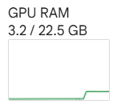

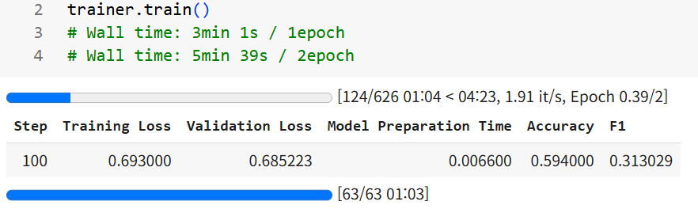

학습 후 평가와 예측, 모델 저장 · 로드는 1.2 절과 같은 코드로 수행한다
(`trainer.evaluate()` 로 acc 0.88, f1 0.87 수준을 확인할 수 있다).

### 참고 — 커스텀 Transformer 에 LoRA 적용하기 (TimeSFormer)
<!-- 노트북 1.3.1.2.TimeSFormer.ipynb 의 참고 내용 (대응 슬라이드 없음) -->

> 노트북: `code/1.3.1.2.TimeSFormer.ipynb`
> [](https://colab.research.google.com/github/AI-BoostCamp/AgenticAI/blob/main/code/1.3.1.2.TimeSFormer.ipynb)

LoRA 는 Hugging Face 의 사전학습 모델에만 쓰는 것이 아니다 — **직접 만든 PyTorch
Transformer 에도** 같은 방식으로 적용할 수 있다. 이 노트북은 주가 시계열 데이터(주가 ·
기술적 지표 23개 특성)를 입력으로 미래 변화율을 11단계로 분류하는 커스텀
Transformer(특성 임베딩 → TransformerEncoder → 예측 헤드)를 만들고, 여기에 peft
LoRA 를 적용해 본다.

절차는 실습 1.3.1 과 같다 — `named_modules()` 로 모델 안의 `nn.Linear` 이름을 확인한
뒤 `target_modules` 에 직접 지정하는 것이 핵심이다.

```python
from peft import LoraConfig, get_peft_model

# 모델의 구조 확인
for name, module in model.named_modules():
    if isinstance(module, nn.Linear):
        print(f"  Linear 모듈: {name}")

# LoRA 설정 (구체적인 Linear 레이어들 타겟)
lora_config = LoraConfig(
    r=16, lora_alpha=32,
    target_modules=[
        "feature_embedding",                        # 특성 임베딩 레이어
        "transformer.layers.0.self_attn.out_proj",  # attention 레이어들
        "transformer.layers.0.linear1",             # FFN 레이어들
        "prediction_heads.3d.0",                    # 예측 헤드의 Linear 레이어들
        # ...
    ],
    lora_dropout=0.1, bias="none",
    task_type="FEATURE_EXTRACTION"
)

model = get_peft_model(model, lora_config)
model.print_trainable_parameters()
```

커스텀 모델에서는 표준 모델과 달리 모듈 경로를 하나하나 적어야 하고,
`task_type="FEATURE_EXTRACTION"` 처럼 분류용 task type 이 맞지 않는 경우가 생긴다 —
노트북은 LoRA 적용이 실패하면 더 간단한 설정(r=8, feature_embedding 만)으로
재시도하고, 그래도 안 되면 일반 fine-tuning 으로 진행하는 방어적 흐름까지 보여준다.
데이터 준비(라벨 생성 · 시퀀스 데이터셋)와 학습 · 평가(confusion matrix, 확신도 분석)
전체는 노트북을 참조한다.

---

## 1.3.5 Hugging Face 주요 라이브러리
<!-- 슬라이드 57 -->

Fine-tuning 생태계를 이루는 주요 라이브러리를 정리해 둔다 (https://huggingface.co/docs).

- **transformers** : Hugging Face 모델 download, fine tuning 지원
- **accelerate** : PyTorch 에서 다중 GPU 관련 상용구 코드를 추상화
- **sentencepiece** : text 를 sub-word 단위의 토큰으로 분리 지원
- **evaluate** : NLP 를 포함하는 성능평가 함수
- **trl** : transformer 강화학습 라이브러리 — Supervised Fine-Tuning(SFT),
  Proximal Policy Optimization(PPO), Direct Preference Optimization(DPO) 지원
- **bitsandbytes** : CUDA 함수 wrapper — 특히 8비트 optimizer, 행렬 곱셈(LLM.int8()),
  8 및 4비트 quantization
- **loralib** : LoRA 지원 (2023.02 부터 peft 에 포함)
- **peft** : Parameter-Efficient Fine-Tuning — LoRA, X-LoRA, LoHa, LoKr, PFT, BOFT,
  AdaLoRA, Llama-Adapter, HRA, Bone 지원. Fine-tuning 에서 소수의 추가 parameter 만
  tuning 하여 적은 리소스로 더 큰 모델을 tuning 할 수 있다.

---

## 1.3.6 Unsloth — LoRA 를 위한 Fine-tuning 프레임워크
<!-- 슬라이드 58~59 -->

Unsloth(https://unsloth.ai/, https://huggingface.co/unsloth)는 LoRA 기반의 초고속
학습과 메모리 최적화에 특화된 Fine-tuning framework 다. Hugging Face 나 PyTorch
기반의 기존 접근보다 빠르고, Colab 환경에서도 효율적으로 학습할 수 있다.

- 2x~5x 빠른 학습 속도, 2x~5x 빠른 LoRA 파인튜닝
- Colab T4/L4 에서도 LLaMA3 8B 를 4bit QLoRA 로 파인튜닝 가능
- PEFT 기반으로 작동하며, 내부적으로 커스터마이징된
  `prepare_model_for_kbit_training` 사용
- 최신 모델 지원 : LLaMA2, LLaMA3, Mistral, Gemma, Phi, OpenHermes 등에 최적화
- Prompt 학습 최적화 : Instruction-tuning 구조와 잘 맞음 (SFT + ChatML, Alpaca 포맷 등)
- Trainer 포함 : 자체 FastTrainer 제공 (Hugging Face Trainer 보다 훨씬 빠름)

단점도 있다 — 구체적인 포맷(ChatML 등)에 따른 데이터 정제가 필요하고, 최신
라이브러리이므로 버전 호환 문제가 발생할 수 있어 권장 환경 설치가 필요하며, 공식 모델
외에 적용하려면 소스 코드 수정이 필요할 수 있다.

Unsloth 가 제공하는 모델 두 계열을 보자.

- **Qwen3-30B 계열** (https://huggingface.co/unsloth/Qwen3-30B-A3B-GGUF) — 모델
  페이지에서 양자화 수준별 메모리 요구량을 확인할 수 있다. 표기 규칙: Q 는
  Quantized, 숫자(1,2,3,4)는 양자화 bit 수, K/K_S/K_XL 은 최적화 방식,
  _0/_1/_NL 은 구조 · 압축 전략, BF16 은 bfloat16 사용.
- **DeepSeek-R1-0528-Qwen3-8B 계열**
  (https://huggingface.co/unsloth/DeepSeek-R1-0528-Qwen3-8B-GGUF) —
  DeepSeek-R1-0528 에서 Qwen3 8B Base 를 훈련해 생각의 사슬(chain of thought)을
  추출한 모델로, Qwen3 8B 를 +10.0% 능가하고 Qwen3-235B 의 reasoning 성능과
  일치한다. 오픈 소스 모델 중 SOTA 를 달성했다.

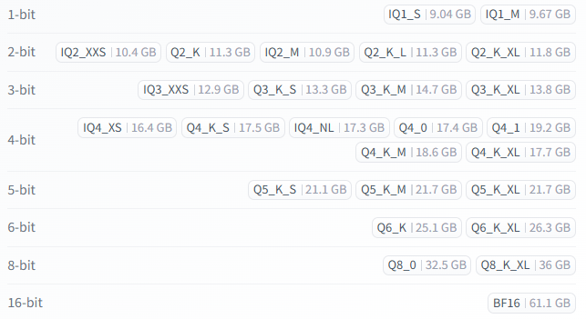

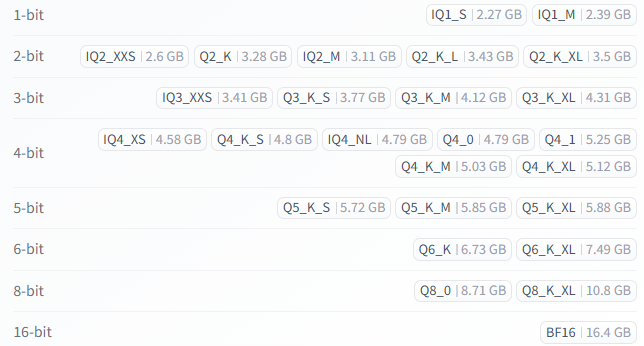

함께 알아 둘 두 용어 — **llama.cpp** 는 양자화 및 연산 최적화를 위한 실행 엔진으로
환경에 맞게 최적화된 실행을 지원하고, **GGUF** 는 llama.cpp 용 파일 format 으로
양자화 파일을 빠르고 안정적으로 load 한다.

---

## 1.3.7 Qwen3-14B Reasoning 모델 Fine-tuning
<!-- 슬라이드 60~66 -->

### 실습 1.3.2 — Unsloth 로 Qwen3-14B Fine-tuning

> 노트북: `code/1.3.2.Qwen3(14B)_Reasoning_Unsloth.ipynb`
> [](https://colab.research.google.com/github/AI-BoostCamp/AgenticAI/blob/main/code/1.3.2.Qwen3%2814B%29_Reasoning_Unsloth.ipynb)

Qwen3-14B(https://huggingface.co/unsloth/Qwen3-14B)를 4bit + LoRA 로 Fine-tuning
한다.

**사용할 모델 Load.** Unsloth 의 `FastLanguageModel` 을 사용한다. 이미 양자화되어
배포된 모델(`-bnb-4bit`)은 Fine-tuning 이 불가능하므로, 원본 모델을 받아
`load_in_4bit=True` 로 로드한다.

```python
%%time
from unsloth import FastLanguageModel
model, tokenizer = FastLanguageModel.from_pretrained(
    model_name = "unsloth/Qwen3-14B",                    # load_in_4bit
    # model_name = "unsloth/Qwen3-14B-unsloth-bnb-4bit", # 양자화된 모델은 FineTuning 불가
    max_seq_length = 2048,   # Context length, 길면 메모리 더 필요
    load_in_4bit = True,     # 4bit 사용으로 메모리 감소
    load_in_8bit = False,    # 더 정밀해짐, 2배 메모리 필요
    full_finetuning = False, # LoRA 사용 예정
    device_map = "auto",
)
# Wall time: 1min 38s
```

**LoRA 적용.** LoRA 어댑터가 추가되어 전체 파라미터의 1%~10% 만 업데이트한다.
attention 의 4개 projection 과 FFN 의 3개 projection 을 target 으로 잡는다.

```python
model = FastLanguageModel.get_peft_model(
    model,
    r = 32,                     # rank : 8, 16, 32, 64, 128
    target_modules = ["q_proj", "k_proj", "v_proj", "o_proj",
                      "gate_proj", "up_proj", "down_proj",],
    lora_alpha = 32,            # rank or rank*2
    lora_dropout = 0,           # 0 is optimized
    bias = "none",              # "none" is optimized
    use_gradient_checkpointing = "unsloth",# "unsloth":메모리 절약됨
    random_state = 3407,
    use_rslora = False,         # Rank Stabilized LoRA, 아직 실험적
    loftq_config = None,        # And LoftQ, 매우 작은모델에 유용
)
```

**Data 준비.** Qwen3 에는 추론(reasoning) 모드와 비추론 모드가 모두 있으므로 두 개의
데이터 세트를 사용해야 한다.

1. AIMO(AI Mathematical Olympiad)에서 우승하는 데 사용된 **Open Math Reasoning**
   데이터 세트 — DeepSeek R1 학습에서 검증 가능한 추론 추적(verifiable reasoning
   trace)으로 사용된 것에서 10% 를 샘플링했고 95% 이상의 정확도를 얻은 데이터다.
2. ShareGPT 스타일의 **Maxime Labonne's FineTome-100k** 데이터 세트 — HuggingFace 의
   일반 multiturn format 으로 변환해 사용한다.

```python
from datasets import load_dataset
reasoning_dataset = load_dataset("unsloth/OpenMathReasoning-mini", split = "cot")
non_reasoning_dataset = load_dataset("mlabonne/FineTome-100k", split = "train")
```

reasoning 데이터의 구조를 확인해 보면 수학 문제 본문(`problem`)과 `<think>` 로
시작하는 CoT 방식의 모델 풀이(`generated_solution`), 정답(`expected_answer`) 등의
필드로 되어 있다.

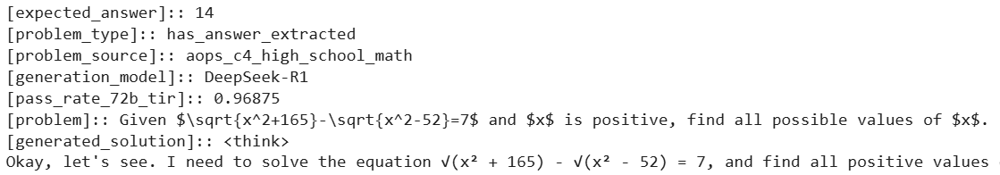

**대화 형식으로 변환.** 두 데이터 세트를 ChatGPT-style 대화 형식(user ↔ assistant)으로
변환해 LLM 의 대화형 파인튜닝 형식으로 전처리한다. 추론 데이터부터 변환한다.

```python
def generate_conversation(examples):
    problems  = examples["problem"]
    solutions = examples["generated_solution"]
    conversations = []
    for problem, solution in zip(problems, solutions):
        conversations.append([
            {"role" : "user",      "content" : problem},
            {"role" : "assistant", "content" : solution}, ])
    return { "conversations": conversations, }

reasoning_conversations = tokenizer.apply_chat_template(
    reasoning_dataset.map(generate_conversation, batched = True)["conversations"],
    tokenize = False, )
```

비추론 데이터는 먼저 Unsloth 의 `standardize_sharegpt` 함수로 형식을 수정한 뒤
같은 템플릿을 적용한다.

```python
from unsloth.chat_templates import standardize_sharegpt
dataset = standardize_sharegpt(non_reasoning_dataset)

non_reasoning_conversations = tokenizer.apply_chat_template(
    dataset["conversations"],
    tokenize = False,
)
```

**추론/비추론 비율 조정.** 비추론 데이터 세트가 훨씬 더 길다. 모델이 몇 가지 추론
기능을 유지하되 기본적으로 채팅 모델이기를 원한다면 채팅 전용 데이터의 비율을
정의해야 한다 — 여기서는 **75% 추론 + 25% 채팅**을 선택한다.

```python
import pandas as pd
chat_percentage = 0.25
non_reasoning_subset = pd.Series(non_reasoning_conversations)
non_reasoning_subset = non_reasoning_subset.sample(
    int(len(reasoning_conversations)*(chat_percentage/(1 - chat_percentage))),
    random_state = 2407, )
```

두 데이터 세트를 결합해 하나의 학습 데이터로 만든다.

```python
data = pd.concat([
    pd.Series(reasoning_conversations),
    pd.Series(non_reasoning_subset)
])
data.name = "text"

from datasets import Dataset
combined_dataset = Dataset.from_pandas(pd.DataFrame(data))
combined_dataset = combined_dataset.shuffle(seed = 3407)
```

**Trainer 생성.** Huggingface TRL 의 SFT(Supervised Fine-Tuning) Trainer 를 사용한다.
**SFTTrainer 는 최신 생성모델 기반 LLM 및 RLHF 에 최적화**되어 있고, 앞서 쓰던
Trainer 는 BERT 류에 최적화되어 있다. 속도를 높이기 위해 30 step 만 수행한다 —
전체 실행을 하려면 `num_train_epochs=1, max_steps=None` 으로 바꾼다.

```python
from trl import SFTTrainer, SFTConfig

trainer = SFTTrainer(
    model = model,
    tokenizer = tokenizer,
    train_dataset = combined_dataset,
    eval_dataset = None,                 # 필요시
    args = SFTConfig(
        dataset_text_field = "text",
        per_device_train_batch_size = 2,
        gradient_accumulation_steps = 4, # batch size가 너무 작을때
        warmup_steps = 5,
        # num_train_epochs = 1,          # full training
        max_steps = 30,                  # 최소한으로 학습
        learning_rate = 2e-4,            # 2e-5 까지(천천히 학습)
        logging_steps = 1,
        optim = "adamw_8bit",            # AdamW(weight decay 유리)
        weight_decay = 0.01,
        lr_scheduler_type = "linear",
        seed = 3407,
        report_to = "none",
    ),
)
```

optimizer 는 `adamw_8bit` 다 — optimizer 가 사용하는 momentum, variance 를 8bit 로
저장해 메모리를 절감한다. 최신 optimizer 목록은
https://huggingface.co/docs/transformers/main/en/optimizers 에서 검토할 수 있다.

**Training.** 학습 중 GPU 메모리는 13.5 GB 수준이다 — 14B 모델을 22.5 GB GPU 에서
학습하고 있다는 점을 기억하자.

```python
%%time
trainer_stats = trainer.train()
```

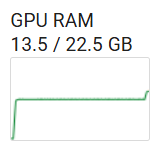

**Inference — thinking 모드 제어.** Qwen3 는 생성 시 `enable_thinking` 으로 추론
모드를 켜고 끌 수 있고, 모드별 권장 sampling 설정이 다르다.

- enable thinking (Qwen-3 권장): `temperature = 0.6, top_p = 0.95, top_k = 20`
- disable thinking (일반 채팅 권장): `temperature = 0.7, top_p = 0.8, top_k = 20`

```python
messages = [
    {"role" : "user", "content" : "이 식을 풀어줘. (x + 2)^2 = 0."} ]
text = tokenizer.apply_chat_template(
    messages,
    tokenize = False,
    add_generation_prompt = True, # Must add for generation
    enable_thinking = False, )    # Disable thinking

from transformers import TextStreamer
_ = model.generate(
    **tokenizer(text, return_tensors = "pt").to("cuda"),
    max_new_tokens = 256,
    temperature = 0.7, top_p = 0.8, top_k = 20, # For non thinking
    streamer = TextStreamer(tokenizer, skip_prompt = True), )
```

thinking 을 끄면 풀이가 바로 나온다.

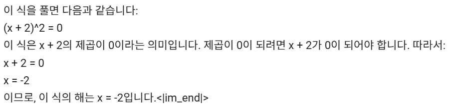

`enable_thinking = True` 로 켜면(그리고 thinking 권장 설정으로 바꾸면) 응답 앞에
`<think>` 블록 — 스스로 풀이를 검토하는 사고 과정 — 이 붙은 뒤 정리된 답이 나온다.

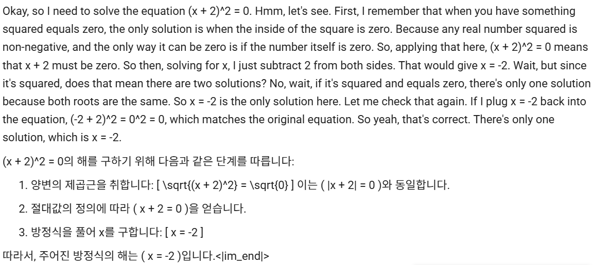

---

## 1.3.8 모델 저장과 GGUF
<!-- 슬라이드 67~68 -->

**Save — 무엇을 저장할지 선택한다.** `model.save_pretrained()` 의 기본 동작은
**LoRA adapter parameter 만 저장**하는 것이다. 모델 전체를 저장하려면 merge 방식
(`save_method = "merged_**bit"`)을 사용한다.

```python
model.save_pretrained("lora_model")    # LoRA Adapter parameter만 저장
tokenizer.save_pretrained("lora_model")# tokenizer 저장
```

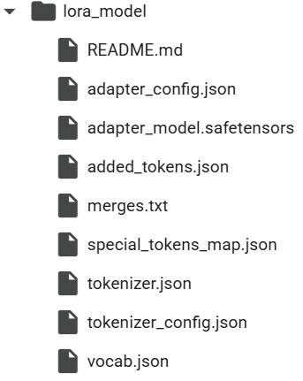

저장한 adapter 는 `FastLanguageModel.from_pretrained(model_name="lora_model", ...)`
로 다시 읽는다 — base 모델은 자동으로 load 된다 (메모리가 부족하면 실패하므로 그때는
session restart 후 실행한다). base 와 LoRA 를 결합해 전체를 저장하려면:

```python
# Merge to 16bit(float16) # 모델이 커서(5GB) 시간이 많이 소요됨
model.save_pretrained_merged("model_m16", tokenizer, save_method = "merged_16bit",)
# Merge to 4bit(int4)
model.save_pretrained_merged("model_m4", tokenizer, save_method = "merged_4bit",)
```

**Save GGUF — llama.cpp format.** `save_pretrained_gguf()` 로 GGUF 형식으로 저장할
수 있다 (저장 시간이 상당히 증가한다).

```python
# Save to 8bit Q8_0
model.save_pretrained_gguf("model_q8_gguf", tokenizer,)
# Save to q4_k_m GGUF
model.save_pretrained_gguf("model_q4_k_m_gguf", tokenizer, quantization_method = "q4_k_m")
```

양자화 방법의 선택 기준은 다음과 같다.

- `q8_0` : 빠른 변환. 리소스 사용량이 많지만 일반적으로 쓸만하다.
- `q4_k_m` : 권장. attention.wv 및 feed_forward.w2 텐서의 절반은 Q6_K 를 적용하고
  나머지는 Q4_K 를 사용한다.
- `q5_k_m` : 권장. 같은 방식으로 절반은 Q6_K, 나머지는 Q5_K.
- `_m`(mixed) : attention.wv 와 feed_forward.w2 는 상대적으로 민감한 부분이므로
  정밀도를 높인다.

왜 그 두 텐서가 민감한가 —

- **attention.wv** : value($V$) layer 의 가중치. 이 값이 부정확하면 맥락 이해
  (예: 수학 추론)가 저하된다.
- **feed_forward.w2** : FFN 의 down-projection 가중치. FFN 은
  up-projection($w_1$, 4096 → 11008) → activation(SiLU/GELU) →
  down-projection($w_2$, 11008 → 4096) 구조인데, $w_2$ 가 부정확하면 생성 품질
  (예: 수학 응답)이 저하된다.

포맷별 정밀도 · 크기 · 손실을 비교하면 다음과 같다 (14B 기준).

| 포맷 | 정밀도 | 파일 크기 (14B) | 정확도 손실 |
|---|---|---|---|
| Q8_0 | 8bit (int8) | ~10-12GB | ~0.1-0.5% |
| Q6_K | 6bit (K) | ~8-9GB | ~0.5-1% |
| Q4_K | 4bit (K) | ~5-6GB | ~1-2% |
| Q4_K_M | 4bit + 6bit (K) | ~5-7GB | ~1-1.5% |

여기서 K-Quantization 은 block 단위 양자화로 scaling factor 를 포함하는 방식이고,
M(Medium)은 민감한 텐서의 절반에 Q6_K 를 쓰는 혼합 전략이다.

**bitsandbytes 와는 뭐가 다른가.** bitsandbytes 는 Hugging Face(transformers)에서
사용하는 4-bit · 8-bit 양자화 라이브러리로 **GPU 환경에 최적화**되어 있다 — 메모리
효율적, GPU 효율적 실행이 목적이고 CUDA 환경(version 등)에 민감하다. 반면
llama.cpp 는 저사양 하드웨어에서도 대형 모델을 실행할 수 있도록 양자화(4-bit,
8-bit)와 최적화된 연산 환경을 제공해 주는 wrapper 로, CPU 및 GPU(NVIDIA CUDA,
Apple Metal)를 지원한다.

### 실습 1.3.3 — GGUF 모델 사용하기 (llama.cpp)

> 노트북: `code/1.3.3.llamaCpp_SemiKong_GGUF.ipynb`
> [](https://colab.research.google.com/github/AI-BoostCamp/AgenticAI/blob/main/code/1.3.3.llamaCpp_SemiKong_GGUF.ipynb)

GGUF 로 배포된 모델을 llama.cpp(파이썬 바인딩 llama-cpp-python)로 실행해 본다.
모델 파일 하나를 내려받아 `LlamaCpp` 로 로드하면 된다.

```python
%%time
# LlamaCpp로 모델 로드 : GGUF 모델 다운로드
from huggingface_hub import hf_hub_download
from langchain_community.llms import LlamaCpp

model_repo = "unsloth/gemma-3-12b-it-qat-GGUF"
model_file = "gemma-3-12b-it-qat-Q4_0.gguf"

model_path = hf_hub_download(repo_id=model_repo, filename=model_file, local_dir="./")

llm = LlamaCpp(
    model_path=model_path,
    n_gpu_layers=40,  # GPU에 최대 레이어 오프로드 나머지는 CPU에서 연산
    n_batch=512,
    n_ctx=2048,       # 컨텍스트 길이
    f16_kv=True,      # FP16 메모리 최적화
    verbose=False,
    temperature=0.3,  # 정확한 답변을 위해서는 낮은값
    max_tokens=256
)

response = llm.invoke("너의 지적 수준을 객관적으로 설명해봐. 한국어로 설명해줘.")
```

핵심 파라미터는 `n_gpu_layers` 다 — transformer block 중 몇 개를 GPU 에 올릴지
정하고, 나머지는 CPU 에서 연산한다. 이 구조 덕분에 **GPU 메모리보다 큰 모델도 실행할
수 있다.** 노트북에서는 이를 세 단계로 확장해 본다.

- **MoE 로 추론 속도 향상** : Llama-3.2-8x3B MoE(Q4_k_m 11.3 GB),
  Phi-3.5-MoE-instruct(42B, Q2_K_L 15.4 GB) 같은 MoE 모델은 추론 시 일부 전문가만
  활성화되어 응답이 빠르다 (같은 질문에 5초 안팎).
- **부족한 GPU 메모리에서 대형 모델 실행** : SEMIKONG-70B(Q4_K_M 42.5 GB)는 80개의
  transformer block 을 가지는데, `n_gpu_layers=40` 으로 40개 block 만 GPU(22 GB)에
  할당하고 나머지는 CPU 에서 실행하면 42 GB 모델이 돌아간다. 대신 속도를 치른다 —
  `verbose=True` 로 확인하면 초당 1.7 token 수준의 생성 속도가 나온다.

---

## 1.3.9 Fine-tuning 해볼 만한 최신 모델들
<!-- 슬라이드 69 -->

Fine-tuning 의 활용 방향은 도메인 특화다.

- 자동 생산되는 정보 · log 정보의 분류와 요약 — 시계열 문자 정보의 분류, 요약 등
- 기술 문서 기반 응답(RAG + LoRA) — 자동 생산되는 정보의 분류 · 요약 문장을 입력으로
  하여 기술문서를 기반으로 응답하고, 응답을 분류하여 중요도 · 민감도를 확인

도메인 특화의 대표 사례가 SemiKong 이다 — "SemiKong: Curating, Training, and
Evaluating A Semiconductor-Specific LLM"(2024.11)은 반도체 산업에 특화된 세계 최초의
오픈 소스 대형 언어 모델로, Llama 3.1 기반 70B 모델을 반도체 도메인 데이터(설계 문서,
제조 프로세스, EDA 도구 지식 등)로 fine-tuning 했다
(https://huggingface.co/models?sort=trending&search=semikong).

Fine-tuning 후보가 될 만한 모델들을 비교하면 다음과 같다.

| 모델명 | #P | 한국어 | 특징 |
|---|---|---|---|
| Qwen3-Omni-30B | 30B | 매우 우수 | Multilingual Omni-modal Model, 텍스트 · 이미지 · 오디오 · 비디오 |
| SEMIKONG-70B | 75B | 우수 | 성능 최상, 반도체 산업 특화, 다양한 Quantization 제공 |
| Qwen3-14B (Unsloth) | 14.8B | 매우 우수 | 성능 최상급, Hybrid Reasoning, VRAM 16GB 도 가능 (4bit+LoRA) |
| Yi-6B-Chat | 6B | 매우 우수 | 한국어 벤치마크 1위권, 추론 + 자연어 처리 강점 |
| Qwen1.5-4B | 4B | 중간 | Qwen3 와 동일 계열, 작고 빠른 실용 모델 |
| Nous Hermes 2 – Yi 6B | 6B | 강함 | Yi 기반 + 실전 instruction 튜닝, 코드/회화 모두 가능 |
| Mistral-7B-Instruct v0.2 | 7B | 강함 | 정제된 instruction 성능, 다양한 훈련 예제 많음 |
| Qwen1.5-MoE-A2.7B | 2.7B (MoE) | 강함 | Mixture of Experts, 추론 시 2개 전문가만 활성화 → 빠름 & 정확 |

---

## 1.3.10 실습과제
<!-- 슬라이드 56 : 하단의 실습과제 -->

**실습과제 — 더 큰 모델에 LoRA 를 직접 설계해 적용해 보자.**

- 모델: `beomi/KcELECTRA-base-v2022` (475M)
- model 구조를 보고 LoRA adapter 를 삽입할 위치를 결정해 보자.
  - 최대한 늘려서 적용해 보자.
  - 생각한 위치에 적용되었는지 확인하자.
- Fine-tuning 을 통해 충분하게 성능이 나오는지 확인하자.
  - 혹시 성능이 나오지 않으면 LoRA 삽입 위치가 적절한지 다시 점검해 보자.

실습 1.3.1 노트북(`code/1.3.1.1.FineTuningLoRA.ipynb`)에서 `model_name` 만
`beomi/KcELECTRA-base-v2022` 로 바꿔 같은 흐름으로 진행하면 된다.

---

## 1.3.11 정리

- PEFT 는 사전학습 모델의 일부 모듈만 tuning 해 메모리와 학습 시간을 줄인다. 대표
  방법이 LoRA — $W$ 를 freeze 하고 low-rank 행렬 $A$, $B$ 만 학습하며, 추론 시에는
  $W + AB$ 를 쓴다. $r=10$ 이면 파라미터가 98% 줄어든다.
- 적용 절차는 LoraConfig 설정 → `get_peft_model()` wrapping → Trainer → train.
  target module 이름을 모델 구조에서 정확히 확인해야 하고, PeftModel 은 래핑 때문에
  `label_names=["labels"]` 명시가 필요하다.
- LoRA 학습은 메모리를 크게 줄인다 — 같은 한국어 감성 분석에서 full fine-tuning
  7.7 GB 대 LoRA 3.2 GB.
- Unsloth 는 LoRA 특화 프레임워크로, Colab 급 GPU 에서 Qwen3-14B 를 4bit + LoRA 로
  학습할 수 있다. 생성 모델의 SFT 에는 Trainer 대신 TRL 의 SFTTrainer 를 쓴다.
- 저장은 세 갈래다 — adapter 만 저장(기본), base 와 병합해 저장(merged_16bit/4bit),
  GGUF 변환(q4_k_m 권장). GGUF + llama.cpp 는 `n_gpu_layers` 로 block 을 나눠
  GPU 메모리보다 큰 모델(70B, 42.5 GB)도 실행하게 해 준다.
