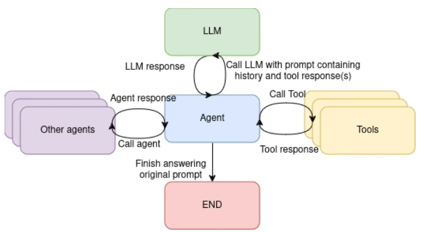

# 2장 개요 — AI Agent

<!-- 슬라이드 70, 74, 88, 110, 126 : 장 표지 (88·110·126 은 절 사이에 다시 나오는 같은 표지다) -->
<!-- 슬라이드 71~73 : 숨김 공백 슬라이드, 내용 없음 -->

2장은 LLM 을 **행동하는 시스템**으로 확장하는 AI Agent 를 다룬다. Agent 의 개념과
구성 요소에서 출발해, LangChain 으로 도구와 데이터를 연결하고(RAG), LangGraph 로
복잡한 흐름을 그래프로 설계하며, 마지막으로 실행 과정을 추적(tracing)하는 방법까지
나아간다.

**이 장의 구성**

- **2.1 AI Agent 개요** — Agent 의 정의, Planning · Memory · Tool use 구성 요소,
  대표 연구와 한계, Agent framework 비교.
- **2.2 LangChain 과 RAG** — LangChain 의 구성 요소와 Agent 만들기, 벡터 검색 기반
  RAG(Retrieval-Augmented Generation) 구축.
- **2.3 LangGraph 활용** — 상태(State) 그래프로 Agent 워크플로우를 설계하고
  multi-agent, MCP 로 확장.
- **2.4 LangGraph Tracing** — LangSmith 로 실행을 추적하고 프롬프트를 관리.
