# 2.1 AI Agent 개요

**학습 목표**

- AI Agent 의 정의와 초기 사례(AutoGPT, GPT-Engineer)의 특징을 설명할 수 있다.
- LLM 기반 자율 Agent 의 세 구성 요소 — Planning · Memory · Tool use — 를 구분할 수 있다.
- 작업 분해(CoT, ToT)와 자기반성(ReAct, Reflexion, CoH, Algorithm Distillation)의
  아이디어를 비교할 수 있다.
- Agent 의 Memory 를 사람의 기억 체계에 대응시키고, 장기 기억을 뒷받침하는 벡터 검색
  기법(MIPS)을 나열할 수 있다.
- AI Agent 의 한계와, 주요 Agent framework(LangChain, LlamaIndex, AutoGen, CrewAI)의
  용도를 설명할 수 있다.

**이 절의 구성**

- 2.1.1 AI Agent 란
- 2.1.2 LLM 기반 자율 Agent 의 구성
- 2.1.3 Planning — 작업 분해와 자기반성
- 2.1.4 Memory
- 2.1.5 Tool Use
- 2.1.6 AI Agent 사례
- 2.1.7 AI Agent 의 한계
- 2.1.8 주요 Agent Framework
- 2.1.9 정리

---

## 2.1.1 AI Agent 란
<!-- 슬라이드 75 -->

AI Agent 는 **목표를 지정하면 세부 목표와 행동 계획을 수립하고 행동**하는 시스템으로,
작업 자동화가 목표다. AutoGPT 와 GPT-Engineer 가 초기 사례다.

**AutoGPT** (https://github.com/Significant-Gravitas/AutoGPT) — 자동화된 콘텐츠 생성,
정보 제공, 간단한 질의 응답 등 정적인 작업이 대상이다.

- 설정한 목표나 요구사항을 기반으로 AI 가 작업을 수행한다. 사용자의 입력에 따라
  자동으로 반응하고 사전에 정의된 작업을 수행하며, 주로 반복적이거나 표준화된 작업에
  사용된다.
- 작업의 세부적인 설정이나 조정은 사용자가 직접 제공해야 한다. 특정 스크립트나
  시나리오에 따라 작업을 수행하고, 사용자의 입력을 받아 해당 스크립트에 맞게 응답한다.

**GPT-Engineer** (https://github.com/AntonOsika/gpt-engineer, 현재는 중단된
프로젝트다) — 소프트웨어 개발 과정을 자동화하거나 지원한다.

- 코드 생성 : 자연어 요구사항을 기반으로 코드를 작성한다
  ("사용자 로그인 기능을 구현하는 Python 코드를 작성해줘.").
- 코드 디버깅 : 오류가 있는 코드를 분석하고 문제를 수정하거나 개선 방안을 제안한다.
- 코드 리뷰 : 작성된 코드의 품질을 평가하고 개선 사항을 제안한다
  ("이 함수의 성능을 최적화할 방법은?").
- 문서화 : 코드에 대한 설명 · 주석 · API 문서를 자동으로 생성한다.
- 테스트 생성 : 테스트 케이스를 생성하고 코드의 안정성을 확인한다.
- 아키텍처 설계 : 소프트웨어 시스템의 구조를 설계하고 시각화하거나 설명한다.
- 자동화된 개발 파이프라인 : 작성 · 테스트 · 배포 과정을 자동화한다.

---

## 2.1.2 LLM 기반 자율 Agent 의 구성
<!-- 슬라이드 76 -->

LLM 기반 자율 Agent 의 표준적인 그림은 Lilian Weng 의 "LLM Powered Autonomous
Agents"(https://lilianweng.github.io/posts/2023-06-23-agent/)가 정리했다. Agent 는
LLM 을 두뇌로 삼고 세 가지 능력을 결합한다.

- **Planning** —
  - 하위 목표 및 분해 : 대규모 작업을 더 작고 관리 가능한 하위 목표로 나누어 작업을
    효율적으로 처리한다.
  - 반성 및 개선 : 과거 행동에 대한 자기비판과 반성으로 실수로부터 학습하고, 최종
    결과의 품질을 향상시킨다.
- **Memory** —
  - 단기 기억 : in-context learning 은 모델의 단기 기억을 활용하여 학습하는 것으로
    간주된다.
  - 장기 기억 : 외부 벡터 저장소와 빠른 검색을 활용하여 장기간에 걸쳐 (무한에 가까운)
    정보를 유지한다.
- **Tool use** — 최신 정보, 코드 실행, DBMS 접근 등 **학습되지 않은 정보**(사전 학습
  후에는 바꾸기 어려운 경우가 많다)를 획득하기 위해 외부 API 를 호출하는 방법을
  학습한다.

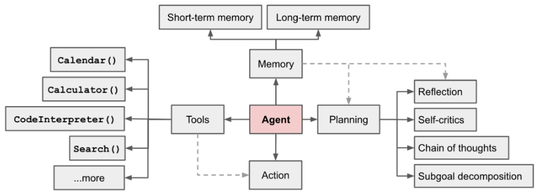

---

## 2.1.3 Planning — 작업 분해와 자기반성
<!-- 슬라이드 77~81 -->

Planning 은 두 계열로 나뉜다 — 작업을 잘게 나누는 **Task Decomposition** 과, 결과를
돌아보고 고치는 **Self-Reflection** 이다.

### 1) Task Decomposition — 작업 분해

**Chain of Thought(CoT)** 는 복잡한 작업에서 모델 성능을 향상시키기 위한 표준적
기술이 되었다. 모델은 어려운 작업을 더 작고 간단한 단계로 분해하기 위해 "단계별로
생각하도록" 지시받는다. 큰 작업을 여러 개의 관리 가능한 작업으로 변환하고, 모델의
사고 과정에 대한 해석을 가능하게 한다.

**Tree of Thoughts(ToT)** ("Tree of Thoughts: Deliberate Problem Solving with Large
Language Models", 2023)는 각 단계에서 여러 추론 가능성을 탐색하여 CoT 를 확장한다.

- 문제를 여러 생각(thought) 단계로 분해하고,
- 단계당 여러 생각을 생성하여 트리 구조를 만든다.
- 검색 프로세스는 BFS(너비 우선 탐색) 또는 DFS(깊이 우선 탐색)일 수 있으며, 각 상태는
  분류기(프롬프트를 통해) 또는 다수결 투표로 평가한다.

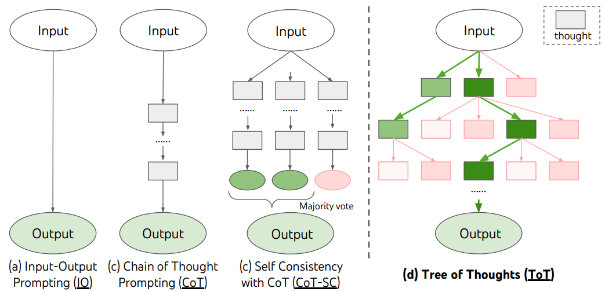

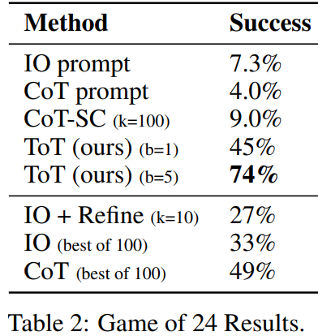

### 2) Self-Reflection — 자기반성

자기반성은 Agent 가 **과거 결정을 반복적으로 정리하여 이전 실수를 수정 · 개선**할 수
있게 하는 것이다. 시행착오가 불가피한 실제 작업에서 중요한 역할을 한다.

**ReAct** ("ReAct: Synergizing Reasoning and Acting in Language Models", 2023)는
LLM 안에서 추론(Reasoning)과 행동(Acting)을 상호작용적으로 생성해 두 기능을 통합한다.

- 추론과 행동을 동시에 수행하여, 외부 환경(예: Wiki 검색)과 상호작용하면서 지식을
  업데이트해 오류를 줄인다.
- 모델의 추론 과정을 명확하게 보여주어, 인간이 모델의 결정을 이해하고 수정할 수 있게
  한다.

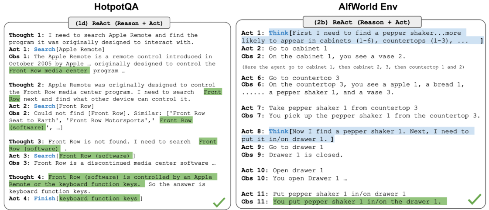

**Reflexion** ("Reflexion: Language Agents with Verbal Reinforcement Learning",
2023)은 LLM agent 가 **언어적 피드백**을 통해 학습하는 강화학습 프레임워크다.

- 의사결정 · 추론 · 프로그래밍 작업에서 성능을 크게 향상시키며 기존 접근법의 한계를
  극복한다.
- 기존의 강화 학습처럼 모델 가중치를 업데이트하지 않고, **언어적 자기 반성**을 통해
  학습한다.
- Agent 는 환경에서 얻은 피드백(value 또는 text)을 언어적 요약으로 변환하고 다음
  작업에 참고한다 — 인간이 과거 실수를 반성하고 개선하는 학습 방식과 유사하다.
- 휴리스틱 함수는 경로가 비효율적이거나 환각이 포함되어 중단해야 할 때를 결정한다.

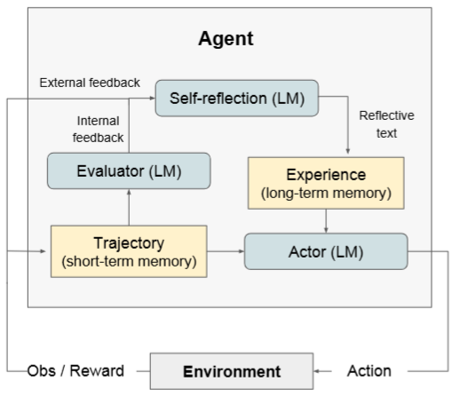

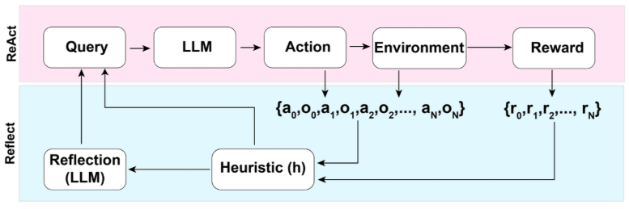

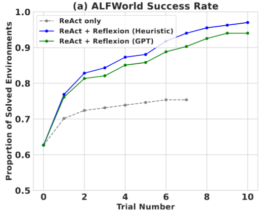

**Chain of Hindsight(CoH)** ("Chain of Hindsight Aligns Language Models with
Feedback", 2023)는 human feedback 을 활용하여 성능을 향상시키는 학습 프레임워크다.
감독 학습(SFT)과 강화 학습(RLHF)에는 데이터 활용의 비효율성과 최적화의 어려움이
있는데, CoH 는 **피드백을 문장 시퀀스로 변환하여 모델을 미세 조정**한다. 긍정적 ·
부정적 피드백 모두에서 학습이 가능하고, 요약과 대화 과제에서 기존 방법보다 우수한
성능을 보였다.

> **Hindsight 란**
> 과거의 실패나 경험을 재해석하여 학습에 활용하는 기술이다. 강화학습에서 Agent 가
> 실패한 경험을 재해석하여 — 실패한 시도에서 "실제로 일어난 결과"를 새로운 목표로
> 간주하여 — 실패를 유용한 학습 데이터로 사용한다. 주로 희소한 보상(sparse reward)
> 환경에서 학습 효율을 높이는 데 쓰인다.
> 예: 목표가 "공을 A 위치에 놓기"였는데 결과가 B 위치였다면, "공을 B 위치에 놓는
> 것"을 성공으로 간주하고 학습한다.

Chain of Hindsight 는 이 개념을 확장해 **여러 단계에 걸친 경험의 연쇄적 연결**로
학습 데이터를 생성한다. 목표를 달성하지 못한 전체 경로(trajectory)를 되돌아보며 각
단계에서 달성된 결과를 목표로 재해석한다.

- 다단계 학습 : 여러 단계의 목표를 분리하여 학습한다.
- 학습 데이터의 다양성 증가 : 실패한 경험 전체를 활용한다.
- 복잡한 작업에 적합 : 긴 경로를 학습해야 하는 환경에서 효과적이다.
- 예: 목표 "공을 A 에 놓기", 경로가 C → B → A 도달 실패였다면, 1단계 목표 "공을 C 에
  놓기", 2단계 "B 에 놓기", 3단계 "A 에 놓기"로 재해석한다.

**Algorithm Distillation(AD)** ("In-context Reinforcement Learning with Algorithm
Distillation", 2022)은 강화학습된 **알고리즘 자체를 증류**하여 인과적 시퀀스 모델로
모델링하는 방법이다. (일반적인 distillation 은 knowledge distillation — 지식을
증류한다 — 인 것과 대비된다.)

- 여러 작업에서 RL 로 학습된 정책(policy/algorithm)을 요약하여 Transformer 모델에
  통합한다. 단일 모델이 다양한 작업을 수행하고 새로운 작업에 빠르게 적응할 수 있다.
- 1단계: 다양한 task 에서 RL 학습 이력을 수집한다 (학습 과정의 실패를 포함).
  2단계: 학습 이력을 기반으로 action 을 예측하는 Causal Transformer 를 학습한다.
  결과적으로 **RL 의 학습 방법(과정)을 학습한 Transformer** 를 얻는다.
- CoH 가 단일 작업 내의 다단계 학습을 최적화한다면, AD 는 **다중 작업 간의 지식
  통합**을 최적화하여 추가 학습 없이 다단계 · 다중 작업 환경에 적응하게 한다.
- In-context 에 AD 를 적용하면 맥락 정보에서 학습을 흉내 낸다 — in-context RL
  학습자로 작동한다.

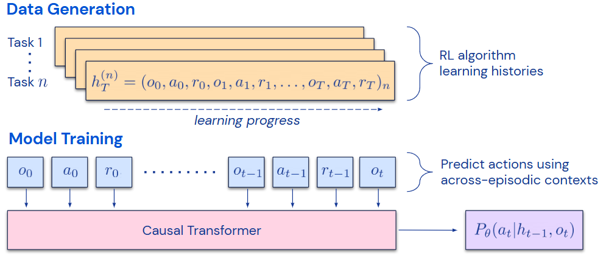

---

## 2.1.4 Memory
<!-- 슬라이드 82 -->

기억은 **정보를 습득, 저장, 유지하고 나중에 검색하는 데 사용되는 과정**으로 정의된다.
사람의 기억 체계를 Agent 에 대응시켜 보면:

- **감각기억(Sensory Memory)** : 자극이 끝난 후에도 수초간 감각 정보(시각 · 청각 ·
  촉각)의 인상을 유지한다.
- **단기기억(Short-Term Memory)** : 학습 · 추론 같은 인지 작업 수행에 필요한 정보를
  저장한다. 약 7개 항목을 20~30초 동안 저장한다. Agent 에서는 in-context 학습으로
  간주되며, Transformer 의 context window 길이에 해당한다.
- **장기기억(Long-Term Memory)** : 며칠에서 수십 년에 이르기까지 무제한의 저장 용량을
  가진다. Agent 가 쿼리할 수 있는 **외부 벡터 저장소**에 해당하며, 빠른 검색을 통해
  접근한다.

장기 기억을 실용화하는 것이 **MIPS(Maximum Inner Product Search, 최대 내적 검색)** —
대규모 · 고차원 데이터 검색 기법이다. 대표적인 알고리즘:

- **LSH**(Locality-Sensitive Hashing) : 유사한 데이터를 빠르게 검색하기 위해 설계된
  hashing 알고리즘
- **ANNOY**(Approximate Nearest Neighbors Oh Yeah) : 속도를 높이기 위해 근사값을 제공
- **HNSW**(Hierarchical Navigable Small World) : 그래프 기반, 검색 속도와 정확도
  면에서 뛰어남
- **FAISS**(Facebook AI Similarity Search) : 대규모 데이터셋에서 고차원 벡터 간의
  유사성을 빠르게 계산
- **ScaNN**(Scalable Nearest Neighbors) : 계산 복잡도가 급격히 증가하는 문제를
  해결(구글,
  https://research.google/blog/announcing-scann-efficient-vector-similarity-search/).
  쿼리와 데이터베이스 항목을 공통 임베딩 공간에 매핑하도록 훈련하는
  Dual-Encoder(Two-Tower) 아키텍처를 쓴다.

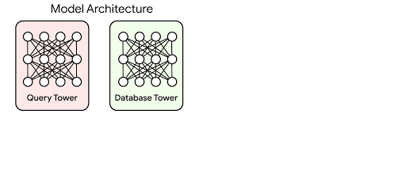

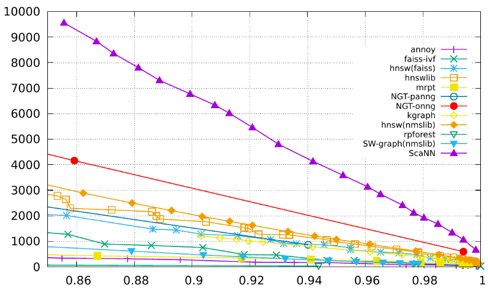

---

## 2.1.5 Tool Use
<!-- 슬라이드 83 -->

도구 사용과 관련된 주요 연구들이다.

- **MRKL**(Modular Reasoning, Knowledge and Language, 2022) — LLM 이 문제 해결을 위해
  다양한 Expert 모듈(AI, 계산기 등)에게 문의를 routing 한다. 핵심 Expert 모듈 + App +
  API 조합으로, Reasoning(논리적 문제 해결) · Knowledge(외부 데이터베이스나 지식
  그래프에서 정보 검색) · Language(자연어 이해 및 생성)를 나눈다.
- **TALM**(Tool Augmented Language Models, 2022) & **Toolformer**(2023) — 외부 API 를
  사용하는 법을 배우도록 LM 을 미세 조정한다.
- **ChatGPT Plugins, OpenAI function calling** — LLM 이 외부 시스템(플러그인 또는
  API)을 호출하여 텍스트 생성 이상의 작업을 수행한다. 예: 파일 생성 · 저장(여행 일정
  생성 등), 실시간 데이터 또는 DB 검색(최신 뉴스 · 주식 시장 정보 · 날씨), 외부
  시스템과의 통합 작업(의료 · 금융 · 교육 · 전자상거래).
- **HuggingGPT**(2023) — ChatGPT 를 작업 계획자로 사용하여 HuggingFace 플랫폼에서
  필요한 모델을 선택하고, 실행 결과를 기반으로 응답을 요약하는 프레임워크다.
- **API-Bank**(2023) — tool-augmented LLM 의 성능을 평가하기 위한 벤치마크. 568개의
  API 호출이 포함된 264개의 주석 달린 대화로 구성되며, API 호출은 검색 엔진 · 계산기 ·
  캘린더 쿼리 · 스마트 홈 제어 · 일정 관리 · 건강 데이터 관리 · 계정 인증 등을
  포함한다. LLM 은 먼저 API 검색 엔진에 접근하여 호출할 올바른 API 를 찾고, 그 문서를
  사용하여 호출을 수행한다.

---

## 2.1.6 AI Agent 사례
<!-- 슬라이드 84 -->

**Scientific Discovery Agent — ChemCrow**(Bran et al. 2023). 유기 합성, 약물 발견,
소재 디자인 전반에 걸쳐 작업을 수행하는 특정 도메인 Agent 의 예다. 13개의 Expert 설계
도구로 보강되었고, LangChain 에서 구현되었으며, ReAct 와 MRKL 이 반영되고 작업 관련
도구와 CoT 추론이 결합되었다.

**Generative Agents Simulation — Generative Agents**(Park, et al. 2023). 25개의 가상
캐릭터가 각각 LLM 기반 agent 에 의해 제어되어, The Sims(오픈형 인생 시뮬레이션
게임)와 유사한 환경에서 생활하고 상호작용하는 실험이다. Agent 는 LLM 과 메모리, 계획,
반성 메커니즘을 결합해 과거 경험에 기반하여 행동하고 다른 Agent 와 상호작용한다.

동작 순환은 이렇다 — 외부 환경에서 정보를 받고(Perceive), 정보를 저장 · 관리하는
Memory Stream 에 쌓고, 기억을 기반으로 상황에 적합한 정보를 불러오고(Retrieve),
기억을 바탕으로 수행할 행동을 계획하고(Plan), 행동과 결과를 평가해 기억을
개선한다(Reflect).

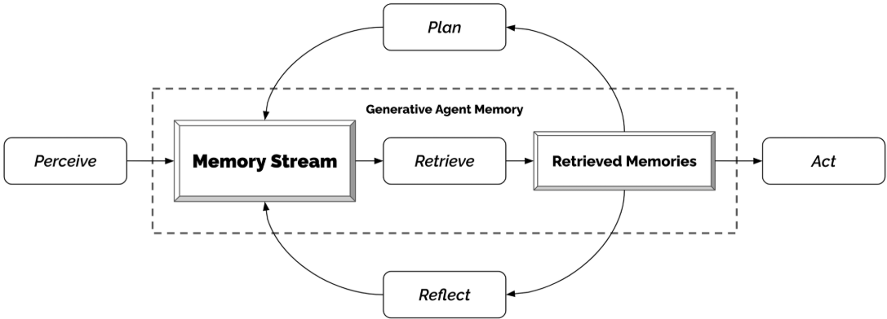

---

## 2.1.7 AI Agent 의 한계
<!-- 슬라이드 85 -->

- **제한된 문맥 길이.** 제한된 문맥 용량은 역사적 정보, 세부 지침, API 호출 맥락 및
  응답의 포함을 제한한다. 과거 실수에서 배우는 자기 반성 같은 메커니즘은 길거나
  무한한 문맥 윈도우가 필요하다. 벡터 저장소와 검색으로 보완할 수 있지만 표현력이
  제한적이다.
- **장기 계획 및 작업 분해의 한계.** 긴 history 를 갖는 계획과 솔루션 공간을
  효과적으로 탐색하는 것은 여전히 어렵다. LLM 은 예상치 못한 오류에 직면했을 때
  계획을 조정하는 데 어려움이 있어, 실수와 오류로부터 배우는 인간에 비해 Agent 를 덜
  강력하게 만든다.
- **자연어 인터페이스의 신뢰성.** Agent 는 LLM 과 외부 구성 요소(tools) 간의
  인터페이스로 자연어에 의존한다. LLM 출력의 신뢰성은 의심스럽다 — 형식 오류를
  일으킬 수 있고, 때때로 반항적인 행동(지시를 따르기를 거부)을 보일 수 있다. 그래서
  Agent 코드의 대부분은 모델 출력을 구문 분석하는 데 중점을 두게 된다.

---

## 2.1.8 주요 Agent Framework
<!-- 슬라이드 86 -->

- **LangChain** — Agent 개발 분야에서 가장 널리 알려져 있고 활발하게 사용된다. 다양한
  구성 요소(모델 연동, 데이터 처리, 에이전트 로직, 체인 등)를 모듈화하여 제공하고,
  복잡한 LLM 애플리케이션 개발 과정을 추상화하며, 다양한 외부 시스템(데이터베이스,
  API, 기타 모델)과의 연동을 위한 표준화된 인터페이스를 제공한다.
  주요 용도: 질문 답변 시스템(Q&A), 문서 분석 및 요약, 챗봇, 외부 데이터 연동.
- **LlamaIndex** — 비공개 데이터나 외부 데이터를 활용하는 RAG 파이프라인 구축에
  강점이 있다. 다양한 데이터 소스를 연결하고 임베딩 · 인덱싱을 통해 관련 정보를 쉽게
  찾아 응답을 생성하도록 지원한다. 데이터 로딩(Connectors), 인덱싱, 저장, 검색 및 쿼리
  엔진 구축 등 RAG 파이프라인의 핵심 단계를 간소화하는 고수준 API 를 제공한다.
  주요 용도: 사내 문서 기반 챗봇, 특정 도메인 지식 기반 Q&A 시스템.
- **AutoGen** — Multi-agent 시스템 구축에 특화되어 있다. 각 에이전트에게 프로그래머,
  사용자 대변자 등 역할을 부여하고 이들 간의 대화 흐름을 설정한다. 에이전트 간 통신
  메커니즘과 워크플로우 정의를 위한 유연하면서도 비교적 간단한 API 를 제공한다.
  주요 용도: 코드 작성 및 디버깅 협업, 연구 · 분석 자동화, 복잡한 문제 해결 프로세스
  자동화.
- **CrewAI** — AutoGen 과 유사하되, 팀 및 작업 할당 방식이 실제 업무 방식과 유사해
  설계가 직관적이다. 'Agent'(명확한 역할 · 목표 · 배경 스토리), 'Task'(수행할 작업 ·
  사용할 도구), 'Process'(작업 실행 방식) 개념으로 구조적인 개발 경험을 제공한다.
  주요 용도: 콘텐츠 생성, 팀 시뮬레이션, 마케팅 전략 기획, 고객 문의 분류 · 처리 등
  명확한 역할 분담과 순차적/계층적 처리가 필요한 협업 태스크.

---

## 2.1.9 정리
<!-- 슬라이드 87 : 숨김 MEMO 슬라이드, 내용 없음 -->

- AI Agent 는 목표를 받아 스스로 세부 목표와 행동 계획을 수립하고 실행하는 시스템이다.
  LLM 기반 자율 Agent 는 Planning · Memory · Tool use 세 능력을 결합한다.
- Planning 의 두 축 — 작업 분해(CoT 로 단계별 사고, ToT 로 트리 탐색)와
  자기반성(ReAct 의 추론+행동, Reflexion 의 언어적 피드백 학습, CoH 의 경로 재해석,
  AD 의 학습 알고리즘 증류).
- Memory 는 사람의 기억 체계에 대응된다 — 단기 기억은 context window, 장기 기억은
  외부 벡터 저장소이고, MIPS 계열 검색(LSH · ANNOY · HNSW · FAISS · ScaNN)이 이를
  실용화한다.
- Tool use 는 학습되지 않은 정보를 외부 API 로 획득하는 능력이며, MRKL · Toolformer ·
  function calling · HuggingGPT 등이 이 방향의 연구다.
- 한계 — 제한된 문맥 길이, 장기 계획의 어려움, 자연어 인터페이스의 신뢰성 — 를
  인식한 상태에서, 다음 절부터 LangChain(2.2)과 LangGraph(2.3)로 Agent 를 직접
  만들어 본다.
