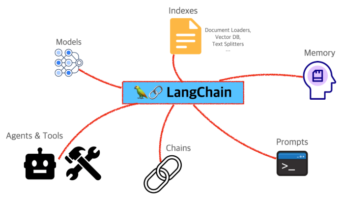
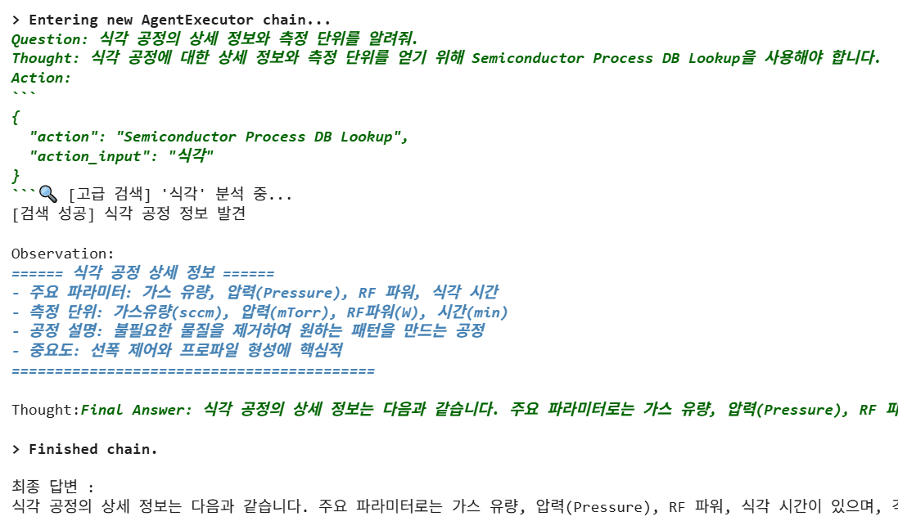
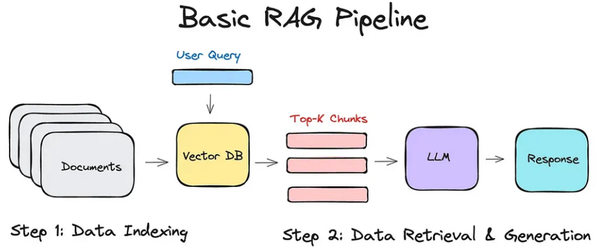
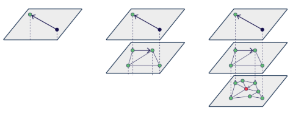
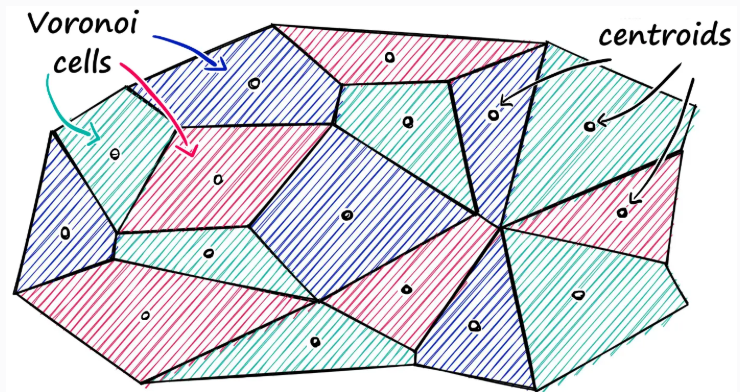
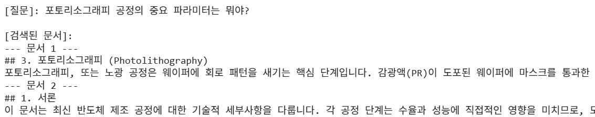

# 2.2 LangChain 과 RAG

**학습 목표**

- LLM 에이전트의 핵심 개념과 구성 요소를 이해하고, 반도체 공정 도메인의 특수성을
  고려한 에이전트 설계의 필요성을 검토할 수 있다.
- 간단한 도메인 맞춤형 LLM 에이전트의 아키텍처 뼈대 코드를 구현하고, Agent 가 외부
  도구(Tool)를 호출하여 정보를 조회하고 응답을 생성하는 과정을 실습한다.
- LangChain framework 로 agent 를 빠르고 효율적으로 구축하는 방법을 익히고, LLM ·
  Prompt Template · Tool 등 핵심 컴포넌트와 agent workflow 를 이해한다.
- Hugging Face Agent 와의 비교를 통해 각 프레임워크의 장단점을 파악한다.
- 문서를 읽고 내용을 이해하여 질문에 답하는, 여러 툴을 사용하는 Multi-step agent 를
  구현하고, RAG(Retrieval-Augmented Generation) 파이프라인을 구축할 수 있다.

**이 절의 구성**

- 2.2.1 Agent 의 정의와 유형
- 2.2.2 Agent 의 핵심 구성 요소
- 2.2.3 Architecture Pattern 과 도메인 요구사항 분석
- 2.2.4 기본 Agent 구조 만들기 (실습 2.2.1)
- 2.2.5 LangChain 개요와 Tool 설계
- 2.2.6 LangChain ReAct Agent 만들기 (실습 2.2.2)
- 2.2.7 Custom Agent — Plan-and-Execute (실습 2.2.3)
- 2.2.8 RAG 의 개념과 벡터 검색 기법
- 2.2.9 Augment 방법 — Query Augment 와 Chunking
- 2.2.10 Agent + RAG (실습 2.2.4)
- 2.2.11 정리

---

**⟨ Agent 정의 및 유형 ⟩**

> LLM Agent 가 무엇인지, 왜 도메인 맞춤형이어야 하는지, 어떤 요소로 구성되는지를
> 정리한 뒤 최소한의 Agent 를 직접 만들어 본다.

## 2.2.1 Agent 의 정의와 유형
<!-- 슬라이드 89~90 -->

Agent 는 ChatBot 을 넘어, **주어진 목표를 달성하기 위해 행동하는 시스템**이다. 환경을
관찰하고(Perceive), 판단하며(Think), 행동한다(Act). 엔지니어가 문제를 해결하기 위해
데이터를 조회하고, 매뉴얼을 찾아보고, 동료에게 질문하는 일련의 과정을 소프트웨어가
수행하는 것이라고 생각하면 된다. LLM Agent 는 이러한 자율적 행동의 두뇌로 LLM 을
사용한다 — LLM 의 언어 이해와 추론 능력을 바탕으로 복잡한 요청을 이해하고, 행동
계획을 수립하며, 최종 결과를 생성한다.

**Reactive(반응형) vs. Proactive(능동형).**

- **Reactive Agent** — 입력에 대해 정의된 반응을 보이는 기본 형태의 agent 다. 현재
  상태만을 기반으로 행동하며 장기적인 계획이나 목표가 없다. 대화의 맥락을 기억하지
  못하고, 여러 단계를 거쳐야 하는 복잡한 문제를 해결할 수 없다.
- **Proactive Agent** — 목표(Goal)를 가지고, 목표 달성을 위해 계획을 세우고, 필요한
  정보를 수집하며, 여러 단계를 거쳐 능동적으로 작업을 수행한다. 예를 들어 "지난주
  3번 라인에서 발생한 수율 저하의 원인을 분석하고 보고해 줘"라는 요청을 받으면 —
  1) MES 에서 수율 데이터 조회 → 2) FDC 에서 관련 공정 파라미터 확인 →
  3) 데이터 간 상관관계 분석 → 4) 원인 요약 및 보고서 생성 — 의 단계를 밟는다.

**도메인 맞춤형 Agent 의 필요성.** 범용 LLM 은 반도체 공정 같은 전문 분야에서 명확한
한계를 가진다.

- **내부 데이터 접근 불가** — MES(생산 관리 시스템), FDC(설비 데이터 수집), 수율 관리
  시스템 같은 내부 데이터베이스에 접근할 수 없다. "A01 Lot 의 현재 상태는?"이라는
  질문에 답할 수 없다.
- **특수 용어 및 맥락 이해 부족** — 'over-etching', 'CMP slurry', 'DoE(실험계획법)'
  같은 전문 용어의 미묘한 의미나 특정 공정에서의 중요도를 파악하지 못한다.
- **보안 문제** — 민감한 공정 데이터나 회사 기밀 정보를 외부 LLM API 로 전송하는 것은
  보안 위험을 초래한다.

그래서 LLM 을 '두뇌'로 사용하되, '손과 발'이 되어 줄 도메인 특화 도구(Tools)와
데이터를 연결하는 **맞춤형 에이전트 구축**이 필요하다. 이를 통해 회사의 데이터와 업무
프로세스에 통합된 Agent 를 만들 수 있다.

---

## 2.2.2 Agent 의 핵심 구성 요소
<!-- 슬라이드 91 -->

Agent 는 4가지 핵심 요소로 구성된다.

- **LLM Core** — 에이전트의 모든 사고 과정을 책임지는 엔진.
  - Tokenizer : 인간의 언어를 모델이 이해할 수 있는 숫자 형태의 token 으로 상호
    변환한다. Tokenizer 에 따라 모델의 성능과 처리 속도가 달라진다.
  - Model : 토큰 시퀀스를 입력받아 다음에 올 토큰을 예측한다. 추론 능력을 통해 질문에
    답하고, 문장을 요약하며, 행동 계획까지 생성한다.
- **Tool Interface** — Agent 가 외부 세계와 상호작용할 수 있게 해주는 '손과 발'.
  실시간 정보 검색, 데이터베이스 조회, 계산, 코드 실행 등을 수행하는 함수나 API 의
  집합이다. 예: `get_process_data()`(특정 웨이퍼의 공정 데이터 조회),
  `parse_equipment_manual()`(장비 매뉴얼 PDF 에서 정보 추출),
  `summarize_yield_report()`(수율 리포트 요약).
- **Memory & State Management** — 에이전트의 '단기 기억'. 이전 대화 내용을 기억하여
  맥락을 유지한다 (없으면 agent 는 매번 새로운 대화를 시작한다). 간단한 형태의
  Session Memory 는 현재 대화 세션 동안의 기록을 저장하고, DB 를 활용해 장기적인
  기억을 구현할 수도 있다.
- **Planner & Executor** — 에이전트의 '사고 및 행동' 프로세스.
  - Planner : 복잡한 요청을 받으면 단계별 실행 계획(Plan)을 수립한다. 어떤 툴을 어떤
    순서로 사용할지, LLM 에게 어떤 질문을 던질지 등이 포함된다.
  - Executor : Planner 의 계획에 따라 각 단계를 순차적으로 실행한다. Tool 을
    실행하거나, LLM 의 추론이 필요하면 LLM 을 호출하여 결과를 얻어낸다.

---

## 2.2.3 Architecture Pattern 과 도메인 요구사항 분석
<!-- 슬라이드 92~93 -->

Architecture Pattern 은 시스템의 구성 요소, 그들 간의 관계, 데이터 흐름, 동작 방식을
정의한다. 두 축으로 구분해 볼 수 있다.

- **Singleton vs. Multi-Agent**
  - Singleton : 하나의 에이전트가 모든 작업을 처리하는 구조. 대부분의 단일 목적
    태스크에 효과적이다.
  - Multi-Agent : 여러 전문 에이전트가 협력하여 문제를 해결하는 복잡한 구조. 데이터
    분석 전문 에이전트, 보고서 작성 에이전트, 사용자 소통 에이전트가 각각의 역할을
    수행하고 서로 결과를 공유해 더 큰 문제를 해결한다.
- **Event-Driven vs. Pipeline flow**
  - Pipeline : 입력 → 계획 → 실행 → 출력 순서로 데이터가 흐르는 직선적인 구조.
    이해하고 구현하기 쉽지만 유연성이 떨어진다.
  - Event-Driven : '수율 저하 감지' 같은 특정 이벤트가 발생했을 때 에이전트가 작업을
    시작한다. 비동기적이고 복잡한 환경에 더 적합하며, 높은 수준의 자율성을 가진다.

**도메인 요구사항 분석**은 에이전트 시스템의 기능을 정의하는 과정이다. 공정 데이터
흐름의 예를 보자.

- 발생 : FDC 시스템에서 특정 Etch 장비의 플라즈마 전력(RF Power) 파라미터에 비정상적
  Event 가 발생한다.
- 질의 : Agent 에게 "Etch-03 장비 RF Power 이상과 수율과의 관련성을 검토해줘"라고
  Query 한다.
- 계획 : Agent 는 계획을 수립한다 —
  - TOOL: FDC 에서 Etch-03 장비의 RF Power 이상이 감지된 시간대와 Lot ID 목록을 조회
  - TOOL: MES 에서 해당 Lot ID 들의 공정 단계별 수율 데이터를 조회
  - LLM: 조회된 데이터들을 종합하여 RF Power 이상과 수율 간의 상관관계를 분석 · 요약 ·
    보고

이 시나리오를 아키텍처 패턴 관점에서 설명하면 — **멀티 에이전트 구조**(FDC 데이터
조회 에이전트, MES 데이터 조회 에이전트, LLM 분석 에이전트가 독립적으로 처리하고
LLM 이 결과를 통합해 응답)는 복잡한 데이터 흐름과 다중 소스 통합에 적합하고,
**이벤트 기반 구조**(FDC 에서 RF Power 알람 발생 시 이 이벤트를 트리거로 가능한
질의를 생성하고, 비동기적으로 FDC 와 MES 데이터를 호출하고, 분석 완료 시 응답 생성 ·
보고)는 실시간 공정 모니터링 같은 동적 환경에 적합하다.

업무 시나리오를 몇 개 더 도출해 보면 패턴 선택이 분명해진다.

- "포토 공정 신규 레시피를 추천해 줘. 현재 사용하는 PR 종류와 타겟 CD 는 OOO 이야."
  → 멀티 에이전트(데이터 조회 MES/SPC · 분석 최적화 모델 · 응답 생성) 또는 이벤트
  기반(새 PR 도입이나 CD 변경 시 추천 프로세스 트리거)
- "지난 분기 CMP 공정에서 발생한 주요 불량 유형과 점유율을 차트로 보여줘."
  → 멀티 에이전트(데이터 조회 · 분석 · 시각화) 또는 파이프라인(데이터 조회 → 불량
  분석 → 차트 생성 → 응답)
- "CVD 장비의 PM(예방보전) 매뉴얼을 요약하고, '가스 라인 퍼지' 절차에 대해 알려줘."
  → 싱글턴(단일 LLM 이 매뉴얼 문서를 처리하고 요약 생성) 또는 이벤트 기반(PM 주기
  도달 시 알람 이벤트로 요약 요청 트리거)

---

## 2.2.4 기본 Agent 구조 만들기
<!-- 슬라이드 94 -->

### 실습 2.2.1 — 최소 구조의 Agent

> 노트북: `code/2.2.1.Agent_basic.ipynb`
> [](https://colab.research.google.com/github/AI-BoostCamp/AgenticAI/blob/main/code/2.2.1.Agent_basic.ipynb)

LLM 모델, Tool, Plan, Execute 로 구성된 Agent 기본형을 만들어 기본 동작을 이해한다.
Agent 용 LLM 으로는 `unsloth/Qwen3-14B` 를 4bit 로 로드해 쓴다 (LLMModel class 로
감싸 두면 Agent 에서 주입받아 쓸 수 있다 — 로드와 생성 코드는 1.3 절의 Unsloth
사용법과 같으므로 노트북을 참조).

Agent 는 딱 세 가지를 가진다 — 등록된 tool 딕셔너리, plan(), execute().

```python
class Agent:
    def __init__(self, llm_model: LLMModel):
        # 툴 등록: 문자열 이름과 실제 함수를 매핑하는 딕셔너리
        self.tools = {
            "get_step_parameters": get_step_parameters
        }
        # TODO: Memory (메모리) 및 상태 관리 초기화
        self.memory = ""
        # 외부에서 주입된 LLMModel 설정
        self.llm_model = llm_model

    def plan(self, query: str) -> list[str]:
        # 지능적인 계획 수립 : 키워드 기반의 간단한 라우팅
        # 더 발전된 에이전트는 이 부분을 LLM을 이용해 동적으로 계획을 생성한다
        if "파라미터" in query or "정보" in query:
            step_name = query.split(" ")[0]  # 간단히 첫 단어를 공정 이름으로 가정
            plan = [f"TOOL_CALL:get_step_parameters({step_name})"]
        else:
            plan = [f"LLM_CALL:{query}"]
        return plan

    def execute(self, steps: list[str]) -> str:
        final_answer = ""
        for step in steps:
            if step.startswith("TOOL_CALL:"):
                # 툴 호출 명령 파싱
                tool_call_str = step.replace("TOOL_CALL:", "")
                tool_name = tool_call_str.split("(")[0]
                tool_arg = tool_call_str.split("(")[1][:-1]
                if tool_name in self.tools:
                    result = self.tools[tool_name](tool_arg)
                    final_answer = json.dumps(result, indent=4, ensure_ascii=False)
            elif step.startswith("LLM_CALL:"):
                # LLM 호출
                prompt = step.replace("LLM_CALL:", "")
                messages = [{"role": "user", "content": prompt}]
                final_answer = self.llm_model.generate_response(messages)
        return final_answer
```

Tool 은 공정 파라미터를 조회하는 더미 함수다 — 실제 환경에서는 이 함수 내부에
데이터베이스에 연결하여 데이터를 조회하는 로직이 들어간다.

```python
def get_step_parameters(step_name: str) -> dict:
    """주어진 공정 단계(step_name)의 파라미터를 조회하는 더미 함수입니다."""
    dummy_data = {
        "포토리소그래피": {"노광시간(Exposure Time)": "5.2초", "레진두께(PR Thickness)": "210nm", "초점(Focus)": "+0.1um"},
        "식각": {"가스(Gas)": "CF4 100sccm", "압력(Pressure)": "50mTorr", "전력(RF Power)": "300W"},
        "증착": {"온도(Temperature)": "450°C", "물질(Material)": "Si3N4", "두께(Thickness)": "50Å"}
    }
    for key, value in dummy_data.items():
        if key in step_name:
            return value
    return {}
```

실행 과정을 확인해 보자. "포토리소그래피 파라미터 정보 알려줘"라는 쿼리는 plan 에서
TOOL_CALL 로 분기되어 tool 이 실행되고, 일반 질문은 LLM_CALL 로 분기되어 LLM 이
답한다.

```python
# Agent 인스턴스 생성 (LLMModel 주입)
agent = Agent(llm_model)

query = "포토리소그래피 파라미터 정보 알려줘."

steps = agent.plan(query)      # 계획 수립 (Plan)
answer = agent.execute(steps)  # 계획 실행 (Execute)
print(answer)
```

---

**⟨ LangChain / HF Tool-Calling Framework 활용 ⟩**

> 손으로 만든 Agent 뼈대를 framework 로 대체한다. LangChain 의 컴포넌트와 ReAct
> 루프를 이해하고, ReAct Agent → Custom Agent 순으로 만들어 본다.

## 2.2.5 LangChain 개요와 Tool 설계
<!-- 슬라이드 95~97 -->

**LangChain 개요.** LangChain 은 LLM 을 활용한 애플리케이션 개발을 위한
**Orchestration Framework** 다. LLM 이라는 핵심 연주자를 중심으로 다양한
component 들을 조율해 복잡한 작업을 수행하며, '계획-실행-분기' 로직을 매우 정교하고
확장 가능하게 만들어 준다.

- **LLMs** : 전문적인 LLM 집합
- **Prompt Templates** : 질문을 고도화하기 위한 틀
- **Agents** : 답변을 만드는 핵심 로직. ReAct 등의 framework 을 사용해
  생각 → 행동 → 관찰을 반복하여 문제를 해결한다.
- **Chain** : 절차를 정해 놓은, 순서대로 component 를 실행하는 pipeline.
  질문 → Prompt Template 적용 → LLM 호출 → 출력. 간단한 워크플로우에 적합하다.



**HF Tool-Calling 라이브러리와의 비교.** transformers 생태계에도 간단한 Agent 기능을
구현하는 라이브러리가 있다(transformers.agent).

- LangChain 의 확장성 : 수많은 외부 서비스(DB, API, Vector Store 등)와의 연동이
  가능해 복잡한 워크플로우 구축에 유리하고, 생태계가 훨씬 크고 기능이 풍부하다.
- HF Tool-Calling 의 사용성 : transformers 사용자에게 직관적이고 가볍다. 별도의 추상화
  계층이 적어 코드 구조가 더 단순하지만, 복잡한 작업을 위해서는 직접 구현해야 할
  부분이 많아진다.
- 결론 — All-in-one 솔루션을 만들려면 LangChain 을, 빠르고 간단한 Agent 를 만들고
  싶다면 HF Agent 를 쓴다.

**Tool design pattern.** 좋은 툴은 Agent 성능에 직접적인 영향을 준다.

- **Callbacks vs 직접 API 호출** — LangChain 등은 주로 callback 을 사용한다. 실행
  루프(AgentExecutor)는 LLM 의 판단("process_parameters 툴을 포토리소그래피 인자와
  함께 호출해야겠다")을 감지하면, 등록된 Tool 객체의 함수를 '대신' 호출해 주고 그
  결과를 다시 LLM 에게 전달한다.
- **입력/출력 형식 정의** —
  - 함수 설명(Description) : "반도체 공정 단계별 파라미터 조회" 같은 설명은 **LLM 을
    위한 지침**이다. LLM 은 이 설명을 읽고 사용자의 질문 의도와 가장 관련성이 높은
    툴을 선택한다. 따라서 "언제, 무엇을 위해, 어떤 입력으로 이 함수를 써야 하는지"를
    명확하고 상세하게 작성해야 한다.
  - 타입 힌트 : 함수의 입력과 출력에 `(step_name: str) -> dict:` 같이 타입 힌트를
    명시해야 한다. LLM 이 툴의 사용법을 이해하는 데 도움을 준다.

**워크플로우 아키텍처 — ReAct Prompt Template.** LangChain 의 ReAct agent 는 정교한
Prompt Template 을 사용한다. 이 템플릿은 LLM 에게 다음 구조로 생각하고 행동하도록
지시한다.

- Question: 사용자의 원본 질문
- Thought: (LLM 이 생성) 질문을 해결하기 위한 나의 생각과 계획. 어떤 툴을 사용해야 할까?
- Action: (LLM 이 생성) 사용할 툴의 이름
- Action Input: (LLM 이 생성) 해당 툴에 전달할 인자
- Observation: (시스템이 제공) 툴 실행 결과
- Thought: (LLM 이 생성) 관찰 결과를 보니, 이제 다음 행동은…… (이 과정을 반복하다가
  최종 답변을 찾으면)
- Thought: 이제 최종 답변을 할 수 있겠다.
- Final Answer: (LLM 이 생성) 최종 답변

**Agent 의사결정 구조(Planner → Executor).** `AgentExecutor` 가 이
'Thought-Action-Observation' 루프를 관리하고 실행한다 — LLM(Planner 역할)이
Action 을 생성하면 그에 맞는 툴을 실행(Executor 역할)하고, 결과를 Observation 으로
다시 LLM 에게 전달하는 과정을 자동화한다. 내부적인 의사결정 과정을 모두 출력해 주면
디버깅에 매우 유용하다.

---

## 2.2.6 LangChain ReAct Agent 만들기
<!-- 슬라이드 98~100 -->

### 실습 2.2.2 — LangChain Agent (Local LLM / OpenAI API)

> 노트북: `code/2.2.2.1.LangChain_basic.Gemma.ipynb` (Local LLM),
> `code/2.2.2.2.LangChain_basic.OpenAI.ipynb` (OpenAI API)
> [](https://colab.research.google.com/github/AI-BoostCamp/AgenticAI/blob/main/code/2.2.2.1.LangChain_basic.Gemma.ipynb)
> [](https://colab.research.google.com/github/AI-BoostCamp/AgenticAI/blob/main/code/2.2.2.2.LangChain_basic.OpenAI.ipynb)

같은 Agent 를 두 가지 LLM 으로 만들어 본다.

**Local LLM 을 사용하는 경우** (`LangChain_basic.Gemma.ipynb`). OpenAI 등은
LangChain 을 지원하는 잘 만들어진 Wrapper 를 제공하지만, HF 에서 제공하는 최신 LLM
모델은 Wrapper 가 없거나 제공되는 Wrapper 에 문제가 있는 경우가 있다. Tuning 해야
LangChain 에 원활하게 적용할 수 있고(지난한 과정이 될 수 있다), 모델이 바뀌면(특히
llama → qwen → gemma 등으로) tuning 을 다시 해야 할 수 있다. 여기서는 Gemma-3-12b
GGUF 모델을 LlamaCpp 로 로드해 ReAct Agent 를 만든다.

```python
%%time
# LlamaCpp로 모델 로드 : GGUF 모델 다운로드
from huggingface_hub import hf_hub_download
from langchain_community.llms import LlamaCpp

model_repo = "unsloth/gemma-3-12b-it-qat-GGUF" # 23.5(FP16) GB
model_file = "gemma-3-12b-it-qat-Q4_K_M.gguf"  # 7.3 GB

model_path = hf_hub_download(repo_id=model_repo, filename=model_file, local_dir="./")

llm = LlamaCpp(
    model_path=model_path,
    n_gpu_layers=40,  # GPU에 최대 레이어 오프로드
    n_batch=512,
    n_ctx=3096,    # 컨텍스트 길이
    f16_kv=True,   # FP16 메모리 최적화
    verbose=False,
    temperature=0.3,
    max_tokens=256
)
```

**OpenAI API 를 사용하는 경우** (`LangChain_basic.OpenAI.ipynb`). Wrapper 로 LLM
connector 를 생성한다 (download 시간 절약과 일관성을 위해). **Wrapper 는 LLM 의
종류와 특성을 LangChain 에 맞도록 숨겨 주는 역할**을 한다 — interface 가 통일되어
LLM 교체를 쉽게 할 수 있다. temperature=0 으로 설정해 일관성 있는 답변을 유도한다.

```python
from langchain_openai import ChatOpenAI
# ChatOpenAI(): OpenAI API를 langchain에 맞춰놓은 Wrapping API임
llm = ChatOpenAI(model="gpt-4o-mini", temperature=0)

# 시스템 프롬프트 내용 정의 : 역할과 답변형식 지시
system_message_content = "귀하는 반도체 공정을 전문으로 하는 친절한 보조원입니다. 귀하의 주요 목표는 사용자에게 정확하고 자세한 정보를 제공하는 것입니다. 모든 최종 답변은 한국어로 명확하고 정중하게 작성해 주시기 바랍니다."
agent_kwargs = {"system_message": SystemMessage(content=system_message_content)}
```

**Tools.** Test 용으로 두 개의 Tool 을 만든다 — 모의 DB 검색(공정 정보 딕셔너리
조회)과 Manual 검색(로컬 텍스트 파일 읽기). **Tool 에 대한 설명(description)을 LLM 이
들여다보고 처리**하므로 설명이 곧 인터페이스다.

```python
# 2개의 Tool로 구성된 리스트 정의
tools = [
    Tool(
        name="Semiconductor Process DB Lookup",
        func=process_lookup,
        description="반도체 공정(포토리소그래피, 식각, 증착)에 대한 상세 정보(주요 파라미터, 설명, 단위, 중요도)를 찾을 때 사용합니다. 사용자 질문에 공정 이름이 포함되어 있어야 합니다."
    ),
    Tool(
        name="Manual Loader",
        func=load_manual,
        description="로컬 텍스트 파일 형식의 매뉴얼을 읽을 때 사용합니다. 'DUV_manual.txt'와 같이 정확한 파일 경로를 입력해야 합니다."
    )
]
```

**LangChain Agent 생성.** ReAct agent 는 내부적으로 프롬프트 템플릿을 하나 만들고,
거기에 사용할 수 있는 Tool 목록, 각 Tool 의 이름과 설명, "어떻게 Tool 을 선택하고
호출해야 하는지"에 대한 규칙을 문자열로 넣어서 LLM 에게 전달한다.

```python
from langchain.agents import initialize_agent, AgentType

# LangChain Agent 생성
# 채팅 모델에 더 적합한 'CHAT_ZERO_SHOT_REACT_DESCRIPTION' 에이전트 사용
agent_final_korean = initialize_agent(
    tools,                                            # LLM이 사용가능한 Tool정보
    llm,                                              # Agent가 사용할 LLM
    agent=AgentType.CHAT_ZERO_SHOT_REACT_DESCRIPTION, # ReAct Prompt 적용
    verbose=True,                                     # ReAct 과정을 출력
    handle_parsing_errors=True,
    agent_kwargs=agent_kwargs,                        # 시스템 프롬프트 전달
    max_iterations=4,)                                # (선택): 루프 제한
```

- `tools` : 에이전트가 사용할 도구 목록
- `llm` : 에이전트의 추론을 담당할 언어 모델
- `agent` : 사용할 에이전트의 유형. `CHAT_ZERO_SHOT_REACT_DESCRIPTION` 은 ReAct
  루프를 채팅 모델로 수행한다 — 모델이 Thought → Action → Action Input →
  Observation … → Final Answer 형식으로 추론과 행동을 번갈아 수행하고, 툴
  설명(description)을 프롬프트에 주입받아 어떤 툴을 언제 쓸지 스스로 결정한다.
  Zero-shot 이라 예시 샘플(few-shot)을 기본 포함하지 않으며, 메모리는 기본 내장하지
  않는다.
- `verbose=True` : 에이전트의 생각(Thought)과 행동(Action) 과정을 모두 출력한다.

**Agent test.** 단일 Tool 질문("식각 공정의 상세 정보와 측정 단위를 알려줘")을
실행하면 ReAct 루프가 그대로 출력된다.



복합 질문("DUV 공정 매뉴얼에서 노광 단계 설명을 요약하고, 포토리소그래피 공정의
중요도도 알려줘")을 주면 Agent 가 두 개의 Tool 을 차례로 사용해 답을 조합한다 —
여러 툴을 쓰는 Multi-step agent 가 된 것이다.

LangChain 의 `@tool` 데코레이터를 쓰면 함수 자체가 Tool 객체로 변환되고 docstring 이
자동으로 description 이 되어 더 간결해진다.

```python
from langchain_core.tools import tool # Tool 생성을 위한 데코레이터

@tool
def process_lookup(query: str) -> str:
    """사용자 질문에서 '포토리소그래피', '식각', '증착' 같은 공정 이름을 찾아, 해당 공정의 상세 정보(파라미터, 설명, 단위, 중요도)를 반환합니다."""
    for process_name, info in semiconductor_processes.items():
        if process_name in query:
            return json.dumps(info, ensure_ascii=False)
    return "해당 공정을 찾을 수 없습니다."

tools = [process_lookup, load_manual]
```

---

## 2.2.7 Custom Agent — Plan-and-Execute
<!-- 슬라이드 101~102 -->

### 실습 2.2.3 — LangChain Custom Agent 만들기

> 노트북: `code/2.2.3.LangChain_CustomAgent.ipynb`
> [](https://colab.research.google.com/github/AI-BoostCamp/AgenticAI/blob/main/code/2.2.3.LangChain_CustomAgent.ipynb)

ReAct Agent 는 편리하지만 **control 이 어렵다**. 루프를 몇 번 돌지, 어떤 순서로 툴을
쓸지 모두 LLM 에 맡기기 때문이다. 그래서 Plan-and-Execute 파이프라인을 직접 구현해
본다.

**Planner** — 사용자의 복잡한 query 를 분석하여 실행 가능한 단계의 list 를
생성한다(LLM 을 활용). **Prompt 를 통해 LLM 을 control 하므로 Prompt 의 설계가
대단히 중요하다.** 프롬프트에 구체적인 예시(few-shot)를 추가하면 계획 수립 능력이
향상된다.

```python
def plan_advanced(query: str, llm_instance: ChatOpenAI) -> List[str]:
    # 프롬프트에 구체적인 예시(few-shot)를 추가하여 LLM의 계획 수립 능력을 향상시킵니다.
    prompt = PromptTemplate.from_template("""
당신은 사용자의 요청을 분석하여, 아래에 명시된 도구를 사용한 단계별 실행 계획을 생성하는 전문 플래너입니다.
계획은 반드시 파이썬 리스트(list) 형식의 문자열로만 응답해야 합니다.

# 사용 가능한 도구 명세:
1. `LOAD_MANUAL:파일경로` : 지정된 경로의 매뉴얼 파일을 읽습니다. 예: `LOAD_MANUAL:DUV_manual.txt`
2. `DB_QUERY:공정명` : 지정된 공정명의 데이터를 데이터베이스에서 조회합니다. 예: `DB_QUERY:노광`

---
# 예시 1
요청: 식각 공정 데이터를 DB에서 조회해줘.
계획: ['DB_QUERY:식각']

# 예시 2
요청: DUV 공정 매뉴얼의 내용을 알려줘.
계획: ['LOAD_MANUAL:DUV_manual.txt']

# 예시 3
요청: 노광 파라미터를 매뉴얼에서 읽고, DB로 검증해줘.
계획: ['LOAD_MANUAL:DUV_manual.txt', 'DB_QUERY:노광']
---

# 실제 요청: {query}
# 계획:
""")

    planner_chain = prompt | llm
    response_content = planner_chain.invoke({"query": query}).content

    try:
        plan_list = ast.literal_eval(response_content)
        if isinstance(plan_list, list):
            return plan_list
        return [f"Error: LLM이 리스트 형식이 아닌 응답을 생성했습니다 - {response_content}"]
    except (ValueError, SyntaxError):
        return [f"Error: LLM 응답을 파싱할 수 없습니다 - {response_content}"]
```

**Executor** — Planner 의 list 를 받아 단계적으로 실행하고 결과를 반환한다.
계획이 문자열 명령(`LOAD_MANUAL:…`, `DB_QUERY:…`)이므로 분기가 명시적이다.

```python
## '실행' 함수 (도구 호출)
def execute(plan_steps: List[str]) -> List[str]:
    results = []
    for step in plan_steps:
        if step.startswith('LOAD_MANUAL:'):
            # 'LOAD_MANUAL:DUV_manual.txt' -> 'DUV_manual.txt'
            _, path = step.split(':', 1)
            results.append(load_manual(path.strip()))
        elif step.startswith('DB_QUERY:'):
            _, name = step.split(':', 1)
            results.append(str(get_process_data(name.strip())))
        elif step.startswith('Error:'):
            results.append(step)
        else:
            results.append(f"알 수 없는 단계입니다: {step}")
    return results
```

도구는 파일 조회(`load_manual`)와 sqlite DB 조회(`get_process_data`)로 준비한다
(생성 코드는 노트북 참조). 실행해 보면 계획 → 실행의 흐름이 명확하게 보인다.

```python
## 파이프라인 테스트
complex_query = "노광 파라미터를 매뉴얼에서 읽고, DB로 검증해줘"

planned_steps = plan_advanced(complex_query, llm)  # 계획 수립
final_execution_results = execute(planned_steps)   # 계획 실행
```

![Plan-and-Execute 파이프라인 실행 결과. plan 함수가 ['LOAD_MANUAL:DUV_manual.txt'] 계획을 생성하고, execute 가 load_manual 툴을 호출해 DUV 노광 공정 SOP 의 내용을 반환한다.](images/s102_02.png)

### 참고 — LCEL(LangChain Expression Language)
<!-- 노트북 2.2.3.LangChain_CustomAgent.ipynb 후반의 참고 내용 (대응 슬라이드 없음) -->

앞의 Custom Agent 코드에 나온 `prompt | llm` 표기가 LCEL 이다. LCEL 은 LangChain 에서
체인을 쉽고 직관적으로 구축할 수 있는 **선언적 언어**로 — 가독성 향상, 다양한 chain
구성, 간단한 병렬처리가 장점이다. (아래 코드는 실행용이 아니라 **구조 설명을 위한
코드**다.)

**파이프라인 연산자 `|`** — 입력 → prompt → llm → parser → 출력의 흐름이 코드에
그대로 보인다.

```python
from langchain.schema.runnable import RunnablePassthrough
from langchain.prompts import ChatPromptTemplate
from langchain.schema.output_parser import StrOutputParser

prompt = ChatPromptTemplate.from_template("""
다음 컨텍스트를 바탕으로 질문에 답하세요:
{context}

질문: {question}
""")

# LCEL 체인 구성
chain = (
    {"context": retriever, "question": RunnablePassthrough()}
    | prompt
    | llm
    | StrOutputParser()
)

result = chain.invoke("반도체 공정에 대해 설명해줘")
```

**체인의 결합 · 재사용** — 만든 체인을 부품처럼 이어 붙여 확장한다.

```python
basic_chain = prompt | llm
enhanced_chain = basic_chain | StrOutputParser()
rag_chain = {"context": retriever, "question": RunnablePassthrough()} | enhanced_chain
```

**병렬 실행** — 여러 개의 체인이 병렬로 동작할 수 있다. agent 가 여러 개일 때 유용하다.

```python
from langchain.schema.runnable import RunnableParallel

# 여러 작업을 병렬로 실행
parallel_chain = RunnableParallel({
    "summary": summarize_chain,
    "translation": translate_chain,
    "sentiment": sentiment_chain
})
```

**RAG chain 구성 예** — vectorstore 준비 → 프롬프트 → 체인 구성 → 실행이 LCEL 로
한눈에 들어온다.

```python
from langchain.vectorstores import FAISS
from langchain.embeddings import OpenAIEmbeddings

# 1. 벡터스토어 준비
vectorstore = FAISS.from_texts(
    ["반도체 제조 공정...", "웨이퍼 처리 단계..."],
    OpenAIEmbeddings()
)
retriever = vectorstore.as_retriever()

# 2. 프롬프트 템플릿
prompt = ChatPromptTemplate.from_template("""
반도체 전문가로서 다음 정보를 바탕으로 답변하세요:

참고 자료:
{context}

질문: {question}

전문적이고 정확한 답변을 제공해주세요.
""")

# 3. LCEL로 체인 구성
rag_chain = (
    {"context": retriever | format_docs, "question": RunnablePassthrough()}
    | prompt
    | ChatOpenAI(temperature=0)
    | StrOutputParser()
)

# 4. 실행
answer = rag_chain.invoke("CMOS 공정의 주요 단계는?")
```

**조건부 실행과 중간 결과 조작** — `RunnableBranch` 로 질문 유형에 따라 다른 체인을
실행하고, 일반 함수를 파이프 중간에 끼워 중간 결과를 가공할 수 있다.

```python
from langchain.schema.runnable import RunnableBranch

# 질문 유형에 따라 다른 체인 실행
conditional_chain = RunnableBranch(
    (lambda x: "기술" in x["question"], technical_chain),
    (lambda x: "가격" in x["question"], pricing_chain),
    general_chain  # 기본값
)

# 중간 결과 추가 조작
def format_context(docs):
    return "\n\n".join([doc.page_content for doc in docs])

chain = (
    {"context": retriever | format_context, "question": RunnablePassthrough()}
    | prompt
    | llm
    | StrOutputParser()
)
```

**오류 처리** — 메인 체인이 실패했을 때 대체 체인을 순차적으로 실행한다.

```python
from langchain.schema.runnable import RunnableWithFallbacks

# 메인 체인이 실패하면 백업 체인 실행
robust_chain = RunnableWithFallbacks(
    main_chain,
    fallbacks=[backup_chain, simple_chain]
)
```

---

**⟨ RAG — Retrieval-Augmented Generation ⟩**

> Agent 의 지식을 외부 문서로 보강한다. RAG 의 3요소와 벡터 검색을 이해하고,
> Agent + RAG 파이프라인을 구현한다.

## 2.2.8 RAG 의 개념과 벡터 검색 기법
<!-- 슬라이드 103~104 -->

**RAG 란?** LLM 이 답변을 생성할 때 외부 지식 베이스(문서, DB 등)에서 관련 정보를
검색(Retrieve)하고, 이 정보를 활용(Augment)하여 답변의 정확성과 신뢰도를 높이는
기술이다. RAG 는 3요소로 구성된다.

- **인덱서(Indexer)** : Vector DB 에 저장하는 과정. 문서를 불러와 작은
  단위(chunk)로 나누고, 각 chunk 를 vector 로 embedding 하여 저장한다.
- **검색(Retriever)** : 사용자의 질문을 벡터로 변환한 뒤, 벡터 DB 에서 가장 관련성
  높은 문서 chunk 벡터들을 찾아낸다.
- **생성(Generator)** : 검색된 문서 chunk 를 원본 질문과 함께 LLM 에 컨텍스트로
  제공하여, 이 정보를 바탕으로 최종 답변을 생성한다.



**벡터 검색 기법.** Query 의 vector 와 유사한 vector 를 찾는다 — 키워드 일치가
아니라 의미 기반이므로 다의적 · 함의적 질의에도 대응한다.

- **Embedding** : 텍스트 · 이미지 등 데이터를 고차원 벡터 공간의 한 점의
  좌표(벡터)로 표현하는 기술이다. 의미가 비슷한 데이터는 벡터 공간에서 가까운 거리에
  위치하도록 학습된다. 흐름은 — 1) 문서 → chunk 들 → vector 들로 저장,
  2) query : query vector 와 유사한 chunk 검색, 3) chunk 를 검색을 위한 정보로 활용.
- **유사도 검색 알고리즘** :
  - **FAISS**(Facebook AI Similarity Search) — 정확한 최근접 이웃(Nearest Neighbor)을
    찾는 데 특화되어 있다. 대규모 데이터셋에서도 빠르고, 모든 벡터와 거리를 직접
    계산해 정확한 결과를 찾을 수 있다. cell 을 찾고 cell 내의 vector 를 찾는 방식이다.
  - **HNSW**(Hierarchical Navigable Small World) — 근사 최근접 이웃(Approximate
    Nearest Neighbor) 알고리즘. 그래프 기반으로 검색 속도가 매우 빠르지만 100%
    정확한 결과가 아닐 수 있다 — 정확도와 속도 간의 트레이드오프가 존재한다. 상위
    계층은 전역 검색에, 하위 계층은 로컬 검색에 사용한다.





---

## 2.2.9 Augment 방법 — Query Augment 와 Chunking
<!-- 슬라이드 105 -->

Augment 는 두 방향이 있다 — **Query Augment**(query 자체를 유사한 것들로 확장)와
**Chunk Augment** 다. Query Augment 의 두 기법을 보자.

**Multi-Query Retrieval** — 하나의 질문을 여러 관점으로 변환한다.

```python
# 하나의 질문을 여러 관점으로 변환
original_query = "반도체 제조 과정에서 웨이퍼 처리 방법은?"

# LLM이 여러 버전의 질문 생성
generated_queries = [
    "웨이퍼 가공 기술에 대해 알려주세요",
    "반도체 웨이퍼의 처리 단계는 무엇인가요?",
    "실리콘 웨이퍼 제조 공정을 설명해주세요" ]
```

**Query Expansion** — 원본 질문을 의미적으로 관련된 여러 키워드로 확장한다.

```python
query = "반도체 수율 향상"
expanded_queries = [
    "반도체 수율 향상",
    "웨이퍼 품질 개선",
    "공정 최적화",
    "defect reduction" ]
```

**LangChain 구현** — `MultiQueryRetriever` 를 쓰면 이 과정이 자동화된다.

```python
from langchain.retrievers.multi_query import MultiQueryRetriever

# Multi-Query Retriever 설정
llm = ChatOpenAI(temperature=0)
retriever = MultiQueryRetriever.from_llm(
    retriever=vectorstore.as_retriever(search_kwargs={"k": 3}),
    llm=llm
)

# MultiQueryRetriever: 내부적으로 다음과 같이 동작
# 1. 원본 질문을 3-5개의 다른 표현으로 변환
# 2. 각각을 vector로 변환하여 검색
# 3. 결과를 합치고 중복 제거
results = retriever.invoke("반도체 수율 향상 방법은?")
```

다만 이 방식은 어떤 방식으로 어떤 query 들이 만들어지는지 관리할 수 없어, 도메인에
맞는 방식으로 설계하기는 어렵다 — 도메인 특화 증강이 필요하면 직접 프롬프트를
설계해야 한다. 그 설계 방법을 이어서 다룬다.

<!-- 이하 2.2.9 의 소절들은 노트북 2.2.4.LangChain_RAG.ipynb 후반의 보강 내용이다 (대응 슬라이드 없음). -->

### Query Augment 를 위한 System Prompt 설계

증강 쿼리를 어떻게 만들지 감을 잡으려면 먼저 손으로 만들어 보는 것이 좋다. 예를 들어
"반도체 제조 과정에서 웨이퍼 처리 방법은?" 이라는 질의는 세 방향으로 변형할 수 있다 —
**A. 동의어/표현 변형**(의미는 같고 문장만 바꿈: "웨이퍼 처리 절차를 설명해 주세요"),
**B. 범위 확장형**("방법"을 세분화: 세정 · 코팅/베이크 · 식각 조건 · 증착 방식 · CMP
평탄화), **C. 공정/장비/품질 관점 변형**(장비별 처리 단계, 핸들링 결함, 오염 관리,
열처리, 검사/계측). 키워드 확장도 마찬가지다 — "반도체 수율 향상"은 동의 키워드(수율
개선 · 불량률 감소 · defect reduction), 원인/메커니즘(파티클 관리 · SPC · 장비
드리프트 · DOE), 결함/검사/분석(defect map · RCA · 이상탐지), 데이터/AI(FDC ·
가상계측 · R2R), 공정별 축(오버레이 최적화 · CD 균일도 등)으로 넓어진다.

이 패턴을 LLM 에게 시키는 것이 **RAG 쿼리 증강 전문가 system prompt** 다. 핵심 구조는
다음과 같다.

```
당신은 검색 효율이 높은 쿼리 변형을 생성하는 데 특화된 "RAG 쿼리 증강 전문가"입니다.
사용자의 입력 쿼리를 원래 의도를 유지하면서 문서 검색 재현율과 검색 범위가 향상된
증강 쿼리 세트로 변환하는 것이 임무입니다.

## 핵심 목표
1) 의도 유지: 사용자의 실제 질문/주제를 변경하지 않습니다.
2) 검색 범위 확장: 문서에 나타날 가능성이 높은 동의어, 의역어, 도메인 관련 패싯을 추가합니다.
3) 모호성 감소: 쿼리가 불충분한 경우, 사용자에게 질문하지 않고 모호성을 해소하는 변형을 생성합니다.
4) 검색 친화성: 기술 문서, 표제어 및 색인 용어와 일치하는 키워드가 풍부한 쿼리를 선호합니다.

## 출력 요구 사항
- 유효한 JSON 형식으로만 출력 (마크다운, 주석, 후행 쉼표 금지)
- 각 질의는 120자 이하, 중복·유사 질의 금지
- 입력에 없는 특정 숫자·회사명·독점 용어를 임의로 만들지 말 것
- 답변이나 설명은 포함하지 말고 질의만 작성할 것

## 질의 증강 전략 (해당되는 범주에 걸쳐 다양한 변형 생성)
A. 의역 paraphrase   B. 동의어 synonyms   C. 패싯 확장 facet_expansion
D. 약어·영어 용어 acronyms_english   E. 범위 좁히기 narrowing
F. 범위 넓히기 broadening   G. 오류 허용 error_tolerant

## JSON schema
{ "original_query": ..., "language": ..., "intents": [...],
  "must_include_terms": [...], "augmented_queries": { "paraphrase": [...], ... } }
```

출력을 JSON 으로 강제하고, 지어내기(없는 수치 · 회사명)를 금지하고, 전략을 범주로
명시하는 것 — 이 세 가지가 운영 가능한 증강 프롬프트의 뼈대다.

### 도메인 특화 Query Augment — 질의 분류에 따라 전략이 달라진다

RAG 성능을 더 끌어올리려면 도메인에 특화된 정교한 증강이 필요하다. 반도체 공정 관리는
단순 제조 지식이 아니라 통제 · 분석 · 의사결정이 핵심이므로, 질의가 다음 축으로 명확히
갈린다.

- **(A) 공정 단계 중심** — 예: 포토 공정 관리, 식각 균일도 문제. 특정 공정(step)이
  명확하고, 물리적 파라미터 · 레시피 · 장비 조건 중심.
- **(B) 품질/수율 중심** — 예: 수율 저하 원인, 불량률 감소. 결과(yield, defect)
  중심이며 여러 공정에 걸친 문제일 가능성이 크다.
- **(C) 통계적 공정 관리(SPC) 중심** — 예: 관리도 설정, Cp/Cpk 해석. 통계 용어 ·
  관리 지표 중심.
- **(D) 장비/설비 상태 관리** — 예: 장비 드리프트, 챔버 컨디션, PM 주기. 시간 축 ·
  장비 이력 · 유지보수와 강하게 연결.
- **(E) 결함 분석/원인 분석(RCA)** — 예: 특정 패턴 결함 원인, wafer map 해석.
  Inspection/Metrology/FA 문서와 잘 매칭.
- **(F) 데이터 · AI 기반 공정 관리** — 예: FDC 모델, 이상 탐지, 가상 계측. 용어가
  영어 혼용이고 논문 · 기술 보고서 매칭이 중요.
- **(G) 운영 · 의사결정 중심** — 예: 공정 관리 전략, 운영 최적화. 기술 + 관리 문서
  혼합, broad query 가 많다.

**모든 질의에 동일한 증강 규칙을 적용하면 RAG 성능이 떨어진다.** 분류에 따라 증강
방향이 달라져야 하는 이유는 다음과 같다.

| 분류 | 증강 방향 | 이유 |
|---|---|---|
| A 공정 단계 | 세분화(Narrowing) | 문서는 공정별로 분리되어 있음 |
| B 수율/품질 | 원인 확장(Facet) | 직접 원인보다 간접 원인이 문서에 많음 |
| C SPC | 지표/용어 확장 | Cp, Cpk, 관리도 등 키워드 매칭 중요 |
| D 장비 | 시간 · 상태 축 추가 | Drift, aging, PM 용어 필수 |
| E 결함 | 분석 방법 중심 확장 | RCA, pattern, map 문서가 많음 |
| F AI | 영문/약어 확장 | FDC, VM, R2R 등 모델링 · 추론 · 자동화 기법 |
| G 운영 | 범위 확장(Broadening) | 전략 · 가이드 문서 탐색 목적 |

입력 쿼리의 자동 분류는 키워드 기반 1차 분류(공정명 → A, 수율/불량 → B, SPC/Cp → C,
장비/챔버/PM → D, 검사/맵/패턴 → E, 모델/예측/탐지 → F, 전략/운영 → G)로 시작하고,
복수 분류를 허용하며("수율 향상을 위한 FDC 적용" → B+F), 분류 결과에 따라 증강 버킷의
가중치를 바꾼다(A: narrowing 40% · facet 30%, B: facet 40% · broadening 20%,
F: acronyms/english 40%).

이를 담은 반도체 공정 관리 전용 system prompt 는 이렇게 구성된다 — **1단계** 쿼리를
A~G 로 분류(복수 허용, 내부 추론만), **2단계** 분류 유형에 따라 적응형 증강 가중치
적용(A: 세분화 · 공정 매개변수 강조, B: 근본 원인 · 공정 간 연관성, C: 지표 · 관리도 ·
통계 용어, D: 시간 · 드리프트 · 장비 상태, E: 검사 · 웨이퍼 맵 · 결함 패턴, F: 영어
용어 · 약어 · 모델 기반, G: 범위 확장 · 관리 지향 언어), **출력**은
`detected_categories` 와 범주별 `augmented_queries`, `deduped_all`,
`top_k_recommended` 를 담은 JSON 만 허용.

적용 결과의 예 — "반도체 수율이 갑자기 떨어졌을 때 어떤 데이터를 먼저 봐야 하나?"를
넣으면 분류 [B, E, C, D] 와 함께 narrowing("수율 급락 발생 시 1차 확인 데이터 목록"
등), facet_expansion("수율 급락과 장비 드리프트/챔버 컨디션 점검" 등),
acronyms_english("yield drop troubleshooting data checklist" 등), broadening("수율
이슈 대응 프로세스 운영 가이드" 등)이 JSON 으로 생성된다.

### 동적 증강 System Prompt 의 문제점과 현실적 대안

한 걸음 더 나가면 "입력 쿼리를 보고 그때그때 system prompt 자체를 생성하면 어떨까"
라는 생각이 든다. 매력적이지만 함정이 있다.

- **장점** : 입력 쿼리가 넓고(공정/장비/SPC/결함/AI/운영) 문서도 이질적이라 증강
  전략을 잘못 고르면 검색 품질이 아주 낮아진다. 입력을 보고 그 순간 최적의 증강
  전략을 선택하는 것은 RAG 품질에 직접적으로 이득이다.
- **단점(현실적으로 발생하는 문제)** :
  - 재현성 붕괴 — 같은 질문인데 답이 달라져 운영 이슈/감사 대응이 어렵다.
  - 프롬프트 인젝션 표면 확대 — "프롬프트를 생성하는 프롬프트"는 공격면이 늘어난다.
  - 평가 난이도 폭증 — 템플릿이 매번 바뀌면 A/B 와 회귀 테스트가 사실상 불가능하다.
  - 문서 거버넌스 충돌 — 어느 문서군을 우선 탐색할지 정책이 흔들리고, 사용자는
    "검색이 불안정"하다고 느낀다.

**현실적 대안 — "생성"이 아니라 "선택 + 조립".**

1. **고정 메타 System Prompt** (항상 동일) : 분류 → 정책 적용 → 출력 JSON 형식 →
   금지사항 → 토큰/길이 제한을 강제한다. 도메인 공통 규칙만 둔다.
2. **템플릿 라이브러리** (도메인/문서군별) : SPC/관리도 템플릿, 장비 드리프트/PM
   템플릿, 결함/wafer map/RCA 템플릿, 공정(포토/식각/증착/CMP) 레시피 템플릿,
   FDC/VM/R2R 템플릿, 운영/의사결정 템플릿.
3. **라우터(입력 쿼리 분류기)** : 쿼리를 A~G 다중 라벨로 분류하고 상위 1~3개 템플릿을
   선택한다. 결과를 "프롬프트 생성"이 아니라 **템플릿 ID + 슬롯 값**으로 표현한다.
4. **동적 요소는 슬롯만 주입** : must_include_terms, acronyms, facet 후보,
   공정명/장비명, 버킷 가중치 — 즉 프롬프트를 새로 쓰지 말고 정해진 프롬프트에 값만
   넣는다.

Agent 관점의 적용 흐름은 — 1) User Query 수신 → 2) Classifier/Router 가 A~G 라벨 +
신뢰도 분류 → 3) Template Selector 가 템플릿 1~3개 선택 → 4) Augmenter LLM 이 선택
템플릿에 슬롯 주입해 증강쿼리 JSON 생성 → 5) Retriever 가 hybrid(BM25+벡터) 검색 →
6) Answer agent 가 검색 결과 기반 답변. 운영 안정성을 위해 (a) (query signature,
template ids, slots) 기준 캐시, (b) 너무 broad 하거나 금지 키워드(사내 민감정보) 포함
시 정제하는 정책 게이트, (c) 대표 질의 세트에 대한 top-k recall/precision 회귀
테스트를 더한다.

### 단일 vector 로 한 번만 질의하기 — Merged-Query Retrieval

증강 쿼리가 여러 개면 각각 검색할 수도 있고(Multi-Query), 하나의 vector 로 결합해 한
번만 검색할 수도 있다(Merged-Query). 단일 vector 검색이 유리하려면 다음 세 가지가
**동시에** 성립해야 한다 — 쿼리가 단일 의미 축을 가진다, 검색 대상 문서가 의미적으로
동질적이다, "부분적으로만 맞는 문서"가 쓸모없다. 이 조건을 만족하지 못하면 단일
vector 는 거의 항상 손해다.

단일 vector 가 유리한 대표적 경우는 —

- (A) 매우 구체적이고 기술적으로 수렴된 질의 : 의미가 하나로 강하게 수렴해 결합해도
  의미 희석이 거의 없고, 오히려 개별 검색은 중복 결과만 늘린다.
- (B) FAQ/매뉴얼/가이드 문서 검색 : broad 하지만 문서군이 단일하고 구조(목차/제목)가
  유사하다. multi-query 는 과잉 탐색이 된다.
- (C) 요약 · 개요 · 전략 수준 질의(교육/보고용) : 여러 의미를 섞는 게 목적이라 단일
  중심 벡터가 오히려 적합하다.
- (D) 문서 자체가 이미 "통합 관점"으로 작성된 경우(백서 · 기술 보고서 · 컨설팅 자료) :
  multi-query 로 쪼개면 같은 문서를 여러 번 가져오는 부작용이 생긴다.

> **Semantic Dilution — 대부분의 경우 단일 vector 가 불리한 이유**
> 여러 의미를 가진 증강 쿼리를 결합하면
> vector = 공정(process) + 장비(equipment) + SPC(statistics) + 결함(defect) + AI(FDC)
> 처럼 서로 멀리 떨어진 의미 축들이 하나의 vector 로 압축된다. 결과는 **결국 모두에게
> 애매한 벡터**다.

여러 query vector 를 다루는 변환 방법들이다.

```python
### 단일 vector로 변환 방법들 ###

# 1) 각각 검색 후 합치기
def multi_vector_search(query_vectors, vectorstore, k=5):
    all_results = []
    # 각 query vector로 개별 검색
    for query_vec in query_vectors:
        results = vectorstore.similarity_search_by_vector(query_vec, k=k)
        all_results.extend(results)
    # 중복 제거 및 점수 합산
    unique_results = remove_duplicates_and_merge_scores(all_results)
    return unique_results[:k]

# 2) Vector 평균화
def average_vector_search(query_vectors, vectorstore, k=5):
    avg_vector = np.mean(query_vectors, axis=0)   # 여러 query vector의 평균
    return vectorstore.similarity_search_by_vector(avg_vector, k=k)

# 3) 가중 평균 (중요한 query에 더 큰 가중치)
def weighted_vector_search(query_vectors, weights, vectorstore, k=5):
    weighted_avg = np.average(query_vectors, weights=weights, axis=0)
    return vectorstore.similarity_search_by_vector(weighted_avg, k=k)

# 4) 최대값 방식 (Max Similarity)
def max_similarity_search(query_vectors, vectorstore, k=5):
    chunk_scores = {}
    # 각 chunk에 대해 모든 query vector와의 유사도 중 최댓값 사용
    for query_vec in query_vectors:
        results_with_scores = vectorstore.similarity_search_with_score_by_vector(query_vec, k=50)
        for chunk, score in results_with_scores:
            chunk_id = chunk.page_content
            chunk_scores[chunk_id] = max(chunk_scores.get(chunk_id, score), score)
    sorted_chunks = sorted(chunk_scores.items(), key=lambda x: x[1], reverse=True)
    return sorted_chunks[:k]

# 5) 앙상블 방식
def ensemble_search(query_vectors, vectorstore, k=5):
    method_results = []
    method_results.append(average_vector_search(query_vectors, vectorstore, k))
    method_results.append(max_similarity_search(query_vectors, vectorstore, k))
    # 결과 투표/가중 합산
    final_results = combine_results_by_voting(method_results)
    return final_results[:k]
```

### Chunking — 문서를 어떻게 나눌 것인가

Augment 의 다른 축인 Chunk 쪽 설계다. **청킹은 단순 전처리가 아니라 RAG 설계의
일부**다. 방식을 정리하면 다음 7종이다.

1. **고정 길이 기반**(Fixed-size) : 256/512/1024 토큰 수 또는 문자 수 기준으로
   분할한다. 의미 단위가 깨질 가능성이 크지만, 구조가 약한 텍스트(대량 로그, OCR
   결과)에 낮은 비용으로 적용할 수 있다.
2. **오버랩 기반**(Overlapping) : 고정 길이(512)에 일부 토큰을 겹치게(64~128,
   10~25%) 분할한다. 검색 recall 이 향상되지만 벡터 중복과 저장/검색 비용이 는다.
3. **문단(Paragraph) 기반** : 줄바꿈 · 공백 · 문단 구분 기준. 문단 길이 편차가 크므로
   최소/최대 토큰 제한(100~500 tokens)과 결합한다.
4. **문장(Sentence) 기반** : 문장 단위로 나눈 뒤 여러 문장을 묶는다(NLTK, spaCy,
   KoNLPy 등 활용). 의미 보존이 최상이고 정밀 질의(QA)에 유리하지만, 짧은 문장 위주
   문서에서는 비효율적이다.
5. **구조 인식**(Structure-aware) : 문서의 논리 구조(제목 · 소제목 · 섹션 · 리스트 ·
   표)를 참조한다. 질문–답변 정합성이 매우 높아 **기술 문서 · 매뉴얼에 최적**이지만,
   전처리가 복잡하고 문서 포맷에 의존한다.
6. **의미 기반**(Semantic) : 문장 단위 임베딩 유사도를 기준으로 자동 분할한다 — 문장
   간 similarity 를 계산해 급변 지점에서 나눈다. 의미 단위 보존이 최상이고 **RAG 품질
   최고 수준**이지만 비용이 크다 (품질을 극대화해야 하는 경우에 쓴다).
7. **하이브리드**(Hybrid) : 여러 전략을 조합한다 — 구조 기반 → 문단 기반 → 토큰
   제한, 문장 기반 → 의미 기반 병합, 고정 길이 + semantic boundary 보정. 실무에서
   가장 안정적이고 다양한 질의 유형에 대응한다.

일반적인 추천 순서는 — 1) 구조 기반 가능 여부 확인 → 2) 문단/문장 기반 + 토큰 제한
→ 3) 고급 시스템에서 semantic/hybrid 적용이다.

### LLM 을 사용한 Chunking

최근 1~2년 사이 "유효한 선택지"로 자리 잡은 방식이다 — LLM context window 가
128k~1M tokens 로 현실화되고, 입력 토큰 비용이 하락했으며, RAG 의 복잡성(청킹 ·
임베딩 · 검색 튜닝)에 대한 피로가 배경이다. 문서 수가 적고 그 문서가 **지식 자산**에
가까운 경우(논문, 내부 기술 문서, 리서치 노트)라면 Full-document → LLM 청킹 → 고정
저장 방식은 실용 단계에 들어왔다.

필수 조건 — 문서 수가 적음(대략 수십~수백 개), 문서 길이가 김(수천~수만 token),
오프라인 처리, 원문 변형 허용(또는 변형 여부 추가 감사 필요), 요약 등 재서술 ·
구조화가 반드시 필요한 경우(규제 · 법률 · 의료 등은 위험).

Chunking 용 system prompt 의 핵심 구조는 다음과 같다.

```
당신은 문서를 검색 기반 LLM 시스템(RAG)에 적합하도록
의미 단위로 분할하는 전처리 전문가이다.

[청킹 목적]
 각 chunk는 검색 시 독립적으로 사용 가능해야 한다.
 질문–답변(QA), 요약, 설명 요청에 자연스럽게 대응할 수 있어야 한다.

[청킹 기준]
1. 각 chunk는 하나의 중심 주제 또는 논리적 단위를 가져야 한다.
2. 문맥상 강하게 연결된 문장은 같은 chunk에 포함하라.
3. 주제가 명확히 전환되는 지점에서는 새로운 chunk를 시작하라.
4. 목록, 정의, 절차, 설명은 가능한 한 분리하지 말고 함께 유지하라.
5. 불필요한 요약, 재서술, 정보 추가는 절대 하지 말고 원문 표현을 그대로 유지하라.

[크기 제약] 각 chunk는 {{MIN_TOKENS}} ~ {{MAX_TOKENS}} tokens.

[출력 형식] JSON 배열. 각 chunk: chunk_id, title, content,
            start_context(시작 문장 요약 1문장), end_context(끝 문장 요약 1문장)

[중요한 제약]
 원문에 없는 내용을 생성하지 말 것. 문장의 순서를 변경하지 말 것.
 모든 원문 내용은 정확히 하나의 chunk에만 포함되어야 한다.
 동일 문서에 대해 항상 유사한 경계를 선택하라. (재현성 강화)
 title과 context 요약은 반드시 content에 포함된 정보만 사용하라. (hallucination 방지)
```

**문서 유형 인식 + 적응형 청킹.** RAG 품질 문제의 상당수는 청킹 알고리즘이 아니라
**문서 유형을 무시한 설계 부재**에서 발생한다. 그래서 문서를 먼저 분석해 유형을
분류한 뒤, 유형에 맞는 청킹 전략을 선택하게 하는 프롬프트로 확장한다.

- **1단계 — 문서 유형 분류** : technical(기술 문서 · API · 시스템 설계),
  academic(논문 · 연구 보고서), legal_policy(법률 · 규정 · 약관),
  manual_guide(매뉴얼 · 절차서), report_analysis(분석 리포트),
  narrative(설명문 · 에세이), mixed(복합 구조). 구조적 특성(섹션/제목 존재, 문단
  중심, 목록 · 표 · 정의 다수, 절차 구조, 주제 전환 빈도 등)도 함께 판별한다.
- **2단계 — 청킹 전략 선택** : technical/academic/legal_policy 는 구조 인식 기반
  우선(섹션 · 논리 블록 단위 유지), manual_guide 는 절차 · 목록 단위 보존(단계가
  끊기지 않게), report_analysis 는 소주제 중심(배경–분석–결론을 분리하지 말 것),
  narrative 는 문단/문장 기반 의미 청킹(주제 전환 지점에서 분리), mixed 는 문단 기반
  후 의미적으로 강하게 연결된 단위 병합.
- **3~5단계** : 공통 청킹 규칙(위 프롬프트와 동일), 크기 제약(법률 · 정의 · 절차
  문서는 의미 보존을 위해 최대 토큰 약간 초과 허용), 출력은 문서 분류 결과
  (`document_classification`)와 chunk 배열을 담은 JSON 하나.

남는 질문 — 분류가 틀렸을 때의 자동 보정 전략, chunk 품질을 정량 점수로 평가하는
기준 — 은 운영하면서 설계해야 할 몫이다.

---

## 2.2.10 Agent + RAG
<!-- 슬라이드 106~108 -->

### 실습 2.2.4 — RAG 파이프라인 구현

> 노트북: `code/2.2.4.LangChain_RAG.ipynb`
> [](https://colab.research.google.com/github/AI-BoostCamp/AgenticAI/blob/main/code/2.2.4.LangChain_RAG.ipynb)
> 참고 노트북(LangChain 표준 컴포넌트로 같은 흐름):
> `code/2.2.4.0.LangChain_RAG_SemanticSearchEngine.ipynb`

검색(Retrieve) → 보강(Augment) → 생성(Generate)의 RAG 핵심 파이프라인을 구현한다.
데이터 흐름은 다음과 같다.

> Query → Agent → Retriever 툴 호출 → 벡터 DB 검색 → 관련 chunk 획득 →
> Agent → (chunks + 질문)으로 LLM 호출 → 최종 답변 생성

이를 통해 hallucination 을 줄이고, 특정 도메인에 대한 최신 정보와 깊이 있는 답변을
제공할 수 있게 한다.

**임베딩 모델과 문서 준비.** 사전 훈련된 embedding model
`sentence-transformers/all-MiniLM-L6-v2` 를 사용한다 — 다국어 chunk / sentence 를
**384차원 vector 로 mapping** 하는 Sentence-BERT(SBERT) 계열 모델이다. 문서는
반도체 공정 매뉴얼 텍스트를 만들어 문단 단위로 분할한다.

```python
from sentence_transformers import SentenceTransformer
import numpy as np

### 사전 훈련된 임베딩 모델 로드
# 'all-MiniLM-L6-v2'는 384차원의 벡터를 생성하며, 영어/다국어 환경에서 좋은 성능을 보입니다.
embed_model = SentenceTransformer('sentence-transformers/all-MiniLM-L6-v2')

# 문서 로드 및 청크(chunk) 분할 : 간단하게 문단 단위("\n\n")로 분할
with open('semiconductor_manual.txt','r',encoding='utf-8') as f:
    docs = f.read().split("\n\n")
```

**문서 임베딩 및 FAISS 인덱스 생성/저장.** 문장 단위로 embedding vector 를 생성하고,
embedding vector 에 index 를 부여한다.

```python
import faiss

# 모든 문서 청크를 인코딩하여 벡터로 변환
embeddings = embed_model.encode(docs, convert_to_numpy=True)

# FAISS 인덱스 생성
# IndexFlatL2는 L2 거리(유클리드 거리)를 사용하여 모든 벡터와 직접 비교하는 가장 기본적인 인덱스입니다.
index_faiss = faiss.IndexFlatL2(embeddings.shape[1])

# 인덱스에 임베딩 데이터 추가
index_faiss.add(embeddings)

# 인덱스 파일 저장 (재사용을 위해)
faiss.write_index(index_faiss, 'manual_faiss.index')
```

**검색 함수.** query 와 유사한 chunk / sentence 를 검색한다.

```python
# FAISS 인덱스에서 쿼리와 가장 관련 높은 k개의 문서를 검색
def retrieve_from_faiss(query: str, k: int = 2) -> list[str]:
    # 저장된 인덱스 로드
    index = faiss.read_index('manual_faiss.index')

    # 쿼리를 벡터로 변환
    query_vector = embed_model.encode([query], convert_to_numpy=True)

    # 인덱스 검색 (D: 거리, I: 인덱스 번호)
    distances, indices = index.search(query_vector, k)

    # 검색된 인덱스 번호에 해당하는 원본 문서 청크 반환
    return [docs[i] for i in indices[0]]
```

`retrieve_from_faiss()` 를 test 해 보면 질문과 관련된 chunk 가 정확히 찾아진다.



**RAG Chain(Pipeline) 정의.** `retrieve_from_faiss()` 를 통해 관련된 정보를 추출하여
질문에 추가한다. LCEL(LangChain Expression Language)의 파이프 연산자로 파이프라인을
구성한다.

```python
from langchain_openai import ChatOpenAI
from langchain_core.prompts import ChatPromptTemplate
from langchain_core.runnables import RunnablePassthrough
from langchain_core.output_parsers import StrOutputParser

# LLM 초기화 (Generator 역할)
llm = ChatOpenAI(model="gpt-4o-mini", temperature=0)

# 프롬프트 템플릿 정의 : 검색된 컨텍스트를 기반으로 답변하도록 지시
template = """당신은 반도체 공정 전문가입니다. 주어진 컨텍스트 정보를 바탕으로 사용자의 질문에 답변해주세요.
컨텍스트에 질문과 관련없는 내용이 있다면, 컨텍스트를 무시하고 아는 대로 답변하세요.

컨텍스트:
{context}

질문:
{question}

답변:
"""
prompt = ChatPromptTemplate.from_template(template)

# RAG 체인(파이프라인) 정의 : LCEL 사용
rag_chain = (
    {"context": (lambda x: "\n---\n".join(retrieve_from_faiss(x["question"]))),
     "question": RunnablePassthrough()}
    | prompt
    | llm
    | StrOutputParser()
)

response = rag_chain.invoke({"question": "포토리소그래피 공정이란 무엇이고, 왜 중요한가요?"})
```

노트북에서는 같은 파이프라인을 HNSW(hnswlib)로도 구성해 FAISS 와 검색 시간을 비교해
본다 — 데이터가 적을 경우 속도 차이가 미미하거나, 인덱스 로딩 시간 때문에 오히려
FAISS 가 빠를 수도 있다.

참고 노트북(`5.2.4.0.LangChain_RAG_SemanticSearchEngine.ipynb`)은 같은 인덱싱 · 검색
흐름을 LangChain 의 표준 컴포넌트 — `Document`(page_content · metadata), PDF
loader(`PyPDFLoader`), `RecursiveCharacterTextSplitter`, `OpenAIEmbeddings`,
VectorStore 의 `similarity_search()` · `as_retriever()` — 로 구성하는 방법을
보여준다. 실무에서 다양한 문서 형식과 벡터 저장소를 다룰 때는 이 방식이 출발점이 된다.

---

## 2.2.11 정리
<!-- 슬라이드 109 : 숨김 MEMO 슬라이드, 내용 없음 -->

- Agent 는 목표 달성을 위해 Perceive → Think → Act 하는 시스템이며, 범용 LLM 의
  한계(내부 데이터 접근 불가, 특수 용어 이해 부족, 보안) 때문에 도메인 특화 도구를
  연결한 맞춤형 에이전트가 필요하다.
- Agent 의 4요소 — LLM Core, Tool Interface, Memory & State, Planner & Executor —
  를 최소 코드로 직접 구현해 보면(실습 2.2.1) 프레임워크가 해 주는 일이 보인다.
- LangChain 은 LLM 애플리케이션의 orchestration framework 다. ReAct agent 는
  Thought → Action → Observation 루프를 AgentExecutor 가 자동화하며, **Tool 의
  description 이 LLM 의 툴 선택 기준**이 된다.
- ReAct 의 제어가 어려울 때는 Plan-and-Execute 를 직접 구현한다 — LLM Planner 가
  명령 리스트를 만들고 Executor 가 명시적으로 분기 · 실행한다. Prompt(few-shot 예시)
  설계가 성능을 좌우한다.
- RAG 는 Indexer · Retriever · Generator 로 구성된다. 임베딩으로 의미 기반 검색을
  하고(FAISS 는 정확, HNSW 는 근사 · 고속), Query Augment(Multi-Query, Expansion)로
  검색 재현율을 높이며, 검색된 chunk 를 컨텍스트로 LLM 에 제공해 hallucination 을
  줄인다.
- Augment 의 설계 원칙 — 증강 프롬프트는 질의 **분류에 따라 전략을 달리**하되,
  프롬프트를 동적으로 생성하지 말고 **고정 템플릿의 선택 + 슬롯 주입**으로 운영한다
  (재현성 · 인젝션 · 평가 문제 회피). 증강 쿼리의 결합 검색은 semantic dilution 을
  경계하고, chunking 은 문서 유형에 맞는 전략(구조 인식 · 의미 기반 · 하이브리드)을
  고른다 — 청킹은 전처리가 아니라 RAG 설계의 일부다.
