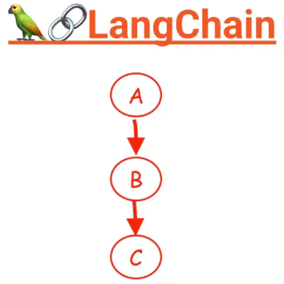
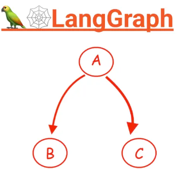
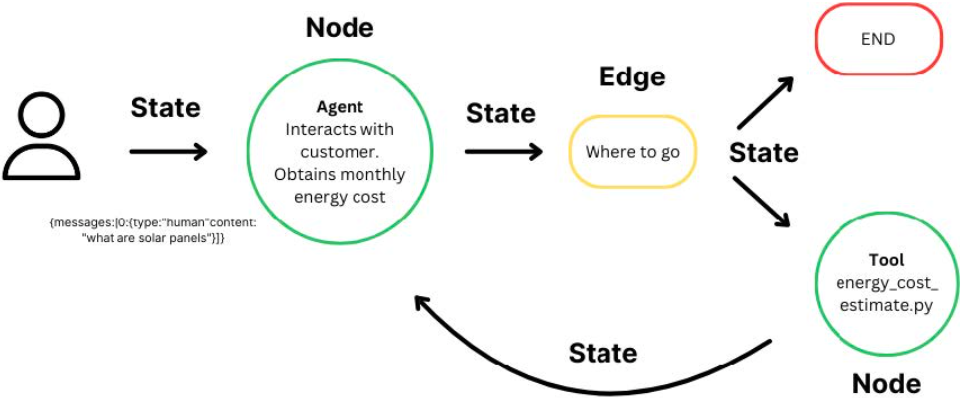
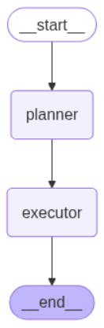
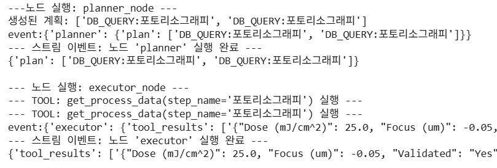
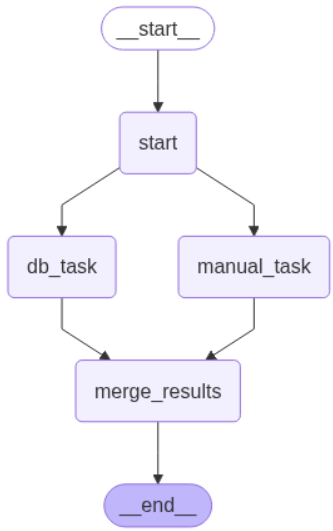
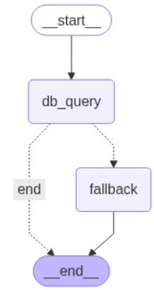
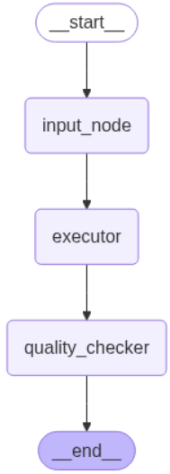
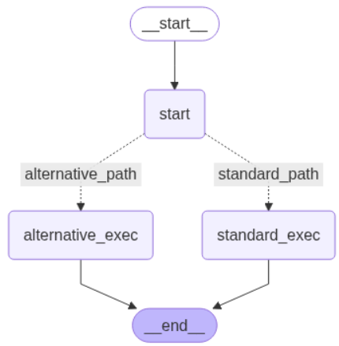
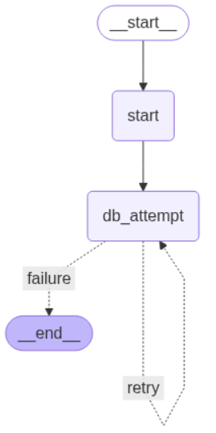

# 2.3 LangGraph 활용

**학습 목표**

- Node 와 Edge 를 사용한 워크플로우 표현 방식을 이해한다.
- LangGraph 의 핵심 요소인 State, Node, Edge 를 직접 정의하고 그래프를 구성할 수 있다.
- 여러 작업을 동시에 수행하는 병렬(Parallel) 분기 및 결과 병합을 구현할 수 있다.
- 특정 조건(예: 오류)에 따라 실행 흐름을 바꾸는 조건부 분기(Conditional Edge)를
  구현할 수 있다.
- 동적 그래프 수정(Hot-Swapping), 피드백 기반 경로 보정, 재시도 루프, 멀티 에이전트
  협업 패턴을 구현할 수 있다.
- MCP(Model Context Protocol)의 개념과 AI-Ready Data 의 요건을 설명할 수 있다.

**이 절의 구성**

- 2.3.1 LangGraph vs LangChain
- 2.3.2 LangGraph 개요
- 2.3.3 LangGraph 기본 — State · Node · Edge · 병렬 · 조건부 분기 (실습 2.3.1)
- 2.3.4 LangGraph 응용 개념 — 동적 그래프 · 최적화 · Persistence
- 2.3.5 Hot-Swapping · 피드백 분기 · 재시도 · Multi-Agent (실습 2.3.2)
- 2.3.6 MCP(Model Context Protocol) (실습 2.3.3)
- 2.3.7 AI-Ready Data
- 2.3.8 정리

---

## 2.3.1 LangGraph vs LangChain
<!-- 슬라이드 111 -->

- **LangChain — 순차적 흐름의 구현.** 여러 컴포넌트를 순차적으로 연결하는
  '체인(Chain)' 구조에 최적화되어 있다. A → B → C 처럼 직선적인 흐름에 강점이 있다.
- **LangGraph — 비선형적 흐름의 구현.** 노드들을 자유롭게 연결하여 병렬 처리(A → B 와
  A → C 를 동시에)하거나, 분기(A 의 결과에 따라 B 또는 C 로 이동), 병합,
  루프(A → B → A) 등 복잡한 제어 흐름을 구성할 수 있다. 복잡한 의사결정이 필요한
  최신 에이전트 아키텍처에 필수적이다.





그래프의 실행 방식도 두 가지로 구분된다.

- **결정론적 실행** : 그래프의 경로가 코드로 고정된다 (예: A 노드 다음에는 항상 B
  노드 실행).
- **확률적/조건부 실행** : 노드의 실행 결과나 상태값으로 다음 실행 노드를 결정한다
  (예: A 노드 결과가 '성공'이면 B 로, '실패'면 C 로 분기). LLM 의 판단을 통해 결정될
  수도 있다.

---

## 2.3.2 LangGraph 개요
<!-- 슬라이드 112 -->

- **그래프 기반 워크플로우** : LLM 애플리케이션의 흐름을 '그래프' 형태로 설계한다.
  각 작업 단위는 '노드(Node)'가 되고, 작업 간의 연결 흐름은 '엣지(Edge)'가 된다.
- **상태(State)** : 그래프의 각 노드들은 '상태'라는 **공유된 데이터 객체**를 통해
  정보를 주고받는다. 한 노드가 실행된 후 상태를 업데이트하면, 다음 노드는 그
  업데이트된 상태를 입력으로 받는다.
- **Graph-of-Thought vs Chain-of-Thought** :
  - Chain-of-Thought(CoT)는 하나의 LLM 호출 내에서 "생각의 사슬"을 만들어 논리적으로
    답변을 유도한다.
  - Graph-of-Thought 는 여러 LLM 호출(또는 다른 작업들)을 노드로 만들고, 이 노드들을
    연결하여 더 복잡하고 정교한 추론 구조를 만드는 방식이다. LangGraph 는
    Graph-of-Thought 를 구현하는 강력한 도구다.



> **핵심 메시지**
> LangGraph 의 State 는 노드가 주고받는 값이 아니라, 그래프 전체가 공유하는 하나의
> 사전(dictionary)이다. 노드는 State 를 받아 참고하고, 행동하고, `{key: value}` 를
> return 해서 State 를 업데이트한다.

---

## 2.3.3 LangGraph 기본 — State · Node · Edge · 병렬 · 조건부 분기
<!-- 슬라이드 113~117 -->

### 실습 2.3.1 — LangGraph 기본 구조

> 노트북: `code/2.3.1.LangGraph_basic.ipynb`
> [](https://colab.research.google.com/github/AI-BoostCamp/AgenticAI/blob/main/code/2.3.1.LangGraph_basic.ipynb)

조건에 따라 분기하고 여러 작업을 병렬로 처리하는 로직을 가진 Agent 를 구현한다.
Graph 를 구성하는 요소는 세 가지다.

- **State Dictionary** — node 가 state 정보를 제공받아 변경 · 추가해서 공유한다.
  node 가 `{key: value}` 를 return 해서 update 하며, key 추가도 가능하다.
- **Node** — State 를 받아서 참고하고, action 하고, 필요시 state 를 변경한다
  (변경은 return 으로 처리된다).
- **Edge** — `.add_node("name", node)` 로 노드를 등록하고,
  `.add_edge("name1", "name2")` 로 연결할 노드를 지정한다.

**State 와 Node 정의.** 상태는 `TypedDict` 로 구조를 정의한다. 2.2 절에서 만들던
Plan → Execute 흐름을 그래프로 옮겨 보자.

```python
from typing import TypedDict, Annotated, List
from langchain_openai import ChatOpenAI

## 그래프의 상태 정의
# 각 노드를 거치면서 이 상태 객체의 값들이 변경
class AgentState(TypedDict):
    query: str             # 사용자의 원본 질문
    plan: List[str]        # LLM이 생성한 실행 계획
    tool_results: List[str]# 각 도구의 실행 결과
    final_answer: str      # 최종 답변

## LLM 초기화
llm = ChatOpenAI(model="gpt-4o-mini", temperature=0)

## 각 노드가 될 함수들 정의
# 쿼리를 바탕으로 실행 계획 생성
def planner_node(state: AgentState) -> dict:
    query = state['query']   # 사용자의 원본 질문
    # 예시를 위해 고정된 계획 생성, 앞에서는 LLM으로 구현
    if "포토리소그래피" in query:
        plan = ["DB_QUERY:포토리소그래피"] * 2
    else:
        plan = [f"LLM_CALL:{query}"]
    return {"plan": plan}   # state update

# 계획에 따라 도구를 실행
def executor_node(state: AgentState) -> dict:
    results = []
    for step in state['plan']:
        if step.startswith("DB_QUERY:"):
            _, step_name = step.split(":", 1)
            results.append(get_process_data(step_name))
        else: # LLM_CALL 또는 기타
             _, prompt = step.split(":", 1)
             results.append(f"'{prompt}'에 대한 설명을 생성했습니다.")
    return {"tool_results": results}
```

**그래프 구성 및 실행.** 정의한 상태와 노드들을 `StateGraph` 에 추가하고 엣지로
연결하여 워크플로우를 완성한다.

```python
from langgraph.graph import StateGraph, END

# 그래프 워크플로우 정의
workflow = StateGraph(AgentState)

# 노드 추가
workflow.add_node("planner", planner_node)
workflow.add_node("executor", executor_node)

# 엣지 추가 (어떤 노드 다음에 어떤 노드가 실행될지)
workflow.set_entry_point("planner") # 시작점 지정
workflow.add_edge("planner", "executor")
workflow.add_edge("executor", END) # 끝점 지정

# 그래프 컴파일
app = workflow.compile()
```



**Graph 실행.** 전체를 한 번에 실행하려면 `app.invoke()`, 단계별로 진행을 보려면
`for event in app.stream(input_data):` 로 실행한다. stream 은 노드가 하나 실행될
때마다 그 노드가 return 한 `{key: value}` 를 event 로 내보낸다.

```python
## 단계별로 실행 결과 검토 : 실행 및 결과 확인
input_data = {"query": "포토리소그래피 파라미터 알려줘"}
for event in app.stream(input_data):
    print(f"event:{event}")
    for key, value in event.items():  # node return {key,value}
        print(f"--- 스트림 이벤트: 노드 '{key}' 실행 완료 ---")
        print(value,'\n')
```



**병렬처리 graph 구성.** 하나의 입력에 대해 DB 조회와 매뉴얼 로딩을 동시에 실행하고
결과를 합친다. `add_edge` 로 한 노드에서 여러 노드로 엣지를 연결하면 해당 노드들이
병렬로 실행된다. 두 가지에 주의한다 — **시작점에 dummy node 가 꼭 필요**하고, 병렬
결과는 **merge 노드에서 결합해 최종 답변을 생성**한다.

```python
# 새로운 병렬 그래프 정의
parallel_workflow = StateGraph(ParallelState)

# 시작점으로 사용할 더미 노드 (입력을 받아서 분기로 전달)
parallel_workflow.set_entry_point("start")
parallel_workflow.add_node("start", lambda state: {})# dummy node 꼭 필요함

# 병렬로 실행될 노드들 추가
parallel_workflow.add_node("db_task", db_node)
parallel_workflow.add_node("manual_task", manual_node)

# 결과 병합 노드 추가
parallel_workflow.add_node("merge_results", merge_node)

# 엣지 연결
parallel_workflow.add_edge("start", "db_task")       # start -> db_task
parallel_workflow.add_edge("start", "manual_task")   # start -> manual_task
parallel_workflow.add_edge("db_task", "merge_results")
parallel_workflow.add_edge("manual_task", "merge_results")

# 병합 노드 이후 종료
parallel_workflow.add_edge("merge_results", END)
parallel_app = parallel_workflow.compile()
```

merge 노드는 두 결과를 프롬프트에 넣어 LLM 으로 종합 요약을 만든다.

```python
# 병렬 노드들의 결과를 종합하여 최종 답변 생성
def merge_node(state: ParallelState) -> dict:
    prompt = f"""
다음 두 가지 정보를 종합하여 사용자의 질문에 대한 최종 요약 답변을 생성해주세요.
질문: {state['query']}에 대한 정보 요약

DB 정보: {state['db_result']}
매뉴얼 정보: {state['manual_result']}

종합 요약:
"""
    summary = llm.invoke(prompt).content
    return {"final_summary": summary}
```



**조건부 분기 graph 구성 — 비정상 조건 처리.** DB 조회 결과가 없으면(오류) LLM 을
호출하여 대안적인 설명을 생성하는 분기를 만든다. `add_conditional_edges` 는 특정
함수의 반환값에 따라 다음에 실행될 노드를 동적으로 결정한다.

```python
# 분기 조건을 결정하는 함수
# state의 result 값에 'error'가 포함되어 있는지 확인하여 분기 경로를 반환
def should_fallback(state: ConditionalState) -> str:
    if "error" in state.get("result", "") or "찾을 수 없습니다" in state.get("result", ""):
        return "fallback" # conditional_edges()에서 참조할 이름
    else:
        return "end"      # conditional_edges()에서 참조할 이름

# 조건부 그래프 구성
conditional_workflow = StateGraph(ConditionalState)
conditional_workflow.set_entry_point("db_query")
conditional_workflow.add_node("db_query", conditional_db_node)
conditional_workflow.add_node("fallback", fallback_node)

# 조건부 엣지 추가
conditional_workflow.add_conditional_edges(
    "db_query",           # 이 노드 실행 후에 조건을 검사
    should_fallback,      # 어떤 경로로 갈지 결정하는 함수
    {
        "fallback": "fallback", # 'fallback'을 반환하면 fallback 노드로 이동
        "end": END              # 'end'를 반환하면 그래프 종료
    }
)
# fallback 노드 실행 후에는 무조건 종료
conditional_workflow.add_edge("fallback", END)
conditional_app = conditional_workflow.compile()
```



검증해 보면 — DB 에 존재하는 "식각"을 조회하면 정상 종료하고, 존재하지 않는
"붕어빵 레시피"를 조회하면 fallback 노드로 분기해 LLM 이 일반 지식으로 답한다.

---

## 2.3.4 LangGraph 응용 개념 — 동적 그래프 · 최적화 · Persistence
<!-- 슬라이드 118~119 -->

실습에 앞서 응용 개념을 정리한다. 목표는 — 실행 중인 workflow(graph)에 동적으로
새로운 node 를 추가하고 경로를 변경하는 방법 이해, 외부 피드백에 따라 agent 의 작업
경로를 동적으로 수정하는 조건부 로직 구현, 감독(Coordinator) agent 와
작업자(Worker) agent 패턴을 이용한 multi-agent 협업 시스템 구축, 작업 실패 시
자동으로 재시도(Retry)하는 Loop 구현이다.

**동적 그래프 변경 (Hot-Swapping).** App 이 실행되는 도중에 그래프의 구조를 변경하는
기술이다. 특정 조건이 만족되면 새로운 검증 노드(Quality Check Node)를 그래프에
추가하거나, 기존 노드를 더 성능이 좋은 노드로 교체할 수 있다. **compile 된
graph(app)를 직접 수정하지 않고**, 그래프 정의 객체(StateGraph)에 node 나 edge 를
추가한 뒤 다시 compile 한다 — 예측 가능하고 안정적인 방식으로 워크플로우를 확장할
수 있다.

**그래프 학습 및 최적화.**

- 피드백 기반 경로 보정 : agent 의 실행 결과(예: 정확도, 사용자 만족도)를 피드백으로
  받아, 다음 실행 시 더 나은 결과를 낼 수 있는 경로로 workflow 를 동적으로 변경하는
  기법이다. A 경로의 정확도가 80% 미만이면 다음부터는 B 경로를 사용하도록
  conditional_edge 로직을 수정하는 식이다.
- 비용 모델 적용 : 각 node(LLM 호출, API 사용 등) 실행에 드는 비용을 모델링하고,
  비용이 최소화되는 경로를 선택한다.

**상태 저장 및 재시작 (Persistence).** LangGraph 는 각 노드의 실행이 끝날 때마다
그래프의 전체 상태를 저장하는 '체크포인트(Checkpoint)' 기능을 제공한다. 이를 통해
중간에 작업이 중단되더라도 마지막으로 성공한 지점부터 작업을 재개할 수 있다. 수
시간이 걸리는 장기 실행 작업이나, 사용자와 여러 번 대화를 주고받아야 하는 챗봇
에이전트의 '기억'을 유지하는 데 필수적이다.

**실제 산업 활용 사례.**

- 공정 예측 유지보수 : 반도체 장비의 센서 데이터를 실시간으로 분석하고, 이상 징후
  발생 시 '원인 분석 노드', '부품 재고 확인 노드', '유지보수 일정 계획 노드' 등으로
  작업을 동적으로 분기하여 고장을 사전에 예방하는 시스템을 구축할 수 있다.
- 멀티 에이전트 협업 : 고객의 복잡한 요청을 '접수 담당 에이전트'가 받은 뒤, 요청의
  성격에 따라 '기술 분석 에이전트', '고객 지원 에이전트', '데이터베이스 담당
  에이전트' 등에게 작업을 분배하고, 각 결과를 취합하여 최종 보고서를 작성하는 협업
  시나리오를 구현할 수 있다.

---

## 2.3.5 Hot-Swapping · 피드백 분기 · 재시도 · Multi-Agent
<!-- 슬라이드 120~122 -->

### 실습 2.3.2 — LangGraph 응용

> 노트북: `code/2.3.2.LangGraph_multi-agent.ipynb`
> [](https://colab.research.google.com/github/AI-BoostCamp/AgenticAI/blob/main/code/2.3.2.LangGraph_multi-agent.ipynb)

**런타임 그래프 수정 (Hot-Swapping).** 기본 2단계 그래프(input → executor)를 정의해
두고, 조건이 만족되면 quality check 노드를 추가한 뒤 다시 compile 한다.

```python
## 그래프에 새로운 노드와 엣지를 '주입'하는 함수 (핫스왑)
def add_quality_check_to_graph(workflow: StateGraph):
    """기존 그래프 정의에 품질 검사 노드와 엣지를 추가합니다."""
    workflow.add_node("quality_checker", quality_check_node)

    # 'executor'->END to 'executor'->'quality_checker'->END
    workflow.add_edge("executor", "quality_checker")
    workflow.add_edge("quality_checker", END)

    # 수정된 그래프 컴파일
    app = workflow.compile()
    return app

# 런타임에 그래프 구조 수정
is_qc_required = True
if is_qc_required:
    app = add_quality_check_to_graph(base_workflow)
```



**피드백 기반 조건부 그래프.** query 와 함께 입력된 feedback 에 따라 경로를 변경한다.
입력되는 dict 에 의해 feedback field 가 update 되고, 이 값을 체크해 경로가 변경된다.

```python
## 피드백에 따라 경로를 결정하는 조건 함수
def route_based_on_feedback(state: FeedbackState) -> str:
    accuracy = state.get("feedback", {}).get("accuracy", 1.0)
    if accuracy < 0.8:
        return "alternative_path"   # LLM 이 상세 설명을 생성하는 대안 경로
    else:
        return "standard_path"      # 간단한 DB 조회 표준 경로

feedback_workflow.add_conditional_edges(
    "start",                 # 이 노드 다음에 분기
    route_based_on_feedback, # 경로 결정 함수
    {
        "standard_path": "standard_exec",
        "alternative_path": "alternative_exec"
    }
)
```



**오류 재시도 루프.** 특정 작업이 실패하면 최대 2회까지 자동으로 재시도하는 Loop 를
구현한다. 조건부 엣지가 **자기 자신으로 돌아가는 경로**를 가지면 루프가 된다.

```python
def should_retry(state: RetryState) -> str:
    """결과에 에러가 있고, 재시도 횟수가 2회 미만인지 확인하여 분기합니다."""
    max_retries = 2
    if "Error" in state["result"]:
        if state["retry_count"] < max_retries:
            return "retry" # 자기 자신으로 돌아가는 루프
        else:
            return "failure" # 최종 실패
    else:
        return "success" # 정상 종료

# db_attempt 노드 실행 후, should_retry 조건에 따라 분기
retry_workflow.add_conditional_edges(
    "db_attempt",             # 50% 확률로 실패하는 도구를 호출하는 노드
    should_retry,             # 재시도 체크
    {
        "retry": "db_attempt",# 다시 db_attempt 실행 (루프)
        "success": END,
        "failure": END        # 최종 실패
    }
)
```



**협업 시나리오 — 감독-작업자(Supervisor-Worker) 패턴.** '감독(Coordinator)' 노드가
사용자의 복잡한 요청을 분석하여 여러 개의 하위 작업으로 나눈 뒤, 각 작업을
'작업자(Worker)' 노드에 분배하여 처리하고, 마지막에 결과를 종합한다.

1. **감독(Coordinator)** : 복잡한 요청(예: "A 도 해주고 B 도 찾아줘")을 받아, LLM 을
   사용해 단일 작업을 수행하는 여러 개의 명확한 지시사항(sub-tasks)으로 분해한다.
2. **작업자(Worker)** : 분배된 개별 지시사항을 받아 각자 맡은 도구로 작업을 실행한다.
3. **병합/요약(Reducer)** : 모든 작업자의 결과물을 모아 하나의 종합적인 답변으로
   만든다.

```python
def coordinator_node(state: CollaborationState) -> dict:
    """사용자의 원본 쿼리를 받아, 여러 작업자에게 분배할 작업 리스트를 생성합니다."""
    query = state['original_query']
    prompt = f"""
당신은 여러 전문가 팀을 관리하는 프로젝트 매니저입니다. 사용자의 복잡한 요청을 분석하여, 각 전문가(도구)가 처리할 수 있는 간단한 작업 단위로 분해해주세요.
각 작업은 '도구:요청사항' 형식이어야 합니다. 응답은 반드시 파이썬 리스트(list) 형식의 문자열로만 생성해야 합니다.

사용 가능한 도구:
- `DB_QUERY:공정명`: 데이터베이스에서 공정 데이터를 조회합니다.
- `MANUAL_QUERY:검색어`: DUV 매뉴얼에서 관련 내용을 찾습니다.

# 요청: {query}
# 작업 분해 결과 (파이썬 리스트 형식):
"""
    response = llm.invoke(prompt).content
    cleaned_content = response.strip().replace("```python", "").replace("```", "").strip()
    tasks = ast.literal_eval(cleaned_content)
    return {"tasks": tasks}
```

그래프는 coordinator → worker → reducer 의 단순한 연결이지만, coordinator 가 LLM 으로
작업을 동적으로 분해하므로 "DUV 공정 매뉴얼을 요약하고, 식각 공정의 DB 데이터도
알려줘" 같은 복합 요청이 자동으로 두 개의 작업으로 나뉘어 처리된다.

이 패턴을 더 확장한 심화 노트북 두 개가 준비되어 있다 —
`code/2.3.3.LangGraph_modular_template.ipynb` 는 tool · 상태 · 노드 생성을 템플릿으로
공통화해 단일 Agent · Planner-Executor · Multi-Agent Supervisor 패턴을 갈아 끼우는
구성을, `code/2.3.4.0.Hierarchical_Podcast_Teaching.ipynb` 는 기획자 · 리서처 ·
요약가 · 각본가 · 진행자 에이전트가 계층적으로 협업하는 예를 보여준다.

---

## 2.3.6 MCP(Model Context Protocol)
<!-- 슬라이드 123 -->

MCP 는 Anthropic 에서 개발한 경량 프로토콜이다.

- **목표** : Claude 와 같은 LLM 이 로컬 파일 시스템, 데이터베이스, API 등과 안전하게
  상호작용하도록 한다. 주로 Claude Desktop 에서 사용되며, STDIO 또는 SSE 를 통해
  통신한다.
- **핵심 기능** :
  - 파일 시스템 접근 : `@modelcontextprotocol/server-filesystem`
  - 웹 콘텐츠 접근 : `@modelcontextprotocol/server-fetch`
  - 데이터 저장 : `@modelcontextprotocol/server-memory` — 검색, 컨텍스트 유지(대화
    기록 저장)
  - 순차 사고 관리 : `@modelcontextprotocol/server-sequential-thinking` — 복잡한
    작업을 단계별로 분해하여 LLM 이 처리
- **구현 방식** : Node.js 기반 서버를 실행하고, LLM 이 JSON 형식의 명령(예:
  `"read_file /content/manual.txt"`)을 보내 결과를 받는다. Node.js 를 설치하고 MCP
  서버를 실행한 뒤 Python 으로 STDIO 통신한다.
- **단점** : Claude 와 로컬/외부 리소스 간 안전한 통신을 위한 경량 프로토콜로 단순
  업무 중심이며, Node.js 기반 별도 서버 실행으로 debugging 복잡도가 상승한다.

### 실습 2.3.3 — MCP 로 파일 시스템 접근하기

> 노트북: `code/2.3.4.MCP.ipynb`
> [](https://colab.research.google.com/github/AI-BoostCamp/AgenticAI/blob/main/code/2.3.4.MCP.ipynb)

Colab 에서 Node.js 를 설치하고 MCP filesystem 서버를 실행한 뒤, 로컬 LLM
(4bit 양자화한 gemma-2-9b-it)과 결합해 파일 기반 질의를 처리한다.

```python
# Install MCP server
!npm install -g @modelcontextprotocol/server-filesystem
```

MCP 서버와의 인터페이스는 subprocess 로 명령을 보내고 결과를 받는 함수다. MCP 가
실패하거나 텍스트가 아닌 형식(PDF, Excel)은 Python 으로 대체 처리한다.

```python
## MCP 서버 Interface
def query_mcp_server(command: str) -> str:
    """Send a command to the MCP server and return the response."""
    process = subprocess.Popen(
        ["npx", "@modelcontextprotocol/server-filesystem", path],
        stdin=subprocess.PIPE,
        stdout=subprocess.PIPE,
        stderr=subprocess.PIPE,
        text=True
    )
    stdout, stderr = process.communicate(input=json.dumps({"command": command}))
    if stderr and "Secure MCP Filesystem Server running on stdio" not in stderr:
        return f"MCP 서버 오류: {stderr}"
    return stdout.strip() or "파일 내용이 비어 있습니다."

## File 기반 Query 처리기
def process_file_with_llm(file_path: str, question: str) -> str:
    # 텍스트 파일은 MCP로, PDF·Excel은 Python fallback으로 읽는다
    if file_path.endswith('.txt'):
        file_content = query_mcp_server(f"read_file {file_path}")
        if "MCP 서버 오류" in file_content:
            file_content = read_file_fallback(file_path)
    else:
        file_content = read_file_fallback(file_path)

    prompt = f"다음 파일 내용을 기반으로 질문에 답변하세요:\n\n{file_content}\n\n질문: {question}"
    inputs = tokenizer(prompt, return_tensors="pt").to("cuda:0")
    outputs = model.generate(**inputs, max_new_tokens=512, do_sample=True, temperature=0.3)
    return tokenizer.decode(outputs[0], skip_special_tokens=True)
```

이 구조로 텍스트 매뉴얼 · PDF 규격서 · Excel 데이터에 대한 질의("내용을 요약해줘"
등)를 처리하고, `list_dir` 명령으로 폴더를 조회해 확장자별로 파일을 정리하는 작업도
수행해 본다.

---

## 2.3.7 AI-Ready Data
<!-- 슬라이드 124~125 -->

Agent 와 RAG 가 성과를 내려면 데이터가 준비되어 있어야 한다. **AI-Ready Data** 란
시스템이 소비 · 학습 · 추론할 수 있도록 구조화 · 품질관리 · 거버넌스가 갖춰진
데이터다 — 읽을 수 있는 형식과 풍부한 metadata, 정확성 · 완전성 · 대표성 등의 데이터
품질, 라이선스 · 보안 · 프라이버시 요건 충족을 갖추어, 모델 훈련/튜닝 · 추론 · RAG
등에 즉시 활용 가능한 상태를 목표로 한다.

**핵심 요건.**

- 형식성 : CSV/Parquet 등 비독점 · 표준 포맷, 스키마 · 데이터사전 · 예제 코드 제공
- 메타데이터 · 계보(lineage) : 생성/수집 출처, 전처리 이력, 버전 · 시점을 시스템이
  해석 가능하게 기록
- 품질관리 : 정확성 · 일관성 · 결측/이상치 처리, 대표성 · 편향 점검(샘플링/라벨 품질
  포함)
- 접근성 : 안정적 API/endpoint(언제나 필요 수준의 접근 가능), 문서화, 검색 가능한
  카탈로그(발견 가능성)
- 거버넌스 · 법규 : 사용권한 · 라이선스 명시, PII(개인정보) 최소화 · 비식별화, 보안 ·
  감사 추적
- 운영성 : 최신성(SLA), 변경관리(스키마 진화), 모니터링/알림(데이터 드리프트 포함)

**용도별 포인트.**

- 모델 훈련/튜닝 : 라벨 신뢰도, 클래스 불균형, 분할 전략(IID 인가?), 데이터 허가
  범위(재학습 가능 여부)
- 추론 · 서빙 : 학습 · 추론에 사용하는 데이터를 중앙화 저장소에(오프라인/온라인)
  관리하고 최신성을 관리
- RAG : 문서 청킹/중복 제거, 메타데이터(출처 · 시간 · 권한), version index 및
  Recall/Precision benchmark 정보 필요

여기서 IID(Independent and Identically Distributed)란 data 가 서로 독립이고 동일한
분포라는 뜻이다 — IID 면 random 으로 train/val 을 분리할 수 있고, non-IID 면 이전
데이터로 train, 이후 데이터로 val 을 구성해야 한다.

**왜 중요한가.** "AI-Ready Data" 가 있어야만 AI 가 성과를 낼 수 있다. NIST AI
RMF(인공지능 위험 관리 프레임워크, https://nvlpubs.nist.gov/nistpubs/ai/NIST.AI.100-1.pdf)
와 그 Playbook, OECD 의 프라이버시/데이터 거버넌스 권고, NOAA/미 상무부의 AI-Ready
Open Data, Azure AI 채택 가이드 등이 이를 표준화하고 있다.

**빠른 자가 점검 (5문항).**

1. 비독점 포맷과 스키마/데이터사전이 있는가?
2. 버전 · 계보 · 품질지표가 기록되는가?
3. 라이선스/접근권한/PII 처리가 명확한가?
4. API · 카탈로그로 쉽게 찾고 가져올 수 있는가?
5. 용도(RAG vs 훈련)에 맞춘 벤치마크 · 모니터링이 있는가?

실무에서는 **머신이 이해할 수 있는 메타데이터(machine-understandable metadata)와
운영 중 지속 모니터링(품질 · 드리프트)이 가장 부족**하다. 데이터 사전과 예제 쿼리 ·
코드를 함께 배포하고, 카탈로그에 품질지표를 노출하는 것만으로도 효과가 오른다.
(데이터 사전이란 데이터셋의 구조와 의미를 기계와 사람이 모두 이해할 수 있게 정리한
문서로, 각 필드의 정의 · 형식 · 의미 · 제약조건 등을 기술한다.)

---

## 2.3.8 정리

- LangChain 이 직선적 체인이라면 LangGraph 는 병렬 · 분기 · 병합 · 루프가 가능한
  그래프다. 그래프 전체가 공유하는 State dictionary 를 노드가 읽고, return 으로
  업데이트한다.
- 기본 구성은 `StateGraph(State)` → `add_node` → `add_edge`/`set_entry_point` →
  `compile` 이고, 실행은 `invoke`(일괄) 또는 `stream`(노드별 event) 으로 한다.
- 병렬은 한 노드에서 여러 edge 를 내면 되고(시작 dummy node 필요), 분기는
  `add_conditional_edges` 로, 루프는 조건부 edge 가 자기 자신을 가리키게 해서
  만든다.
- 응용 — Hot-Swapping 은 StateGraph 정의에 노드를 추가하고 재컴파일, 피드백 기반
  경로 보정은 state 의 피드백 값으로 분기, 재시도 루프는 retry_count 로 제어,
  멀티 에이전트는 Coordinator(LLM 분해) → Worker → Reducer 패턴.
- MCP 는 LLM 과 로컬 리소스를 잇는 경량 프로토콜이고, 이 모든 것의 토대는 형식 ·
  품질 · 거버넌스를 갖춘 AI-Ready Data 다.
