# 2.4 LangGraph Tracing

**학습 목표**

- LLM 애플리케이션 관측(tracing) 플랫폼인 LangSmith 와 LangFuse 의 특징을 비교할 수 있다.
- LangSmith · LangFuse 에 실행 정보를 기록하고, run name · tag · metadata 로 trace 를
  관리할 수 있다.
- 재시도 루프가 있는 복잡한 그래프의 실행 경로를 trace 로 검증할 수 있다.
- 프롬프트를 버전 · 라벨로 관리(Prompt Management)하고, A/B 실험과 평가 결과를
  trace 에 기록할 수 있다.

**이 절의 구성**

- 2.4.1 Tracing 플랫폼 — LangSmith vs LangFuse
- 2.4.2 LangSmith · LangFuse 로 Trace 하기 (실습 2.4.1)
- 2.4.3 복잡한 동작 Trace 하기
- 2.4.4 Prompt Management — 버전 · 라벨 · A/B (실습 2.4.2)
- 2.4.5 Prompt 평가와 Trace 검토
- 2.4.6 정리

---

## 2.4.1 Tracing 플랫폼 — LangSmith vs LangFuse
<!-- 슬라이드 127 -->

LangGraph Tracing 은 **graph 실행 과정을 관측 + 평가 + Prompts/Dataset 운영까지
포괄하는 AIOps** 다. 대표 플랫폼이 둘 있다.

**LangSmith** — SaaS 중심의 LangChain 기본 관측/평가 platform 이다. Team 단위 통합
관측 · 평가에 적합하다(LangChain/LangGraph 에 최적).

- 체인/에이전트 단계별 상세 Trace · Filter · Dashboard
- Prompts 버전 관리 · 테스트(문서화)
- Dataset 생성 · 버전 · 온라인/오프라인 평가, production 에서 실험

**LangFuse** — open source 로, self-hosting 이 가능한 관측/평가 · Prompts 운영
플랫폼이다.

- 요청 · 툴 · 재시도 · 비용까지 추적하는 Trace/Metric
- 평가 · 스코어링 지원(오픈소스/유료 기능 조합), 실험 워크플로우 제공
- Prompts 관리(version, composable playground 제공), 유료 cloud service 도 제공
- Self-hosting 유료 기능(중규모 이상, 기업 수준에 필요한 기능) : 프로젝트 단위 RBAC,
  SSO 강제/엔터프라이즈 SSO, 데이터 보관 정책 관리, SCIM API, Audit Logs,
  Admin/Org 관리 API, UI 커스터마이즈, 규정 준수 검토(SOC2/ISO 보고서)

> **용어 정리**
> - SSO(Single Sign-On) : 로그인/인증을 통합한다.
> - RBAC(Role-Based Access Control) : 로그인 후 권한을 역할로 관리한다.
> - SCIM(System for Cross-domain Identity Management) : 사용자/그룹을 자동으로
>   생성 · 수정 · 삭제하는 표준 프로토콜. 직원 입사 → 계정 생성 → 연동된 앱에 자동
>   사용자 생성/역할 부여 → 퇴사 시 자동 비활성화/회수.
> - SOC2 : 보안 통제 수준을 공인회계법인(CPA)이 검증해 주는 감사 보고서.
> - ISO/IEC 27001 : ISMS(정보보호 관리체계)가 표준에 부합하는지에 대한 인증서.

---

## 2.4.2 LangSmith · LangFuse 로 Trace 하기
<!-- 슬라이드 128~133 -->

### 실습 2.4.1 — Tracing 기본

> 노트북: `code/2.4.1.LangGraph_tracing.ipynb`
> [](https://colab.research.google.com/github/AI-BoostCamp/AgenticAI/blob/main/code/2.4.1.LangGraph_tracing.ipynb)

**LangSmith 가입.** https://smith.langchain.com 에 가입한다(개인 계정 사용). us/eu 를
선택하고 몇 가지 질문에 답한 뒤 Trace 를 선택하고, LangGraph 메뉴에서 Generate API
Key 로 key 를 만들어 복사한다. 로그인 후에는 왼쪽 메뉴 → Tracing Projects → Name
에서 프로젝트를 선택해 기록을 본다.

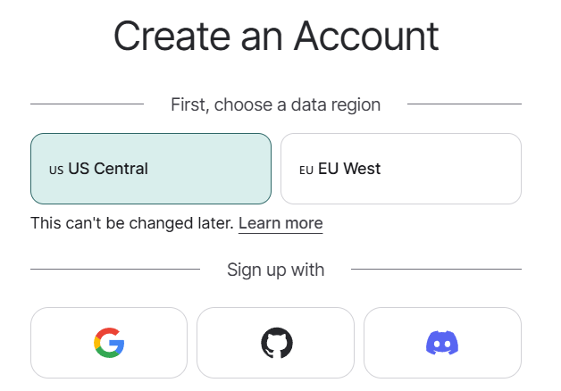

**환경설정.** 설정된 project 이름으로 모든 LangGraph 실행 정보가 저장된다. 환경
변수를 설정한 **이후에** langchain_openai, langgraph 를 import 해야 한다.

```python
import os
from google.colab import userdata
os.environ["OPENAI_API_KEY"] = userdata.get('OPENAI_API_KEY')
os.environ["LANGCHAIN_TRACING_V2"] = "true"
os.environ["LANGSMITH_TRACING"] = 'true'          # 구버전 호환을 위해
os.environ["LANGSMITH_API_KEY"] = userdata.get('LANGSMITH_API_KEY')
os.environ["LANGSMITH_ENDPOINT"] = 'https://api.smith.langchain.com'
os.environ["LANGSMITH_PROJECT"] = "LangSmith-Demo"# 프로젝트명
```

**`@traceable`.** 함수 · node 에 이 데코레이터를 붙이면 그 동작이 trace 에 더
자세하게 표시된다.

```python
## @traceable : 함수, node의 동작이 Trace에 더 자세하게 표시됨
@traceable
def get_parameter_from_db(step_name: str) -> str:
    db = {"포토리소그래피": "Dose: 25.0, Focus: -0.05", "식각": "Power: 500, Pressure: 10"}
    return db.get(step_name, "해당 공정 데이터를 찾을 수 없습니다.")

@traceable
def input_node(state: AgentState) -> dict:
    return {"query": state['query']}
```

**Graph 구성과 실행 — Run Name 및 기타 정보 전달.** 2.3 절의 기본 그래프를 그대로
실행하되, config 로 run name · tags · metadata 를 전달하면 LangSmith 에서 필터링과
분석에 쓸 수 있다.

```python
## 지정된 run_name으로 저장
result = app.invoke(
    {"query": "포토리소그래피"},
    config={
        "run_name": "Photolithography-Demo",        # LangSmith Run 이름
        "tags": ["demo", "langsmith"],
        "metadata": {"dataset":"n/a", "env":"colab"}# 임의 메타데이터
    }
)
```

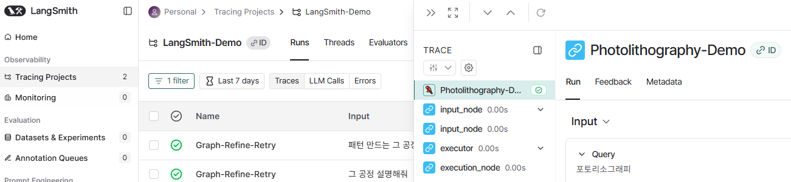

**LangFuse 가입.** LangFuse Cloud(https://cloud.langfuse.com)에 가입한다(개인 계정).
us/eu 선택 → 몇 가지 질문 답변 → New Organization 생성 → (member 추가는 skip) →
New Project 생성 → API Keys → Create new API keys. **API Key 가 두 개**
제공된다 — `LANGFUSE_PUBLIC_KEY` 와 `LANGFUSE_SECRET_KEY` — 서버 URL 도 확인하고,
Usage(LangChain 선택)에서 참고 코드를 복사할 수 있다. 로그인 후에는 Organization →
Go to project → Dashboard → Tracing 에서 방금 실행한 run 이 자동으로 기록된 것을
본다.

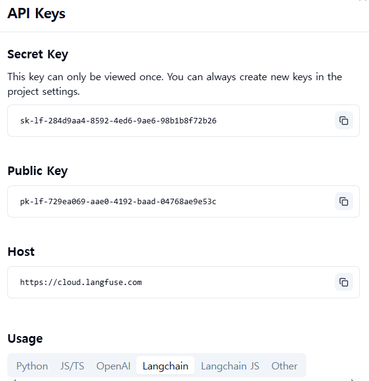

**환경설정과 Tracer 활성화.** LangFuse 는 환경 변수 + callback handler 로 붙인다.

```python
os.environ["LANGFUSE_PUBLIC_KEY"] = userdata.get('LANGFUSE_PUBLIC_KEY')
os.environ["LANGFUSE_SECRET_KEY"] = userdata.get('LANGFUSE_SECRET_KEY')
os.environ["LANGFUSE_HOST"] = "https://us.cloud.langfuse.com"

from langfuse.langchain import CallbackHandler
# LangFuse Tracer 활성화
lf_handler = CallbackHandler()
```

**LangChain 적용 — metadata 추가.** chain 의 `invoke` 에 callback 을 넣으면 그
실행이 trace 된다. `langfuse_user_id` · `langfuse_session_id` · `langfuse_tags` 는
LangFuse 가 인식하는 지정된 이름의 metadata 다.

```python
prompt = ChatPromptTemplate.from_template("반도체 공정 중 {process} 단계를 2문장으로 설명해줘.")
chain = prompt | llm
response = chain.invoke(
    {"process": "포토리소그래피"},
    config={
        "callbacks": [lf_handler],
        "run_name": "LangChain한글-Demo",
        "metadata": {
            "langfuse_user_id": "연구소A03",     # 지정된 name
            "langfuse_session_id": "session-1", # 지정된 name
            "langfuse_tags": ["tag-1", "tag-2"],# 지정된 name
            "새로운정보": "넣어보자"
        }
    }
)
```

**LangGraph 적용.** graph 의 `app.invoke` 에도 같은 방식으로 callback 을 전달하면
노드 단위의 trace 가 기록된다.

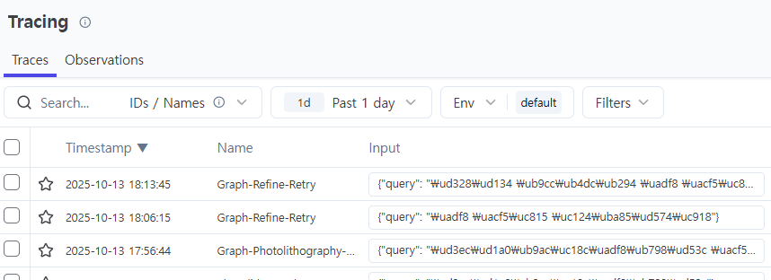

---

## 2.4.3 복잡한 동작 Trace 하기
<!-- 슬라이드 134~141 -->

tracing 의 진짜 가치는 복잡한 그래프에서 드러난다. 다음 흐름의 그래프를 만들어
trace 해 본다.

> query → rewrite(query 동의어 생성) → retrieve(rewrite query 로 DB 검색, docs 생성 ·
> 요약) → quality(docs 품질 검사, yes/no) → 분기(no 면 refine, yes 면 answer, 포기
> 시 fallback) → refine(query 를 더 보강) → retrieve … → answer(docs 내용 정리) /
> fallback(DB 에서 충분한 정보 수집 불가 시 일반 정보 생성)

각 단계에서 **LLM 을 어떻게 사용하는지, prompt 를 어떻게 만드는지** 확인하는 것이
핵심이다 — prompt 에 따라 LLM 이 어떻게 반응하는지 충분히 검증해야 한다.

- **Rewrite node** — query 관련 동의어/영문을 추가하여 query 를 보강한다.
- **Retrieve node** — 보강된 query(rewritten_query)로 DB 를 검색해 docs list 를
  만들고, docs 내용을 요약한다(trace 에 보이게 하기 위한 dummy action — LLM 을 한 번
  더 호출하면 span 이 남는다).
- **Quality node** — retrieve 결과(docs)가 query 에 대한 답변의 충분한 근거가 되는지
  LLM 으로 검토한다. 결과는 yes/no 로 답하도록 prompt 로 유도한다.
- **Route** — quality 출력을 검토해 충분하면 answer, 부족하면 refine, refine 이
  반복되어 한도에 도달하면 내부 정보 검색을 포기한다.
- **Refine node** — 품질 부족 시 query 를 더 보강한다(기본 동의어/영문에 추가
  동의어/영문 + 키워드 보강).
- **Answer node** — 품질 충족 시 원본 질문 + 검색 정보(docs)를 LLM 으로 정리한다.
- **Fallback node** — retry 로도 충분한 정보를 얻지 못한 경우 일반 지식으로 답한다.

```python
# 분기: 품질검사 → OK면 answer, 아니면 refine 또는 fallback
def route_after_quality(state: AgentState) -> str:
    if state.get("quality_ok"):
        return "ok"
    if state.get("retries",0) < 2:
        return "refine"
    return "fallback"

workflow = StateGraph(AgentState)
workflow.set_entry_point("input")

workflow.add_node("input", input_node)
workflow.add_node("rewrite", rewrite_query_node)
workflow.add_node("retrieve", retrieve_node)
workflow.add_node("quality", quality_check_node)
workflow.add_node("refine", refine_query_node)
workflow.add_node("generate_answer", answer_node)
workflow.add_node("fallback", fallback_answer_node)

workflow.add_edge("input", "rewrite")
workflow.add_edge("rewrite", "retrieve")
workflow.add_edge("retrieve", "quality")

# 조건 분기
workflow.add_conditional_edges(
    "quality",
    route_after_quality,
    {"ok":"generate_answer", "refine":"refine", "fallback":"fallback"}
)

# 재시도 루프: refine → retrieve → quality
workflow.add_edge("refine", "retrieve")

workflow.add_edge("generate_answer", END)
workflow.add_edge("fallback", END)

app = workflow.compile()
```

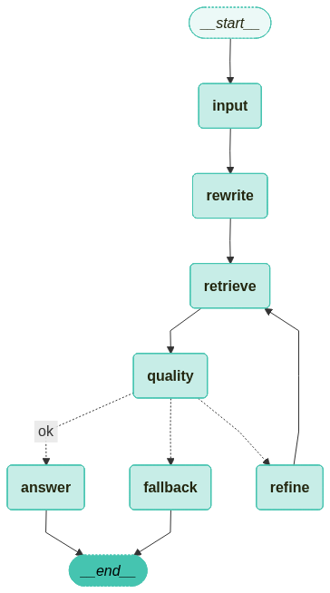

**케이스 1 — 내부 정보에서 충분하게 답변을 찾은 경우.** 명확한 질의("포토리소그래피
공정의 기본 단계를 간단하게 설명해줘")는 refine node 를 거치지 않고 답변까지
생성된다. trace 에서 각 노드의 실행 시간과 LLM 호출의 token 수까지 확인할 수 있다.

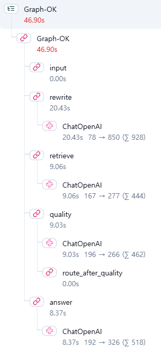

**케이스 2 — 내부 정보에서 답변을 찾지 못한 경우.** 의도적으로 모호한 질의("그
공정을 정확하게 설명해줘")를 주면 refine node 를 반복하며 답변을 생성하려 하고,
그래도 근거가 충분하지 않으면 fallback 을 거쳐 일반적인 답변을 생성한다.

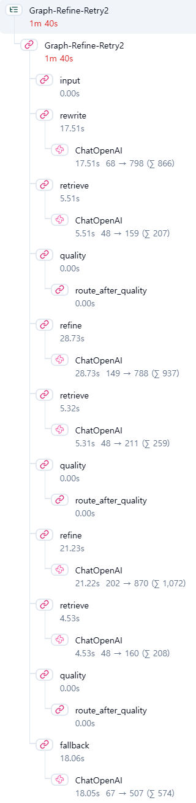

---

## 2.4.4 Prompt Management — 버전 · 라벨 · A/B
<!-- 슬라이드 142~146 -->

**Prompt management(versioning)는 LLM 앱의 소스코드 관리와 같은 역할**을 한다.

- 버전 관리 & 롤백 : 실수/회귀(regression) 시 즉시 이전 버전으로 복구한다. 환경별
  배포(dev/staging/prod)도 태그/라벨로 스위치한다.
- 재현성 & 감사 가능성 : "이 응답이 어떤 프롬프트 · 설정으로 생성됐는가"를
  추적한다(트레이스와 연결).
- 실험/배포 파이프라인 : 커밋/태그를 기준으로 A/B 테스트 · 웹훅(CI/CD)을 자동화한다.
- 런타임 안전성 : SDK 캐시 · 사전 로드 · 폴백으로 가용성을 보장한다(네트워크 이슈
  시에도 안전 실행).

LangFuse 의 workflow 는 — 1) UI/SDK 로 프롬프트를 생성하고(버전 자동), 2) 라벨(예:
production)로 환경 배포를 관리하고, 3) 런타임에서 라벨/버전으로 가져와 실행하며
트레이스에 프롬프트를 연결한다.

### 실습 2.4.2 — Prompt Management 와 A/B 실험

> 노트북: `code/2.4.2.LangGraph_prompt_manage.ipynb`
> [](https://colab.research.google.com/github/AI-BoostCamp/AgenticAI/blob/main/code/2.4.2.LangGraph_prompt_manage.ipynb)

**UI 로 프롬프트 생성.** 메뉴 Organization → 프로젝트 선택 → Prompt → + New
prompt 에서 Name(예: `photo_litho.rewrite`), Text, Labels(예: production)를 넣고
Create prompt 한다. 이후 새 버전 생성과 label 변경 · 추가가 가능하다.

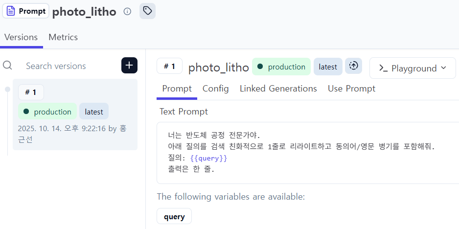

**Prompts 관리.** Prompt list 와 version list 로 관리한다. 같은 이름의 프롬프트에
여러 버전을 만들고 `prod-a`, `prod-b` 라벨로 A/B 를 운영한다.

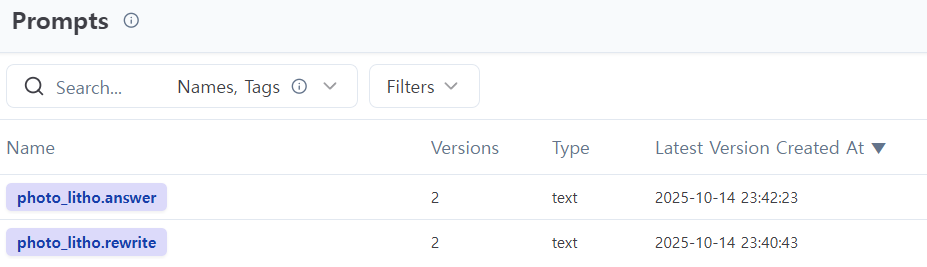

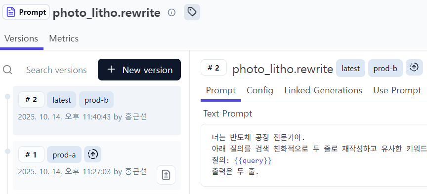

**Prompts 읽어 오기.** 런타임에서는 name + label 로 가져오되, **실패 시 내장 값으로
폴백**한다. LangFuse 의 `{{var}}` 표기는 LangChain 의 `{var}` 로 변환한다.

```python
# 다음 Prompt Name을 label "prod-a","prod-b"로 운영
PROMPT_NAME_REWRITE = "photo_litho.rewrite"
PROMPT_NAME_ANSWER  = "photo_litho.answer"

lf = get_client() # prompts 가져 오기 위해 필요

def lf_text_prompt(p) -> str:
    """LangFuse Prompt 객체 -> LangChain용 문자열"""
    tmpl = p.get_langchain_prompt()   # 3.x 표준
    if not isinstance(tmpl, str):
        raise TypeError("chat type 프롬프트입니다. text type만 지원합니다.")
    # {{var}} → {var}
    return tmpl.replace("{{","{").replace("}}","}")

def fetch_prompt_text(name: str, label: str, fallback_text: str) -> tuple[str, str]:
    """LangFuse(name, label)에서 텍스트 프롬프트를 가져오거나, 실패 시 fallback 사용."""
    try:
        p = lf.get_prompt(name, label=label)
        return lf_text_prompt(p), f"lf:{label}"
    except Exception:
        return fallback_text, "fallback"

def build_prompt_pack(variant_label: str):
    """variant_label = 'prod-a' | 'prod-b'"""
    rewrite_text, rewrite_src = fetch_prompt_text(PROMPT_NAME_REWRITE, variant_label, FALLBACK_REWRITE)
    answer_text,  answer_src  = fetch_prompt_text(PROMPT_NAME_ANSWER,  variant_label, FALLBACK_ANSWER)
    return {
        "variant": variant_label,
        "rewrite_text": rewrite_text,
        "answer_text": answer_text,
        "sources": {"rewrite": rewrite_src, "answer": answer_src}, }
```

**Prompts 변경 — LangGraph 에서 prompt set 갈아 끼우기.** 그래프의 state 에
`prompts`(build_prompt_pack 결과)를 넣어 두고, rewrite/answer node 가 그 텍스트를
사용하게 하면, **그래프 코드는 그대로 두고 프롬프트만 A/B 로 바꿔** 실행할 수 있다.

```python
### Rewrite query (Prompt 변경 적용)
def rewrite_query_node(state: AgentState) -> AgentState:
    prompt_text = state["prompts"]["rewrite_text"]
    user_q = state["query"]
    msg = prompt_text.format(query=user_q)
    resp = llm.invoke([{"role":"user","content": msg}])
    return {"rewritten_query": resp.content.strip()}

def run_once(query: str, variant: str):
    prompt_pack = build_prompt_pack(variant)
    res = app.invoke(
        {"query": query, "prompts": prompt_pack},
        config={
            "callbacks": [lf_handler],
            "run_name": f"Graph-AB-{variant}",
            "metadata": {
                "variant": variant,
                # 대시보드 필터용 태그
                "langfuse_tags": ["graph", "ab", f"variant:{variant}"],
                "langfuse_user_id": "sunny",
                "langfuse_session_id": "colab-ab-demo",
            },
        }
    )
    return res

res_a = run_once("포토리소그래피 공정을 간단하게 설명해줘", "prod-a")
res_b = run_once("포토리소그래피 공정을 간단하게 설명해줘", "prod-b")
```

---

## 2.4.5 Prompt 평가와 Trace 검토
<!-- 슬라이드 147~149 -->

**Prompts 평가.** version 별 prompt 의 성능을 측정 · 기록 · 관리해야 한다. 두 방식이
있다.

- **규칙을 사용한 평가** — 예: 답변의 길이 평가(간결성: conciseness), 답변에
  docs(검색한 정보)의 단어가 포함된 정도 평가(근거 적용 수준: coverage).
- **LLM 을 사용한 평가** — LLM 에게 평가를 요청한다. 규칙으로 평가하기 어려운 정성적
  평가가 가능하지만 일관성 문제가 있다.

```python
# 규칙 기반 점수 # 간결성: 0~1로 정규화(400자 이하면 1, 1200자 이상이면 0, 선형감소)
L = len(answer)
conciseness = 1.0 if L <= 400 else (0.0 if L >= 1200 else (1200 - L) / 800.0)
cov_hits = sum(1 for d in docs if any(tok in answer for tok in d.split()[:5]))
coverage = cov_hits / max(1, len(docs))

# LLM 채점(정확도)
judge = ChatOpenAI(model="gpt-4o-mini", temperature=0)
judge_prompt = f"""질문: {query} \n근거:- {"\n- ".join(docs) if docs else "(없음)"}
아래 답변이 근거와 질문에 비추어 얼마나 정확한지 0~1 사이의 실수만 출력: \n답변: {answer}"""
accuracy_llm = float(judge.invoke(judge_prompt).content.strip().split()[0])
```

**평가 결과 기록.** `app.invoke()` 의 run 과 별도로 **새로운 이름의 span 을 생성**하여
trace 에 기록한다. span 의 name 을 정하고, tag 를 통해 run 의 trace 와의 관계를
추적한다.

```python
with lf.start_as_current_span(name="AB-Evaluation") as span:
    span.update_trace(
        tags=["ab-eval", f"variant:{variant}"],
        input={"query": query, "docs": docs},
        output=answer,
        metadata={"variant": variant}
    )
    span.score_trace(name="conciseness_rule", value=round(conciseness, 3))
    span.score_trace(name="coverage_rule", value=round(coverage, 3))
    span.score_trace(name="accuracy_llm", value=round(accuracy_llm, 3), comment="0~1, LLM judge")
lf.flush()
```

> **span 과 run 의 차이 (LangFuse)**
> Span 은 LangFuse 의 기본적인 관찰(observation) 단위다 — trace 내의 단일 작업
> 단위로, 시작/종료 시간 · 이름 · 속성을 가지고 중첩되어 부모-자식 관계를 이룬다
> (비-LLM 작업을 위한 일반적인 OpenTelemetry 스팬). Run 은 실험(experiment)
> 컨텍스트의 개념으로, 데이터셋의 각 항목에 대해 태스크를 실행하고 평가하는 단위다.

**Trace 검토.** trace 목록에서 `Graph-AB-{variant}` 는 run 에 대한 trace,
`AB-Evaluation` 은 평가 span 에 대한 trace 다(평가 span 은 token 정보를 기록하지
않는다).

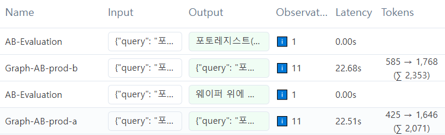

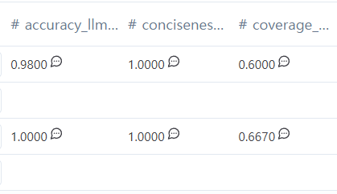

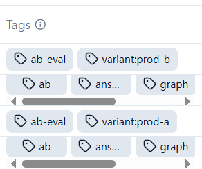

---

## 2.4.6 정리

- Tracing 은 graph 실행의 관측 + 평가 + prompt/dataset 운영을 포괄한다. LangSmith 는
  SaaS 중심, LangFuse 는 오픈소스 · self-hosting 가능이 핵심 차이다.
- LangSmith 는 환경 변수(project 지정)만으로, LangFuse 는 CallbackHandler 로 붙인다.
  run name · tags · metadata 를 전달해 두면 대시보드에서 필터링 · 비교가 가능하다.
- 재시도 루프가 있는 복잡한 그래프에서 trace 는 실행 경로(어느 분기를 몇 번
  돌았는지)와 노드별 시간 · 토큰을 그대로 보여준다 — prompt 검증의 근거가 된다.
- Prompt 는 소스코드처럼 버전 · 라벨로 관리한다. 런타임에서 label 로 가져오고 실패 시
  fallback 하며, state 에 prompt pack 을 실어 그래프 코드 수정 없이 A/B 를 돌린다.
- 평가는 규칙 기반(간결성 · 근거 포함도)과 LLM judge(정확도)를 병행하고, 결과를
  별도 span 의 score 로 trace 에 기록해 버전별 성능을 관리한다.
