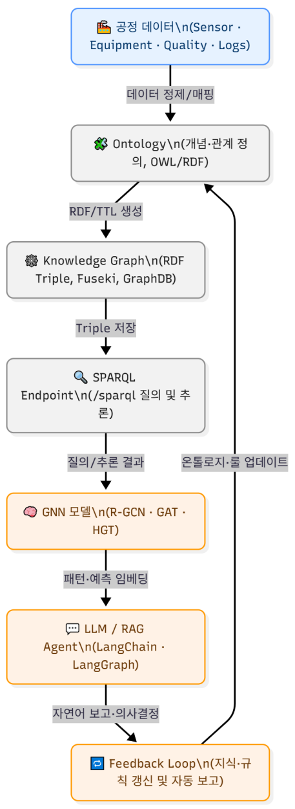
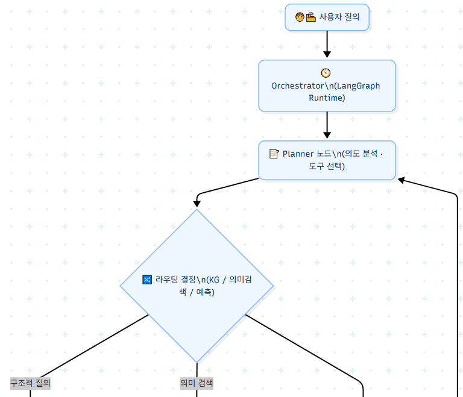
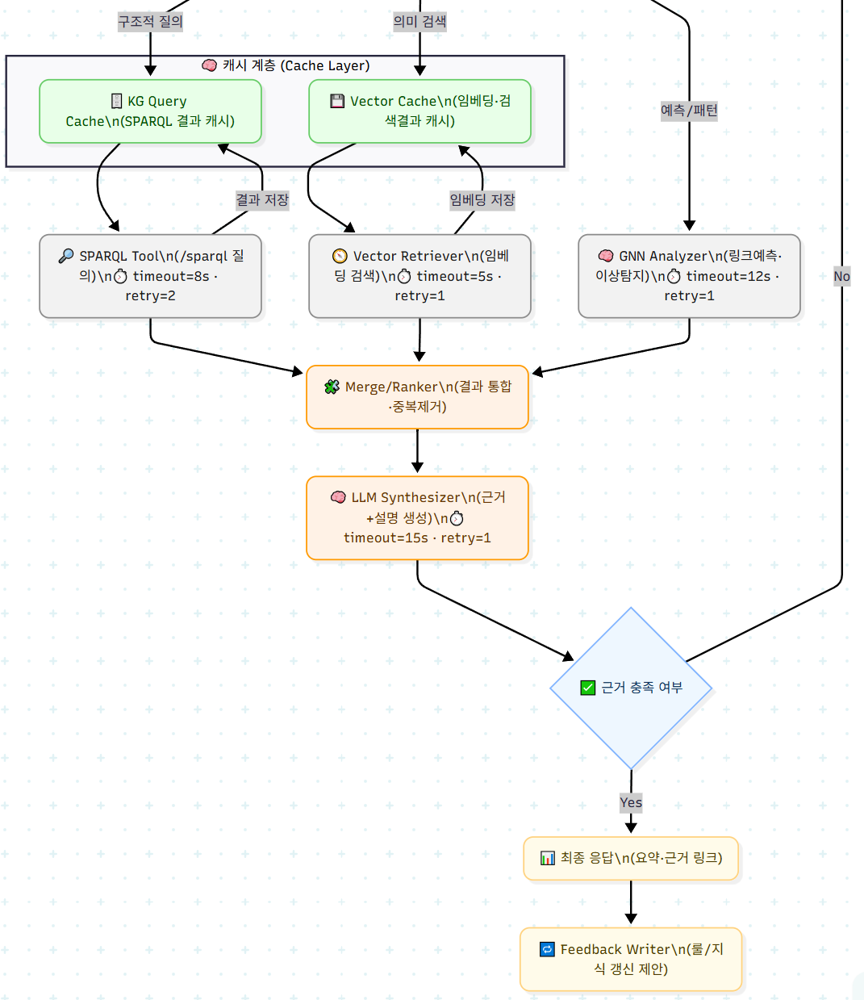
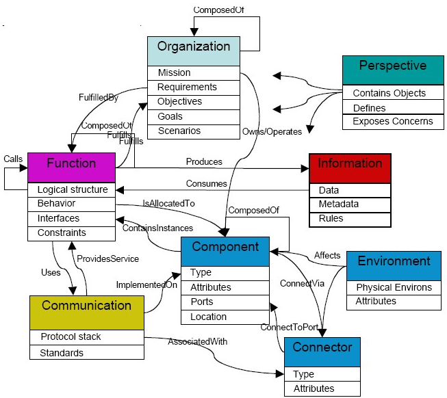

# 부록 A. Agentic AI 와 Ontology — Topic Review

이 부록은 강의를 마무리하며 다룬 Topic Review — **Agentic AI 를 "지능형 데이터 분석
시스템"으로 확장하는 그림** — 을 정리한다. LLM · Ontology · Knowledge Graph · GNN 이
하나의 파이프라인으로 이어지는 구조와, 이를 상용 수준으로 구현한 Palantir 의 접근
방식을 살펴본다.

**이 부록의 구성**

- A.1 LLM 과 Knowledge Processing
- A.2 지능형 데이터 분석 시스템의 Data Flow (실습 A.1)
- A.3 Palantir — Ontology + Action Type + 사고방식
- A.4 운영 Data Flow
- A.5 Palantir solution 에서 LLM 의 위치와 역할

---

## A.1 LLM 과 Knowledge Processing
<!-- 슬라이드 150 -->

LLM 을 문장 생성 도구가 아니라 **지식 '처리'/'응용' 엔진(Knowledge Processing
Engine)** 으로 보는 관점에서 출발한다. Knowledge Processing 이란:

- 입력된 텍스트나 데이터에서 지식을 추출하고 정형화한다 (명제, 관계, 지식 그래프 등).
- 추출된 지식을 조직하고 저장하고 검색 가능하게 유지한다.
- 그 지식을 바탕으로 추론하거나 응답(질문 응답, 의사결정 지원 등)을 생성한다.
- 지식을 갱신하거나 진화시킨다.
- Parametric knowledge(모델 내부 지식)와 외부 지식(non-parametric memory /
  knowledge bases) 간에 상호작용한다.

이를 뒷받침하는 개념들 —

- **Ontology & Knowledge Graph** : Ontology 는 개념 · 관계 · 속성의 체계적
  정의서(데이터의 "의미 모델")로 **지식의 설계도**이고, Knowledge Graph 는 Ontology
  정의에 따라 실제 데이터를 그래프로 표현한 **지식의 지도**다.
- **Knowledge Graph & GNN** : Knowledge Graph 는 지식 표현(관계 중심 데이터 구조)으로
  무엇과 무엇의 연결관계를 표현하며 구조적 지식의 저장/추론(SPARQL, SWRL)을 담당한다.
  GNN 은 지식 학습(관계 기반 딥러닝 구조)으로 연결된 관계로부터 의미를 학습한다.
  Knowledge Graph 표현을 GNN 의 학습 데이터로 사용할 수 있다.

이 요소들이 이어지면 하나의 축이 된다:

> **Data → Ontology → KG → GNN → LLM**

---

## A.2 지능형 데이터 분석 시스템의 Data Flow
<!-- 슬라이드 151~152 -->

각 단계의 역할과 대표 기술을 흐름 순서대로 정리한다.

- **Ontology** — 개념 · 관계 · 속성을 명시적으로 정의하는 지식의 설계도. RDF, OWL 로
  표현한다.
- **Knowledge Graph** — data 를 ontology 에 따라 정의 · 관리한다. Triple
  Store(Fuseki, Neo4j, GraphDB)에 저장하고, SPARQL 로 질의 · 추론한다.
- **GNN** — KG 의 관계 · 구조에서 의미를 찾는다. R-GCN, CompGCN, GAT/HGT 같은 모델을
  쓴다.
- **LLM** — 여러 역할을 맡는다:
  - RAG : 신뢰성 있는 결과 해석
  - Graph Reasoning Agent : SPARQL 작성
  - Explainable AI : GNN 결과 해석
  - Knowledge Fusion : 새로운 triple 을 제안하고 Ontology 를 확장
  - LangGraph : GNN · Fuseki 와 연동해 pipeline 을 자동화



### 실습 A.1 — 통합 아키텍처 다이어그램 그리기

> 노트북: `code/A.1.Agentic_AI_diagram.ipynb`
> [](https://colab.research.google.com/github/AI-BoostCamp/AgenticAI/blob/main/code/A.1.Agentic_AI_diagram.ipynb)

노트북은 이 시스템 구조를 mermaid(https://mermaid.live)로 단계별로 그려 본다 —
기본 파이프라인, 계층별 세부 컴포넌트를 포함한 상세 버전, SPARQL ↔ GNN ↔ LLM 양방향
흐름 강조 버전, Vector Store 를 결합한 하이브리드 RAG 버전, 그리고 **LangGraph 기반
Agent Workflow** 버전까지 확장한다.

Agent Workflow 의 요점은 다음과 같다.

- **Planner** 가 질의 의도와 정보 부족을 판단해 SPARQL / Vector / GNN 중 단일 또는
  조합을 선택한다.
- 각 도구의 결과를 **Merge/Ranker** 가 통합하고 → LLM 이 근거와 함께 답변을 생성한다.
- 만족도/근거 확인 후 필요 시 **재계획 루프**를 실행한다.
- 결과는 **Feedback Writer** 를 통해 룰/지식 개선으로 시스템에 환류된다.





운영을 고려한 확장 버전에는 두 레이어가 더해진다 — 노드별 타임아웃 · 재시도
정책(예: SPARQL timeout 8s · retry 2)과 캐시 계층(Vector Cache / KG Query Cache).
SPARQL/Vector 요청 시 먼저 캐시를 확인한 뒤 도구를 실행하고, 새 결과는 캐시에
저장해 재사용성을 높인다 — 실시간 질의 대응, 캐시 기반 저지연 처리, 타임아웃/재시도
자동 복구를 갖춘 실제 운영형 Agent 설계도다.

---

## A.3 Palantir — Ontology + Action Type + 사고방식
<!-- 슬라이드 153~156 -->

이 구조를 상용 수준으로 구현한 대표 사례가 Palantir 다 — **Ontology + Action type +
문제에 접근하는 사고방식**의 결합이다. Mission statement 는 "조직이 데이터를 사용하여
더 나은 결정을 내릴 수 있도록 한다"이다.

- **특징 1 — Ontology + Action** : data 와 model 이 실시간으로 결합 · 분석되어
  실행되는 operation workflow 를 빠르게 구축할 수 있다. 실시간 운영과 실행을 결합한
  거의 유일한 솔루션이다.
- **특징 2 — IT 비전문가를 위한 솔루션** : 비전문가가 질문하고 답을 구할 수 있는
  솔루션을 구축한다. 쿼리 언어 · 통계 모델링 · 명령줄 없이 처리하며, 시스템에 LLM 을
  통합해 자연어로 소통한다.
- **특징 3 — 고객의 지식을 시스템으로 구축** : 고객이 가진 문제에 대한 깊은 이해와
  data 를 솔루션화한다 — 구조화하는 S/W 에 문제에 접근하는 사고방식을 더한 것이다.
- **특징 4 — 존재를 위협하는 문제를 중심으로 사고** : 조직의 존재를 위협하는 문제
  중심으로 사고/운영 체계를 구축한다 — 존재의 문제를 정의하고, 문제가 발생하는
  data 를 통합하고, 문제에 대한 action 을 정의하여 data(상태)와 action(문제 해결)을
  연결한다(의사결정 중심의 구조). 과거 · 현재 · 미래의 문제에 대한 소통(자연어)을
  제공한다.



**Ontology 개념 정리.**

- Ontology 는 본래 철학의 한 분야로, 지식/언어/지각(현실/존재)과 본질의 관계를
  설명하려는 분야다.
- **정보과학의 Ontology** 는 시스템 내에서 지식을 형식적으로 표현하는 틀로, 자동
  추론을 지원한다. 지식(개념, 속성, 관계)을 형식적으로 명시하여 공유 개념화하며
  class, instance, properties, relation, link 등이 포함된다.
- **Palantir 의 Ontology** 는 조직의 존재를 보장하기 위한 본질적 문제를 표현하기 위해
  사용된다.
  - 위치/역할 : 조직의 디지털 자산(데이터셋 · 가상 테이블 · 모델)을 현실 세계의
    객체/활동에 연결하고 운영한다. 단순한 의미 모델을 넘어 실제 업무 흐름과 결합한다.
  - 구성 개념 : **Object Types · Properties**(실체 — 설비, 주문, 거래 — 와 그 속성의
    유형화), **Link Types**(객체 간 관계 — "주문–제품", "장비–공장"),
    **Action Types**(ontology 에 mapping 된 데이터 · 모델을 업무 행동과 직접 연결하는
    실행 — 시뮬레이션, 승인, 알림, 배치 실행 등). 조직의 디지털 트윈에 해당하는
    풍부한 의미 계층으로 ontology 를 구성한다.
- Palantir 의 지향점은 **"데이터-의미-행동"을 잇는 운영 가능성(operationalization)**
  이다 — 의미 모델을 앱 · 워크플로 · 의사결정 자동화와 즉시 접속시키는 것.
- 경쟁 관계(C3 AI, Azure Digital Twins, Stardog EKG, Databricks, Snowflake,
  MS Fabric, IBM watsonx.gov)는 주로 data 수집/가공/분석이 중심이고 action 과
  분리되어 있다.

**문제 접근 방식 — 표준 절차 : 문제정의 → 온톨로지 모델링 → 운영화.**

1. **문제를 "업무 언어"로 재정의** : 조직의 핵심 명사/동사(업무 개념)를 정리한다.
   "납기 위험 완화" → 객체(주문 · 부품 · 공장 · 선적), 관계(주문–부품, 부품–공급사),
   핵심 지표(리드타임, 재고회전율)로 명시한다. 이 단계에서 데이터를 객체 · 링크로
   귀속(semantic binding)한다 — 이질적 data source(ERP, MES, WMS, 시뮬레이션 결과
   등)를 객체/링크 타입에 매핑해 의미적 일관성과 추적 가능성을 확보한다.
2. **Action Type 으로 '행동'을 정의** : 분석 · 예측의 결과가 즉시 실행 단위로
   연결된다. "공급선 대체 제안 생성", "생산계획 재배치", "가격 변경 승인" 등 한 번의
   제출로 발생할 변경과 부수효과(검증 · 알림 · 버전 관리)를 스키마로 정의한다.
3. **애플리케이션/워크플로로 표현 · 운영** : 온톨로지 위에 표준 UI(객체 뷰, 탐색기)와
   워크플로를 얹어 현업 사용자가 반복 실행하도록 제공한다.
4. **디지털 트윈 · 시뮬레이션 · AI 결합** : 예측 모델을 객체 속성이나 액션 추천에
   결합하고, 객체 그래프를 디지털 트윈으로 활용해 시나리오 분석/시뮬레이션을 수행해
   action 에 결합한다.
5. **보안 · 거버넌스 · 감사 추적** : 권한과 변경 이력을 관리해 민감 데이터 환경에서도
   협업이 가능하도록 설계한다.

**문제 유형별 접근 예시.** 다음은 문제 유형별로 온톨로지를 어떻게 적용하고 어떤
실행(action)으로 잇는지의 예다.

| 문제 유형 | 온톨로지 적용 방식 | 실행(액션) 예 |
|---|---|---|
| 공급망 충격 (부품 결손, 선적 지연) | 주문 · 부품 · 공급사 · 선적 · 재고를 객체/링크로 연결, 리드타임/대체가능성 지표를 속성으로 모델링 | "대체공급선 생성", "재할당된 생산계획 적용", "고객 ETA 업데이트" |
| 제조 OEE 저하 | 설비 · 작업지시 · 고장 이벤트 · 공정 조건을 객체화, 병목 원인 추적 | "보수 작업 오더 발행", "레시피 파라미터 롤백" |
| 금융 리스크/사기 탐지 | 계정 · 거래 · 상품 · 규칙을 객체화, 패턴 탐지 모델과 결합 | "거래 보류 · 심사 라우팅", "한도 조정 승인" |
| 공공 안전/운영 | 인물 · 장소 · 이벤트의 동적 온톨로지로 상황맥락 연결, 권한 기반 공유 | "사건 배정", "자원 재배치 지시" |

**왜 효과적인가.**

- 의미적 일관성 구축 : 부서/시스템마다 흩어진 용어를 하나의 객체 모델로 통일한다.
  이식성과 재사용성이 향상된다.
- 분석 → 결정 → 집행의 closed loop 구성 : 예측/최적화 결과를 Action Type 으로 곧바로
  집행 · 감사하고, 운영 성과가 다시 데이터로 feedback 된다.
- 스케일과 안전성 : 정교한 권한/감사로 규제 · 보안 환경에서도 협업이 가능하게
  설계된다.
- 디지털 트윈 · 시뮬레이션 : 객체 그래프가 그대로 현실 시스템의 작동 모형이 되어,
  가정 변경의 정량적 영향을 곧바로 평가할 수 있다.

(용어 — ETA(Estimated Time of Arrival): 도착예상시간. OEE(Overall Equipment
Effectiveness): 설비 종합 효율.)

---

## A.4 운영 Data Flow
<!-- 슬라이드 157 -->

이 접근을 데이터 흐름으로 펼치면 다음과 같다.

```
[센서/IoT/PLC] ─────┐
[ERP/MES/SCADA] ────┼────▶ [ Stream data 수집 ]
[공급망/외부 데이터] ──┘
        ▼
[Streaming Pipeline] (Kafka/EventHub 등에서 실시간 변환)
  ├─▶ (Hot buffer)   : 최신 Event Cache
  ├─▶ (Cold storage) : 장기 로그/재처리용 저장
        ▼
[버전형 dataset (중간 산출물)]
  ├─▶ (Checkpoint A: 품질 데이터 정제)
  ├─▶ (Checkpoint B: 설비가동/공정 OEE 집계)
  └─▶ (Checkpoint C: 공급망 ETA/재고 스냅샷)
        ▼
[Ontology Binding (Object/Link/Property)]
  - Object: 설비, 주문, 제품, 라인
  - Link: "주문–제품", "설비–라인", "부품–공급사"
  - Property: 리드타임, 가동률, 결함률 등
        ▼
[Action Types]
  - 대체 공급선 할당      - 생산계획 재배치
  - 보수 작업 오더 발행   - 품질 경보 알림
        ▼
[운영 앱/워크플로]
  - 디지털 트윈 기반 시뮬레이션   - OEE 모니터링 대시보드
  - 공급망 충격 대응 시나리오 실행 - 규제 준수 보고 및 감사 추적
```

ETA 는 출발 시간 · 운송 거리 · 속도 등을 고려해 계산해 실시간 추적하고, OEE 는
가용성 × 성능 × 품질 지표로 다운타임 · 스크랩률 등을 그래프/차트로 제공하며 실시간
추적한다.

---

## A.5 Palantir solution 에서 LLM 의 위치와 역할
<!-- 슬라이드 158~159 -->

LLM 은 **"Data–Ontology–Action" 사이를 잇는 AIP Layer** 에 존재한다. Palantir
AIP 는 Foundry 의 data/Ontology 와 LLM/Agent 를 결합해 운영 워크플로까지 연결하는
계층이다. 어디서 어떻게 쓰이는가 —

- **파이프라인(배치/대량 처리)에서의 LLM** : Pipeline Builder 의 "Use LLM" 노드가
  정제된 테이블/문서에 대해 요약 · 분류 · 정보추출 · 번역 · 정규화 등을 대량 병렬로
  수행하고, 새 데이터셋(버전형)으로 재질화한다. 데이터 품질 향상 · 메타데이터 보강에
  활용된다.
- **에이전트(대화/액션)에서의 LLM** : AIP Agent Studio 로 조직 특화 지식과 Tool 을
  갖춘 AIP Agent 를 GUI 로 구성 · 배포한다. 온톨로지 객체를 조회 · 추론하고, Action
  Type/Function Type 을 호출해 실제 업무 변경(승인 · 티켓 발행 · 계획 재배치 등)을
  수행한다. Tool 사용(함수 호출/도구 호출)으로 객체 쿼리 · 시맨틱 검색 · 외부 API
  같은 툴을 실행하고 결과를 다시 컨텍스트로 활용한다.
- **로직(함수) 계층에서의 LLM** : AIP Logic 은 코드 없이 LLM 기반 함수를 설계 ·
  테스트 · 배포 · 모니터링하는 환경이다. 프롬프트 엔지니어링 · 자동화 · 평가를
  내장하고 온톨로지와 직접 결합하며, 복잡한 다단계 프롬프트/툴 조합을 설계 · 운영한다.
- **모델 선택 · 배치** : OpenAI/Anthropic/Meta/Google/xAI 등 상용 · 오픈 모델을
  지원(임베딩 포함)하며, 환경/지역/보안 요건에 맞춰 선택해 AIP 워크플로 전반에서
  사용한다.

**온톨로지와의 결합 포인트.** LLM/에이전트는 Ontology SDK 로 운영 실체(주문, 설비,
부품, 재고 등)에 접속하고, Action Type 을 통해 결정 → 집행까지 연결한다 — "AI →
현업 변경"의 closed loop 가 기본 설계다.

**거버넌스 · 안전성(Explainability/Guardrails).** AIP 는 권한 · 감사추적과 결합되고
설명가능성(결과 근거, 체인 관찰/평가) 강화를 제공한다 — 운영 환경에서 LLM 의 안전한
사용과 모니터링을 중시한다.

**실시간/스트리밍 시나리오.** 스트림으로 유입되는 이벤트에 대해 LLM 요약/분류/이상
메모 생성 등을 수행하고, 결과를 버전형 데이터셋 또는 객체 속성/알림으로 반영해 운영
대시보드 · 액션과 연결한다.

**외부/내부 앱으로의 확장.** 에이전트와 LLM 워크플로는 Foundry API/SDK 로 내부
포털 · 모바일 · 챗봇 등에 확장 배포할 수 있다. 에이전트가 사용하는 객체/액션/함수
타입을 지정해 권한을 관리한다.

> **정리**
> Palantir 에서 LLM 은 AIP 계층에 배치되어 — (1) 데이터 파이프라인의 대량
> 변환(Use LLM 노드): 요약/정규화/설명, (2) 에이전트의 대화 · 툴/액션 호출(Agent
> Studio), (3) LLM 함수의 무코드 설계 · 배포(AIP Logic) — 를 통해 온톨로지(운영
> 실체)와 액션(집행)을 연결한다. 즉, **데이터 → 의미 → 행동**의 전 과정에서 LLM 이
> 설명 가능 · 감사 가능한 방식으로 작동한다.
